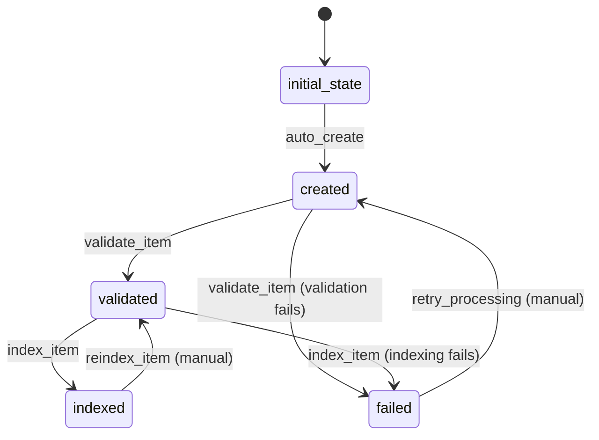

# HNItem Workflow Specification

## Overview
The HNItem workflow manages the lifecycle of Hacker News items from creation through validation and processing.

## Workflow States

### 1. initial_state
- **Description**: Starting state for all new HNItem entities
- **Purpose**: Entry point for workflow processing

### 2. created
- **Description**: HNItem has been created and basic validation passed
- **Purpose**: Item is ready for content validation and processing

### 3. validated
- **Description**: HNItem has passed all validation checks
- **Purpose**: Item is confirmed valid and ready for indexing

### 4. indexed
- **Description**: HNItem has been indexed for search functionality
- **Purpose**: Item is fully processed and searchable

### 5. failed
- **Description**: HNItem failed validation or processing
- **Purpose**: Terminal state for items that cannot be processed

## State Transitions


```mermaid
stateDiagram-v2
    [*] --> initial_state
    initial_state --> created : auto_create
    created --> validated : validate_item
    created --> failed : validate_item (validation fails)
    validated --> indexed : index_item
    validated --> failed : index_item (indexing fails)
    indexed --> validated : reindex_item (manual)
    failed --> created : retry_processing (manual)
```

## Transitions

### 1. auto_create
- **From**: initial_state
- **To**: created
- **Type**: Automatic
- **Manual**: false
- **Processors**: [CreateHNItemProcessor]
- **Criteria**: None
- **Purpose**: Automatically move new items to created state

### 2. validate_item
- **From**: created
- **To**: validated (success) / failed (failure)
- **Type**: Automatic
- **Manual**: false
- **Processors**: [ValidateHNItemProcessor]
- **Criteria**: [HNItemValidCriterion]
- **Purpose**: Validate item data and structure

### 3. index_item
- **From**: validated
- **To**: indexed (success) / failed (failure)
- **Type**: Automatic
- **Manual**: false
- **Processors**: [IndexHNItemProcessor]
- **Criteria**: None
- **Purpose**: Index item for search functionality

### 4. reindex_item
- **From**: indexed
- **To**: validated
- **Type**: Manual
- **Manual**: true
- **Processors**: [ReindexHNItemProcessor]
- **Criteria**: None
- **Purpose**: Manual reindexing of items

### 5. retry_processing
- **From**: failed
- **To**: created
- **Type**: Manual
- **Manual**: true
- **Processors**: [RetryHNItemProcessor]
- **Criteria**: None
- **Purpose**: Retry processing of failed items

## Processors

### 1. CreateHNItemProcessor
- **Entity**: HNItem
- **Purpose**: Initialize HNItem with creation metadata
- **Input**: Raw HNItem data
- **Output**: HNItem with createdAt, updatedAt, and sourceType set
- **Pseudocode**:
```
process(hnItem):
    hnItem.createdAt = now()
    hnItem.updatedAt = now()
    if (hnItem.sourceType == null):
        hnItem.sourceType = "UNKNOWN"
    return hnItem
```

### 2. ValidateHNItemProcessor
- **Entity**: HNItem
- **Purpose**: Validate HNItem data integrity and business rules
- **Input**: HNItem with basic data
- **Output**: HNItem with validation status
- **Pseudocode**:
```
process(hnItem):
    hnItem.updatedAt = now()
    // Validation is handled by criterion
    // This processor just updates timestamp
    return hnItem
```

### 3. IndexHNItemProcessor
- **Entity**: HNItem
- **Purpose**: Index HNItem for search functionality
- **Input**: Validated HNItem
- **Output**: HNItem ready for search
- **Pseudocode**:
```
process(hnItem):
    hnItem.updatedAt = now()
    // Index item for search (implementation specific)
    // Could update search metadata or trigger external indexing
    return hnItem
```

### 4. ReindexHNItemProcessor
- **Entity**: HNItem
- **Purpose**: Reindex existing HNItem
- **Input**: Indexed HNItem
- **Output**: HNItem prepared for reindexing
- **Pseudocode**:
```
process(hnItem):
    hnItem.updatedAt = now()
    // Clear any existing index metadata
    // Prepare for reindexing
    return hnItem
```

### 5. RetryHNItemProcessor
- **Entity**: HNItem
- **Purpose**: Reset failed HNItem for retry
- **Input**: Failed HNItem
- **Output**: HNItem ready for retry
- **Pseudocode**:
```
process(hnItem):
    hnItem.updatedAt = now()
    // Clear any error flags or metadata
    // Reset for retry processing
    return hnItem
```

## Criteria

### 1. HNItemValidCriterion
- **Purpose**: Validate HNItem data integrity and business rules
- **Pseudocode**:
```
check(hnItem):
    if (hnItem.id == null):
        return false
    if (hnItem.type == null || !isValidType(hnItem.type)):
        return false
    if (hnItem.type == "comment" && hnItem.parent == null):
        return false
    if (hnItem.type == "poll" && (hnItem.parts == null || hnItem.parts.isEmpty())):
        return false
    if (hnItem.type == "pollopt" && hnItem.poll == null):
        return false
    return true

isValidType(type):
    return type in ["job", "story", "comment", "poll", "pollopt"]
```

## Workflow JSON Structure
- **Name**: HNItem
- **Initial State**: initial_state
- **Version**: 1.0
- **Active**: true
- **States**: 5 states with defined transitions
- **Processors**: 5 processors for different lifecycle stages
- **Criteria**: 1 validation criterion
