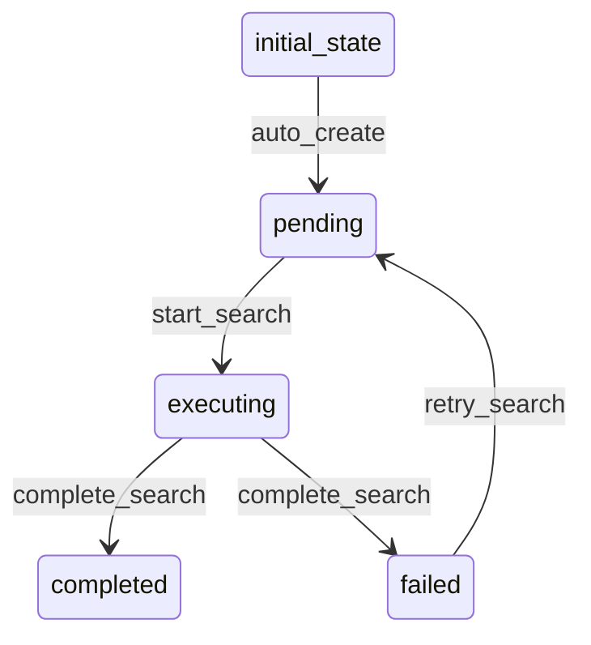

# HNItemSearch Workflow

## States
- **initial_state**: Starting state for new searches
- **pending**: Search request received
- **executing**: Search is being executed
- **completed**: Search completed successfully
- **failed**: Search execution failed

## Transitions



## Processors

### ExecuteSearchProcessor
- **Entity**: HNItemSearch
- **Purpose**: Executes search query against HNItem entities
- **Input**: Search parameters and query
- **Output**: Search results and metadata
- **Pseudocode**:
```
process(search):
    startTime = currentTimestamp()
    
    results = []
    if search.searchType == "text":
        results = searchByText(search.query, search.filters)
    else if search.searchType == "author":
        results = searchByAuthor(search.query, search.filters)
    else if search.searchType == "hierarchical":
        results = searchWithParentHierarchy(search.query, search.filters)
    
    if search.includeParents:
        results = enrichWithParentHierarchy(results)
    
    search.resultCount = results.length
    search.executionTimeMs = currentTimestamp() - startTime
    
    return search
```

### CompleteSearchProcessor
- **Entity**: HNItemSearch
- **Purpose**: Finalizes search and sets completion timestamp
- **Input**: Executed search
- **Output**: Completed search
- **Pseudocode**:
```
process(search):
    search.searchTimestamp = currentTimestamp()
    return search
```

## Criteria

### ValidSearchQueryCriterion
- **Purpose**: Validates search query parameters
- **Pseudocode**:
```
check(search):
    return search.query != null and search.searchType != null
```

### SearchSuccessfulCriterion
- **Purpose**: Determines if search execution was successful
- **Pseudocode**:
```
check(search):
    return search.resultCount >= 0 and search.executionTimeMs > 0
```
