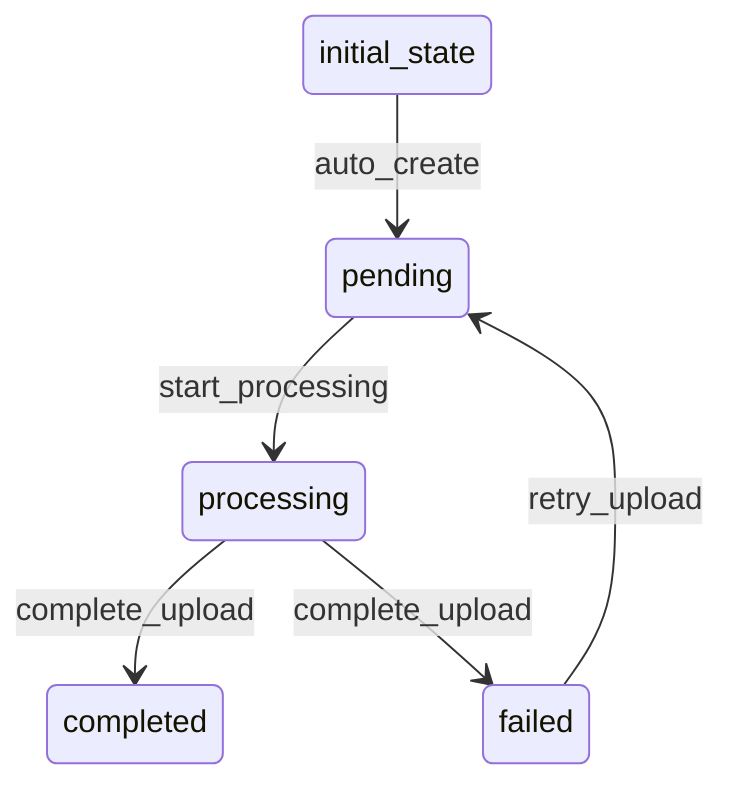

# HNItemUpload Workflow

## States
- **initial_state**: Starting state for new uploads
- **pending**: Upload request received
- **processing**: Upload is being processed
- **completed**: Upload completed successfully
- **failed**: Upload failed

## Transitions



## Processors

### ProcessUploadProcessor
- **Entity**: HNItemUpload
- **Purpose**: Processes uploaded HN items and creates individual HNItem entities
- **Input**: Upload data (single item, array, or file)
- **Output**: Updated upload with processing results
- **Pseudocode**:
```
process(upload):
    items = parseUploadData(upload)
    upload.totalItems = items.length
    upload.processedItems = 0
    upload.failedItems = 0
    
    for each item in items:
        try:
            hnItem = createHNItemEntity(item)
            entityService.create(hnItem)
            upload.processedItems++
        catch Exception e:
            upload.failedItems++
            upload.errorMessages.add(e.message)
    
    return upload
```

### CompleteUploadProcessor
- **Entity**: HNItemUpload
- **Purpose**: Finalizes upload and sets completion timestamp
- **Input**: Processed upload
- **Output**: Completed upload
- **Pseudocode**:
```
process(upload):
    upload.completionTimestamp = currentTimestamp()
    return upload
```

## Criteria

### HasUploadDataCriterion
- **Purpose**: Checks if upload has valid data to process
- **Pseudocode**:
```
check(upload):
    return upload.uploadType != null and upload.uploadId != null
```

### ProcessingSuccessfulCriterion
- **Purpose**: Determines if upload processing was successful
- **Pseudocode**:
```
check(upload):
    return upload.failedItems == 0 and upload.processedItems > 0
```
