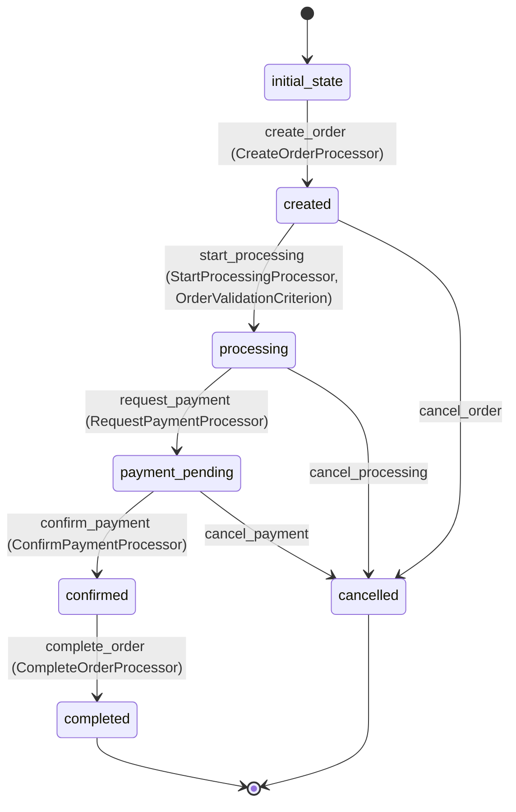

# Order Workflow

## States
- **initial_state**: Starting state for new orders
- **created**: Order has been created but not processed
- **processing**: Order is being processed and validated
- **payment_pending**: Waiting for payment completion
- **confirmed**: Order confirmed and ready for fulfillment
- **completed**: Order successfully completed
- **cancelled**: Order was cancelled

## Transitions

### initial_state → created
- **Name**: create_order
- **Type**: Automatic
- **Processor**: CreateOrderProcessor
- **Purpose**: Initialize new order in the system

### created → processing
- **Name**: start_processing
- **Type**: Manual
- **Processor**: StartProcessingProcessor
- **Criterion**: OrderValidationCriterion
- **Purpose**: Begin order validation and processing

### processing → payment_pending
- **Name**: request_payment
- **Type**: Manual
- **Processor**: RequestPaymentProcessor
- **Purpose**: Request payment from customer

### payment_pending → confirmed
- **Name**: confirm_payment
- **Type**: Manual
- **Processor**: ConfirmPaymentProcessor
- **Purpose**: Confirm payment and finalize order

### confirmed → completed
- **Name**: complete_order
- **Type**: Manual
- **Processor**: CompleteOrderProcessor
- **Purpose**: Mark order as completed after pet pickup

### created → cancelled
- **Name**: cancel_order
- **Type**: Manual
- **Purpose**: Cancel order before processing

### processing → cancelled
- **Name**: cancel_processing
- **Type**: Manual
- **Purpose**: Cancel order during processing

### payment_pending → cancelled
- **Name**: cancel_payment
- **Type**: Manual
- **Purpose**: Cancel order due to payment issues

## Processors

### CreateOrderProcessor
- **Entity**: Order
- **Input**: New order data with customer and pet references
- **Purpose**: Initialize order and validate references
- **Output**: Created order
- **Pseudocode**:
```
process(order):
    validate order.isValid()
    verify customer exists and is active
    verify pet exists and is available
    calculate total amount
    set order creation timestamp
    return order
```

### StartProcessingProcessor
- **Entity**: Order
- **Input**: Order ready for processing
- **Purpose**: Begin order validation and reserve the pet
- **Output**: Processing order
- **Pseudocode**:
```
process(order):
    reserve pet for this order
    validate customer eligibility
    set processing timestamp
    log processing start
    return order
```

### RequestPaymentProcessor
- **Entity**: Order
- **Input**: Validated order
- **Purpose**: Generate payment request and notify customer
- **Output**: Order awaiting payment
- **Pseudocode**:
```
process(order):
    generate payment invoice
    send payment request to customer
    set payment request timestamp
    log payment request
    return order
```

### ConfirmPaymentProcessor
- **Entity**: Order
- **Input**: Order with payment confirmation
- **Purpose**: Confirm payment and prepare for fulfillment
- **Output**: Confirmed order
- **Pseudocode**:
```
process(order):
    validate payment completion
    set payment confirmation timestamp
    schedule pet pickup
    notify customer of confirmation
    return order
```

### CompleteOrderProcessor
- **Entity**: Order
- **Input**: Order ready for completion
- **Purpose**: Finalize order after successful pet pickup
- **Output**: Completed order
- **Pseudocode**:
```
process(order):
    set actual pickup timestamp
    mark pet as adopted
    send completion confirmation
    log order completion
    return order
```

## Criteria

### OrderValidationCriterion
- **Purpose**: Validate order can be processed
- **Pseudocode**:
```
check(order):
    return order.customerId != null AND 
           order.petId != null AND 
           order.orderType != null AND
           order.totalAmount >= 0
```

## Mermaid State Diagram


