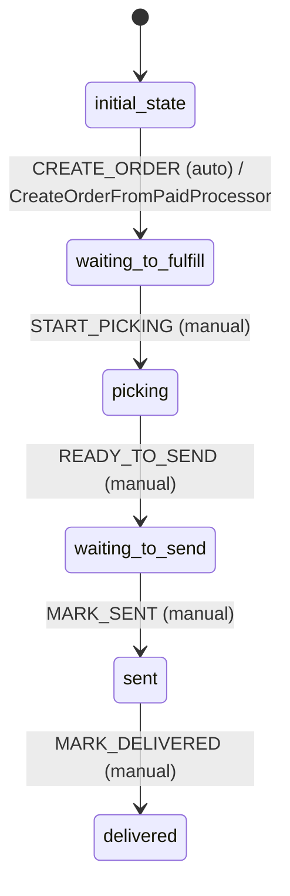

# Order Workflow

## States
- **initial_state**: Entry point
- **waiting_to_fulfill**: Order created, awaiting fulfillment
- **picking**: Items being picked
- **waiting_to_send**: Ready for shipment
- **sent**: Shipped
- **delivered**: Delivered

## Transitions

### initial_state → waiting_to_fulfill
- **Name**: CREATE_ORDER
- **Type**: Automatic
- **Processors**: CreateOrderFromPaidProcessor
- **Criteria**: None

### waiting_to_fulfill → picking
- **Name**: START_PICKING
- **Type**: Manual
- **Processors**: None
- **Criteria**: None

### picking → waiting_to_send
- **Name**: READY_TO_SEND
- **Type**: Manual
- **Processors**: None
- **Criteria**: None

### waiting_to_send → sent
- **Name**: MARK_SENT
- **Type**: Manual
- **Processors**: None
- **Criteria**: None

### sent → delivered
- **Name**: MARK_DELIVERED
- **Type**: Manual
- **Processors**: None
- **Criteria**: None

## Mermaid State Diagram


## Processors

### CreateOrderFromPaidProcessor
- **Entity**: Order
- **Purpose**: Create order from paid cart, decrement stock, create shipment
- **Input**: Order with cart and payment references
- **Output**: Complete order with shipment created
- **Transition**: CREATE_ORDER

**Pseudocode for process() method:**
```
function process(orderWithMetadata):
    order = orderWithMetadata.entity
    
    // Get cart and payment data (passed in order context)
    cart = getCartById(order.cartId)
    payment = getPaymentById(order.paymentId)
    
    // Validate payment is PAID
    if payment.meta.state != "paid":
        throw ValidationException("Payment must be PAID")
    
    // Snapshot cart data to order
    order.lines = cart.lines.map(line => {
        sku: line.sku,
        name: line.name,
        unitPrice: line.price,
        qty: line.qty,
        lineTotal: line.price * line.qty
    })
    
    order.totals = {
        items: cart.totalItems,
        grand: cart.grandTotal
    }
    
    order.guestContact = cart.guestContact
    order.orderNumber = generateShortULID()
    
    // Decrement product stock
    for line in order.lines:
        product = entityService.findByModelKey("Product", line.sku)
        product.entity.quantityAvailable -= line.qty
        entityService.update(product)
    
    // Create shipment
    shipment = createShipment(order)
    entityService.create(shipment)
    
    return orderWithMetadata
```

## Criteria
None required for Order workflow.

## Business Rules
- Orders created only from PAID payments
- Stock decremented on order creation
- Single shipment created per order
- Order number is short ULID format
