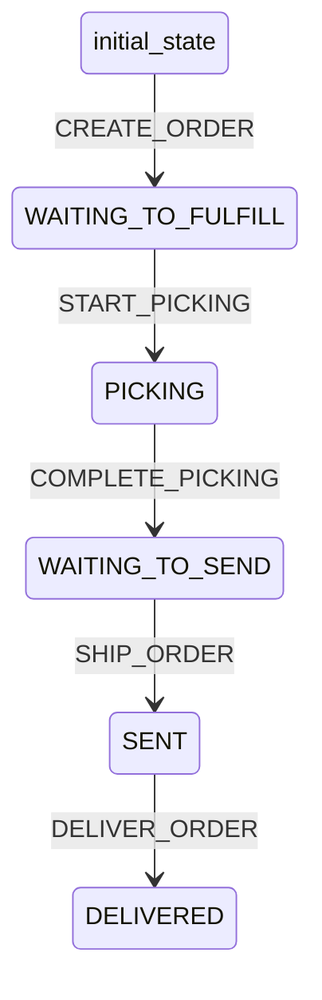

# Order Workflow

## States
- **initial_state**: Starting state
- **WAITING_TO_FULFILL**: Order created, waiting for fulfillment
- **PICKING**: Order being picked in warehouse
- **WAITING_TO_SEND**: Order picked, waiting to ship
- **SENT**: Order shipped
- **DELIVERED**: Order delivered to customer

## Transitions



## Transition Details

### CREATE_ORDER (initial_state → WAITING_TO_FULFILL)
- **Type**: Automatic
- **Processors**: CreateOrderProcessor
- **Criteria**: None

### START_PICKING (WAITING_TO_FULFILL → PICKING)
- **Type**: Manual
- **Processors**: None
- **Criteria**: None

### COMPLETE_PICKING (PICKING → WAITING_TO_SEND)
- **Type**: Manual
- **Processors**: None
- **Criteria**: None

### SHIP_ORDER (WAITING_TO_SEND → SENT)
- **Type**: Manual
- **Processors**: None
- **Criteria**: None

### DELIVER_ORDER (SENT → DELIVERED)
- **Type**: Manual
- **Processors**: None
- **Criteria**: None

## Processors

### CreateOrderProcessor
- **Entity**: Order
- **Purpose**: Create order from paid cart, decrement stock, create shipment
- **Input**: Order with cart and payment data
- **Output**: Created order
- **Pseudocode**:
```
process(order):
    generate short ULID for orderNumber
    snapshot cart lines to order.lines
    copy cart.guestContact to order.guestContact
    calculate order.totals from lines
    
    for each line in order.lines:
        find product by sku
        decrement product.quantityAvailable by line.qty
        update product entity
    
    create shipment with orderId and PICKING status
    
    update order.createdAt and updatedAt
    return order
```
