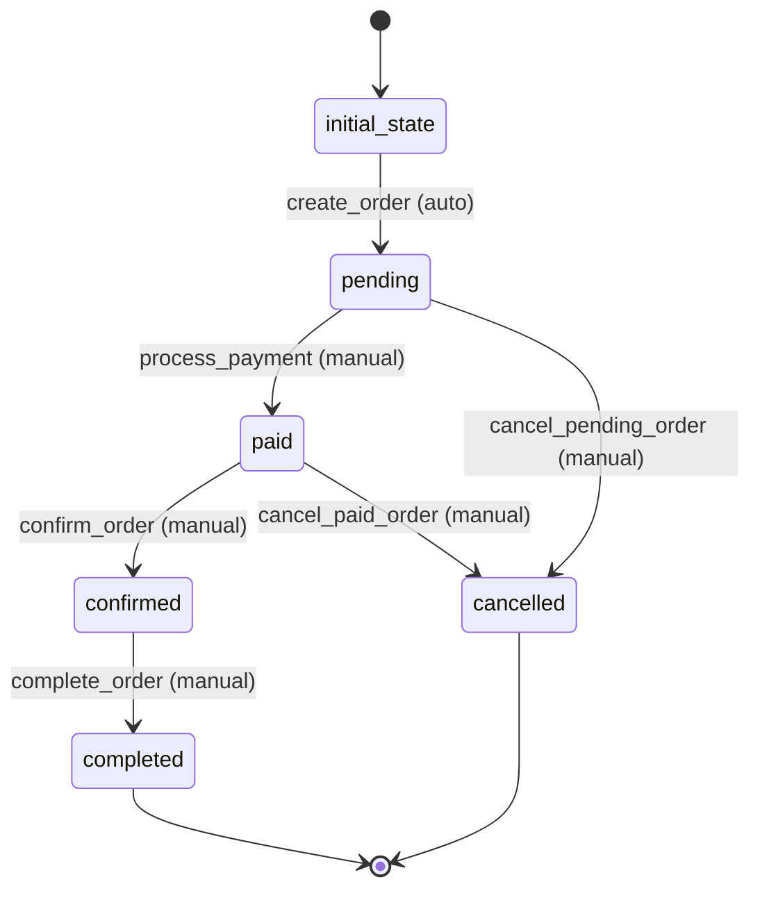

# Order Workflow

## States
- **initial_state**: Starting state
- **pending**: Order created, awaiting payment
- **paid**: Payment received, processing order
- **confirmed**: Order confirmed, preparing for delivery/pickup
- **completed**: Order completed successfully
- **cancelled**: Order cancelled

## Transitions

### initial_state → pending
- **Name**: create_order
- **Type**: Automatic
- **Processors**: OrderCreationProcessor
- **Criteria**: None

### pending → paid
- **Name**: process_payment
- **Type**: Manual
- **Processors**: PaymentProcessor
- **Criteria**: None

### paid → confirmed
- **Name**: confirm_order
- **Type**: Manual
- **Processors**: OrderConfirmationProcessor
- **Criteria**: None

### confirmed → completed
- **Name**: complete_order
- **Type**: Manual
- **Processors**: OrderCompletionProcessor
- **Criteria**: None

### pending → cancelled
- **Name**: cancel_pending_order
- **Type**: Manual
- **Processors**: None
- **Criteria**: None

### paid → cancelled
- **Name**: cancel_paid_order
- **Type**: Manual
- **Processors**: RefundProcessor
- **Criteria**: None

## Mermaid State Diagram


## Processors

### OrderCreationProcessor
- **Entity**: Order
- **Purpose**: Initialize order with calculated totals and validate data
- **Input**: New order entity
- **Output**: Validated order entity
- **Pseudocode**:
```
process(order):
    validate order.isValid()
    calculate total amount from pet price and services
    set order timestamp
    return order
```

### PaymentProcessor
- **Entity**: Order
- **Purpose**: Process payment and update order status
- **Input**: Order entity with payment details
- **Output**: Updated order entity
- **Pseudocode**:
```
process(order):
    validate payment information
    process payment transaction
    update payment timestamp
    return order
```

### OrderConfirmationProcessor
- **Entity**: Order
- **Purpose**: Confirm order and reserve pet
- **Input**: Order entity
- **Output**: Updated order entity
- **Pseudocode**:
```
process(order):
    validate order is paid
    reserve pet via EntityService
    send confirmation notification
    return order
```

### OrderCompletionProcessor
- **Entity**: Order
- **Purpose**: Complete order and finalize pet adoption
- **Input**: Order entity
- **Output**: Updated order entity
- **Pseudocode**:
```
process(order):
    validate order is confirmed
    complete pet adoption via EntityService
    update completion timestamp
    return order
```

### RefundProcessor
- **Entity**: Order
- **Purpose**: Process refund for cancelled paid orders
- **Input**: Order entity
- **Output**: Updated order entity
- **Pseudocode**:
```
process(order):
    validate order is paid
    process refund transaction
    update refund timestamp
    return order
```
