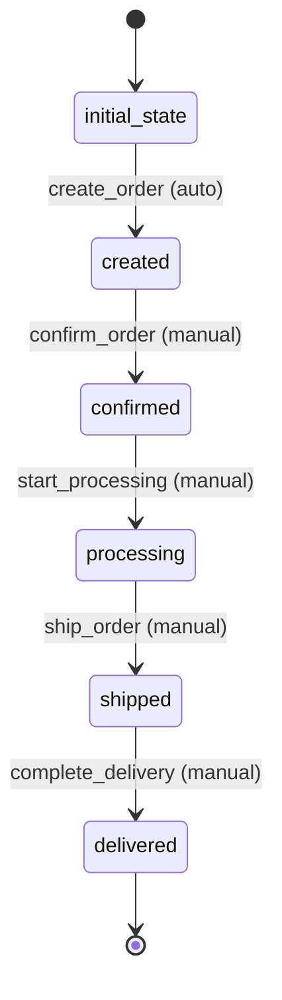

# Order Workflow

## States
- **initial_state**: Starting state for new orders
- **created**: Order has been created but not confirmed
- **confirmed**: Order confirmed and payment processed
- **processing**: Order is being prepared for delivery
- **shipped**: Order has been shipped to customer
- **delivered**: Order successfully delivered to customer

## Transitions

### initial_state → created
- **Name**: create_order
- **Type**: Automatic
- **Processors**: OrderCreationProcessor
- **Criteria**: None

### created → confirmed
- **Name**: confirm_order
- **Type**: Manual
- **Processors**: OrderConfirmationProcessor
- **Criteria**: OrderValidationCriterion

### confirmed → processing
- **Name**: start_processing
- **Type**: Manual
- **Processors**: OrderProcessingProcessor
- **Criteria**: None

### processing → shipped
- **Name**: ship_order
- **Type**: Manual
- **Processors**: None
- **Criteria**: None

### shipped → delivered
- **Name**: complete_delivery
- **Type**: Manual
- **Processors**: OrderCompletionProcessor
- **Criteria**: None

## Processors

### OrderCreationProcessor
- **Entity**: Order
- **Purpose**: Create new order and validate basic information
- **Input**: New order entity
- **Output**: Created order
- **Pseudocode**:
  ```
  process(order):
    validate petId exists and is available
    validate ownerId exists and is active
    calculate totalAmount = adoptionFee + serviceFee
    set orderDate to current timestamp
    return order
  ```

### OrderConfirmationProcessor
- **Entity**: Order
- **Purpose**: Confirm order and process payment
- **Input**: Order entity with payment details
- **Output**: Confirmed order
- **Pseudocode**:
  ```
  process(order, paymentData):
    process payment for totalAmount
    reserve pet for this order
    send confirmation email to owner
    update pet status to reserved
    return order
  ```

### OrderProcessingProcessor
- **Entity**: Order
- **Purpose**: Prepare order for delivery/pickup
- **Input**: Order entity
- **Output**: Processing order
- **Pseudocode**:
  ```
  process(order):
    prepare pet documentation
    schedule health check if needed
    arrange transportation if delivery
    notify customer of processing status
    return order
  ```

### OrderCompletionProcessor
- **Entity**: Order
- **Purpose**: Complete order delivery and finalize sale
- **Input**: Order entity
- **Output**: Completed order
- **Pseudocode**:
  ```
  process(order):
    confirm delivery with customer
    update pet status to sold
    send completion notification
    update store inventory
    return order
  ```

## Criteria

### OrderValidationCriterion
- **Purpose**: Validate order can be confirmed
- **Pseudocode**:
  ```
  check(order):
    pet = getPetById(order.petId)
    owner = getOwnerById(order.ownerId)
    return pet.state == "available" AND
           owner.state == "active" AND
           order.totalAmount > 0
  ```

## Mermaid State Diagram


```mermaid
stateDiagram-v2
    [*] --> initial_state
    initial_state --> created : create_order (auto)
    created --> confirmed : confirm_order (manual)
    confirmed --> processing : start_processing (manual)
    processing --> shipped : ship_order (manual)
    shipped --> delivered : complete_delivery (manual)
    delivered --> [*]
```
