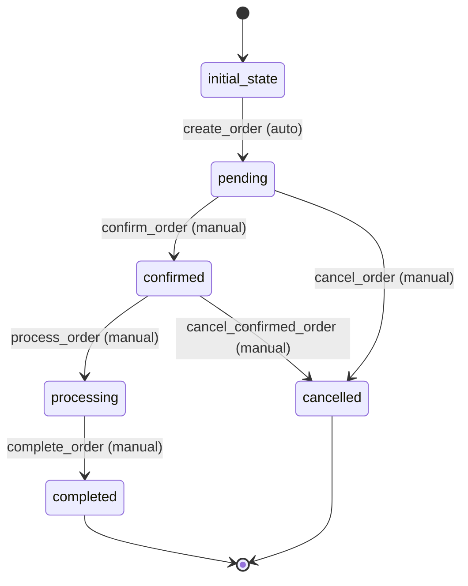

# Order Workflow

## States
- **initial_state**: Starting state for new orders
- **pending**: Order has been created and awaiting confirmation
- **confirmed**: Order has been confirmed by customer
- **processing**: Order is being processed
- **completed**: Order has been completed successfully
- **cancelled**: Order has been cancelled

## Transitions

### initial_state → pending
- **Name**: create_order
- **Manual**: false (automatic)
- **Processors**: OrderCreationProcessor
- **Criteria**: None

### pending → confirmed
- **Name**: confirm_order
- **Manual**: true
- **Processors**: OrderConfirmationProcessor
- **Criteria**: OrderValidityCriterion

### confirmed → processing
- **Name**: process_order
- **Manual**: true
- **Processors**: OrderProcessingProcessor
- **Criteria**: None

### processing → completed
- **Name**: complete_order
- **Manual**: true
- **Processors**: OrderCompletionProcessor
- **Criteria**: None

### pending → cancelled
- **Name**: cancel_order
- **Manual**: true
- **Processors**: OrderCancellationProcessor
- **Criteria**: None

### confirmed → cancelled
- **Name**: cancel_confirmed_order
- **Manual**: true
- **Processors**: OrderCancellationProcessor
- **Criteria**: None

## Mermaid State Diagram

```mermaid
stateDiagram-v2
    [*] --> initial_state
    initial_state --> pending : create_order (auto)
    pending --> confirmed : confirm_order (manual)
    pending --> cancelled : cancel_order (manual)
    confirmed --> processing : process_order (manual)
    confirmed --> cancelled : cancel_confirmed_order (manual)
    processing --> completed : complete_order (manual)
    completed --> [*]
    cancelled --> [*]
```

## Processors

### OrderCreationProcessor
- **Entity**: Order
- **Purpose**: Create and validate new order
- **Input**: New Order entity
- **Output**: Validated Order entity
- **Pseudocode**:
```
process(order):
    validate order.petId exists
    validate order.ownerId exists
    validate order.totalAmount > 0
    set order.orderDate to current timestamp
    return order
```

### OrderConfirmationProcessor
- **Entity**: Order
- **Purpose**: Confirm order and reserve pet
- **Input**: Order entity
- **Output**: Confirmed Order entity
- **Pseudocode**:
```
process(order):
    get pet by order.petId
    update pet state to reserved
    send confirmation notification
    return order
```

### OrderProcessingProcessor
- **Entity**: Order
- **Purpose**: Process payment and prepare for completion
- **Input**: Order entity
- **Output**: Processing Order entity
- **Pseudocode**:
```
process(order):
    process payment (simulated)
    prepare adoption paperwork
    schedule pickup/delivery
    return order
```

### OrderCompletionProcessor
- **Entity**: Order
- **Purpose**: Complete order and finalize adoption
- **Input**: Order entity
- **Output**: Completed Order entity
- **Pseudocode**:
```
process(order):
    get pet by order.petId
    update pet state to adopted
    update pet.ownerId with order.ownerId
    send completion notification
    return order
```

### OrderCancellationProcessor
- **Entity**: Order
- **Purpose**: Cancel order and release pet
- **Input**: Order entity
- **Output**: Cancelled Order entity
- **Pseudocode**:
```
process(order):
    get pet by order.petId
    if pet is reserved, update pet state to available
    clear pet.orderId
    process refund if applicable
    return order
```

## Criteria

### OrderValidityCriterion
- **Purpose**: Check if order is valid for confirmation
- **Pseudocode**:
```
check(order):
    pet = get_pet(order.petId)
    owner = get_owner(order.ownerId)
    return pet.state == "available" AND owner.state == "verified"
```
