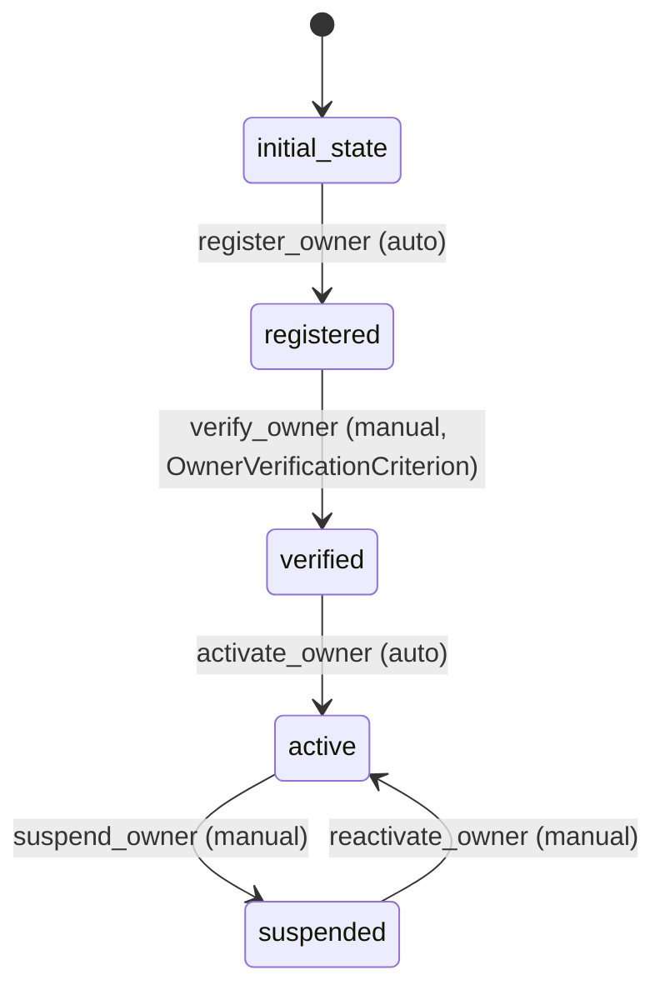

# Owner Workflow

## States
- **initial_state**: Starting state for new owners
- **registered**: Owner has registered but not verified
- **verified**: Owner has been verified and can adopt pets
- **active**: Owner is actively using the system
- **suspended**: Owner account is temporarily suspended

## Transitions

### initial_state → registered
- **Name**: register_owner
- **Manual**: false (automatic)
- **Processors**: [RegisterOwnerProcessor]
- **Criteria**: none

### registered → verified
- **Name**: verify_owner
- **Manual**: true
- **Processors**: [VerifyOwnerProcessor]
- **Criteria**: [OwnerVerificationCriterion]

### verified → active
- **Name**: activate_owner
- **Manual**: false (automatic)
- **Processors**: none
- **Criteria**: none

### active → suspended
- **Name**: suspend_owner
- **Manual**: true
- **Processors**: [SuspendOwnerProcessor]
- **Criteria**: none

### suspended → active
- **Name**: reactivate_owner
- **Manual**: true
- **Processors**: [ReactivateOwnerProcessor]
- **Criteria**: none

## Processors

### RegisterOwnerProcessor
- **Entity**: Owner
- **Purpose**: Initialize new owner registration
- **Input**: Owner entity with basic info
- **Output**: Owner registered in system
- **Pseudocode**:
```
process(owner):
    validate owner information
    set registration date
    send welcome email
    return updated owner
```

### VerifyOwnerProcessor
- **Entity**: Owner
- **Purpose**: Complete owner verification process
- **Input**: Owner entity with verification documents
- **Output**: Owner marked as verified
- **Pseudocode**:
```
process(owner):
    validate verification documents
    perform background check
    set verification date
    return updated owner
```

### SuspendOwnerProcessor
- **Entity**: Owner
- **Purpose**: Suspend owner account
- **Input**: Owner entity and suspension reason
- **Output**: Owner account suspended
- **Pseudocode**:
```
process(owner):
    set suspension date and reason
    notify owner of suspension
    log suspension activity
    return updated owner
```

### ReactivateOwnerProcessor
- **Entity**: Owner
- **Purpose**: Reactivate suspended owner account
- **Input**: Owner entity
- **Output**: Owner account reactivated
- **Pseudocode**:
```
process(owner):
    clear suspension data
    set reactivation date
    notify owner of reactivation
    return updated owner
```

## Criteria

### OwnerVerificationCriterion
- **Purpose**: Check if owner meets verification requirements
- **Pseudocode**:
```
check(owner):
    return owner has valid ID AND
           address is verified AND
           background check passed
```

## Mermaid State Diagram


