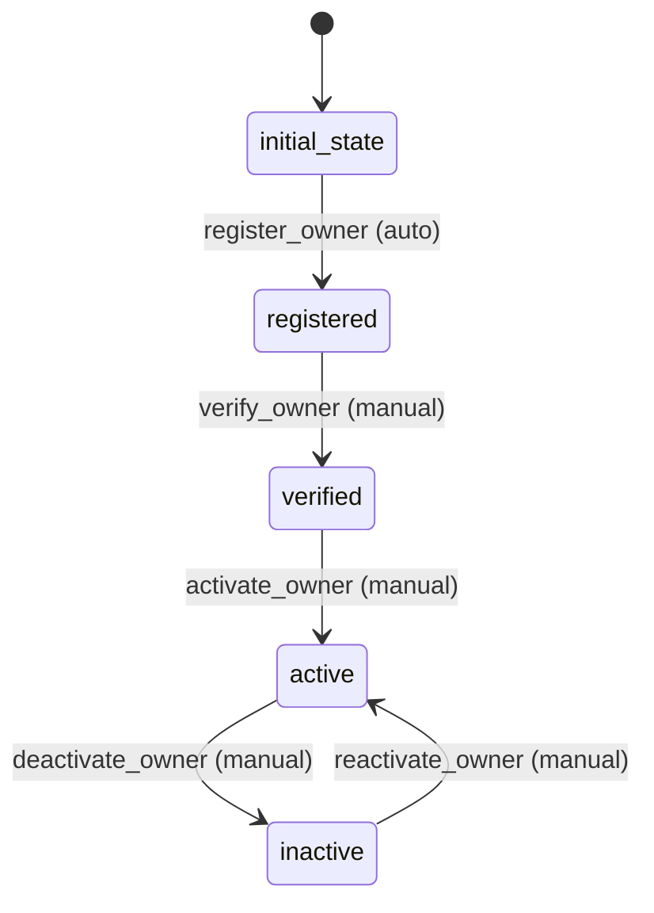

# Owner Workflow

## States
- **initial_state**: Starting state for new owners
- **registered**: Owner has completed registration
- **verified**: Owner has passed background verification
- **active**: Owner is actively adopting pets
- **inactive**: Owner account is inactive

## Transitions

### initial_state → registered
- **Name**: register_owner
- **Type**: Automatic
- **Processors**: OwnerRegistrationProcessor
- **Criteria**: None

### registered → verified
- **Name**: verify_owner
- **Type**: Manual
- **Processors**: OwnerVerificationProcessor
- **Criteria**: OwnerEligibilityCriterion

### verified → active
- **Name**: activate_owner
- **Type**: Manual
- **Processors**: None
- **Criteria**: None

### active → inactive
- **Name**: deactivate_owner
- **Type**: Manual
- **Processors**: OwnerDeactivationProcessor
- **Criteria**: None

### inactive → active
- **Name**: reactivate_owner
- **Type**: Manual
- **Processors**: None
- **Criteria**: None

## Processors

### OwnerRegistrationProcessor
- **Entity**: Owner
- **Purpose**: Process new owner registration
- **Input**: New owner entity
- **Output**: Registered owner
- **Pseudocode**:
```
process(owner):
    validate owner information
    set registration date
    send welcome email
    initialize verification status
    return updated owner
```

### OwnerVerificationProcessor
- **Entity**: Owner
- **Purpose**: Complete owner background verification
- **Input**: Owner entity with verification details
- **Output**: Verified owner
- **Pseudocode**:
```
process(owner):
    perform background check
    verify contact information
    update verification status
    send verification confirmation
    return updated owner
```

### OwnerDeactivationProcessor
- **Entity**: Owner
- **Purpose**: Deactivate owner account
- **Input**: Owner entity
- **Output**: Deactivated owner
- **Pseudocode**:
```
process(owner):
    cancel any pending adoptions (null transition)
    archive owner data
    send deactivation notice
    return updated owner
```

## Criteria

### OwnerEligibilityCriterion
- **Purpose**: Check if owner meets verification requirements
- **Pseudocode**:
```
check(owner):
    return owner.email != null AND 
           owner.firstName != null AND 
           owner.lastName != null AND
           owner.address != null
```

## Mermaid State Diagram


```mermaid
stateDiagram-v2
    [*] --> initial_state
    initial_state --> registered : register_owner (auto)
    registered --> verified : verify_owner (manual)
    verified --> active : activate_owner (manual)
    active --> inactive : deactivate_owner (manual)
    inactive --> active : reactivate_owner (manual)
```
