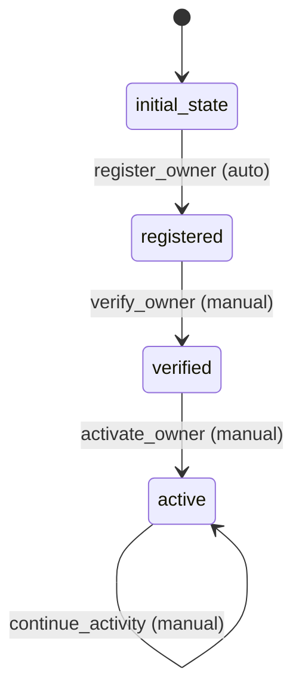

# Owner Workflow

## States
- **initial_state**: Starting state for new owners
- **registered**: Owner has registered but not verified
- **verified**: Owner has been verified and can adopt pets
- **active**: Owner is actively using the system

## Transitions

### initial_state → registered
- **Name**: register_owner
- **Manual**: false (automatic)
- **Processors**: OwnerRegistrationProcessor
- **Criteria**: None

### registered → verified
- **Name**: verify_owner
- **Manual**: true
- **Processors**: OwnerVerificationProcessor
- **Criteria**: OwnerEligibilityCriterion

### verified → active
- **Name**: activate_owner
- **Manual**: true
- **Processors**: None
- **Criteria**: None

## Mermaid State Diagram

```mermaid
stateDiagram-v2
    [*] --> initial_state
    initial_state --> registered : register_owner (auto)
    registered --> verified : verify_owner (manual)
    verified --> active : activate_owner (manual)
    active --> active : continue_activity (manual)
```

## Processors

### OwnerRegistrationProcessor
- **Entity**: Owner
- **Purpose**: Register new owner and validate basic information
- **Input**: New Owner entity
- **Output**: Validated Owner entity
- **Pseudocode**:
```
process(owner):
    validate owner.email format
    validate owner.firstName and lastName not empty
    validate owner.phone format
    check email uniqueness
    return owner
```

### OwnerVerificationProcessor
- **Entity**: Owner
- **Purpose**: Verify owner eligibility for pet adoption
- **Input**: Owner entity
- **Output**: Verified Owner entity
- **Pseudocode**:
```
process(owner):
    verify owner age >= 18
    validate address information
    perform background check (simulated)
    return owner
```

## Criteria

### OwnerEligibilityCriterion
- **Purpose**: Check if owner meets eligibility requirements
- **Pseudocode**:
```
check(owner):
    age = calculate_age(owner.dateOfBirth)
    return age >= 18 AND owner.email is valid AND owner.address is not empty
```
