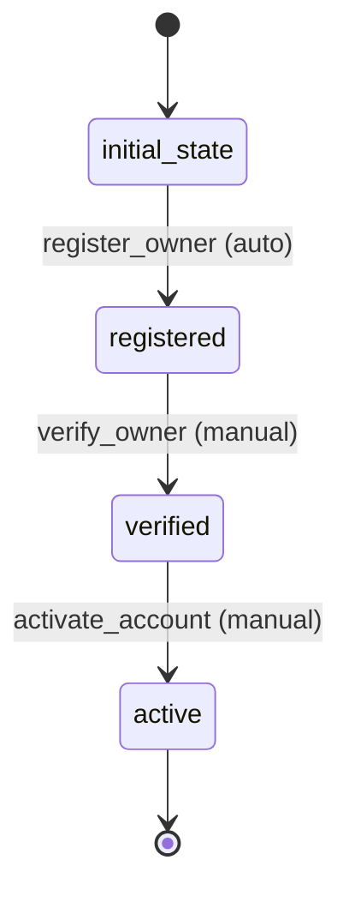

# Owner Workflow

## States
- **initial_state**: Starting state for new owners
- **registered**: Owner has created an account
- **verified**: Owner's identity and eligibility confirmed
- **active**: Owner can make purchases and adoptions

## Transitions

### initial_state → registered
- **Name**: register_owner
- **Type**: Automatic
- **Processors**: OwnerRegistrationProcessor
- **Criteria**: None

### registered → verified
- **Name**: verify_owner
- **Type**: Manual
- **Processors**: OwnerVerificationProcessor
- **Criteria**: OwnerEligibilityCriterion

### verified → active
- **Name**: activate_account
- **Type**: Manual
- **Processors**: None
- **Criteria**: None

## Processors

### OwnerRegistrationProcessor
- **Entity**: Owner
- **Purpose**: Process new owner registration and validate basic information
- **Input**: New owner entity
- **Output**: Registered owner
- **Pseudocode**:
  ```
  process(owner):
    validate email format and uniqueness
    validate phone number format
    calculate age from dateOfBirth
    validate age >= 18
    send welcome email
    return owner
  ```

### OwnerVerificationProcessor
- **Entity**: Owner
- **Purpose**: Verify owner identity and set verification status
- **Input**: Owner entity with verification documents
- **Output**: Verified owner
- **Pseudocode**:
  ```
  process(owner, verificationData):
    validate identity documents
    perform background check if required
    set verified = true
    send verification confirmation
    return owner
  ```

## Criteria

### OwnerEligibilityCriterion
- **Purpose**: Check if owner meets verification requirements
- **Pseudocode**:
  ```
  check(owner):
    return owner.age >= 18 AND
           owner.email is valid AND
           owner.phone is valid
  ```

## Mermaid State Diagram


```mermaid
stateDiagram-v2
    [*] --> initial_state
    initial_state --> registered : register_owner (auto)
    registered --> verified : verify_owner (manual)
    verified --> active : activate_account (manual)
    active --> [*]
```
