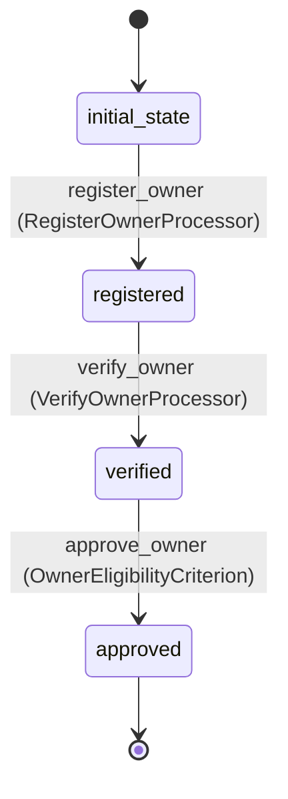

# Owner Workflow

## States
- `initial_state`: Starting state when owner is first registered
- `registered`: Owner has completed registration
- `verified`: Owner's information has been verified
- `approved`: Owner is approved for pet adoption

## Transitions

### initial_state → registered
- **Name**: `register_owner`
- **Type**: Automatic
- **Processor**: `RegisterOwnerProcessor`
- **Purpose**: Complete owner registration

### registered → verified
- **Name**: `verify_owner`
- **Type**: Manual
- **Processor**: `VerifyOwnerProcessor`
- **Purpose**: Verify owner's contact information and address

### verified → approved
- **Name**: `approve_owner`
- **Type**: Manual
- **Criterion**: `OwnerEligibilityCriterion`
- **Purpose**: Approve owner for pet adoption

## Processors

### RegisterOwnerProcessor
- **Entity**: Owner
- **Input**: New owner registration data
- **Purpose**: Validate and complete owner registration
- **Output**: Registered owner
- **Pseudocode**:
```
process(owner):
    validate owner.email format
    validate owner.phone format
    validate owner.address is complete
    return owner
```

### VerifyOwnerProcessor
- **Entity**: Owner
- **Input**: Owner with verification request
- **Purpose**: Verify owner's contact information
- **Output**: Verified owner
- **Pseudocode**:
```
process(owner):
    // Simulate verification process
    // In real system: send verification email, check address
    return owner
```

## Criteria

### OwnerEligibilityCriterion
- **Purpose**: Check if owner meets adoption requirements
- **Pseudocode**:
```
check(owner):
    return owner.email is not null AND 
           owner.phone is not null AND 
           owner.address is not null
```

## Mermaid State Diagram


```mermaid
stateDiagram-v2
    [*] --> initial_state
    initial_state --> registered : register_owner (RegisterOwnerProcessor)
    registered --> verified : verify_owner (VerifyOwnerProcessor)
    verified --> approved : approve_owner (OwnerEligibilityCriterion)
    approved --> [*]
```
