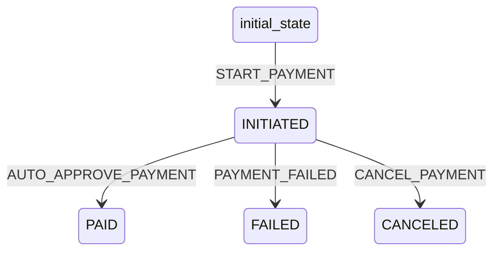

# Payment Workflow

## States
- **initial_state**: Starting state
- **INITIATED**: Payment started
- **PAID**: Payment completed successfully
- **FAILED**: Payment failed
- **CANCELED**: Payment canceled

## Transitions



## Transition Details

### START_PAYMENT (initial_state → INITIATED)
- **Type**: Automatic
- **Processors**: None
- **Criteria**: None

### AUTO_APPROVE_PAYMENT (INITIATED → PAID)
- **Type**: Manual
- **Processors**: AutoApprovePaymentProcessor
- **Criteria**: None

### PAYMENT_FAILED (INITIATED → FAILED)
- **Type**: Manual
- **Processors**: None
- **Criteria**: None

### CANCEL_PAYMENT (INITIATED → CANCELED)
- **Type**: Manual
- **Processors**: None
- **Criteria**: None

## Processors

### AutoApprovePaymentProcessor
- **Entity**: Payment
- **Purpose**: Auto-approve dummy payment after 3 seconds
- **Input**: Payment in INITIATED status
- **Output**: Payment with PAID status
- **Pseudocode**:
```
process(payment):
    wait approximately 3 seconds
    set payment.status = "PAID"
    update payment.updatedAt
    return payment
```
