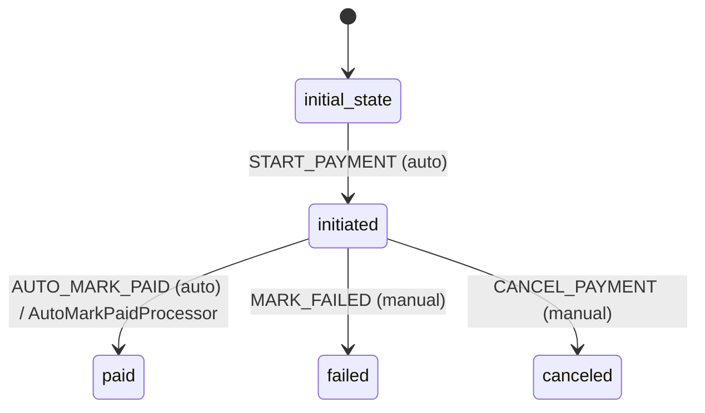

# Payment Workflow

## States
- **initial_state**: Entry point
- **initiated**: Payment started
- **paid**: Payment successful
- **failed**: Payment failed
- **canceled**: Payment canceled

## Transitions

### initial_state → initiated
- **Name**: START_PAYMENT
- **Type**: Automatic
- **Processors**: None
- **Criteria**: None

### initiated → paid
- **Name**: AUTO_MARK_PAID
- **Type**: Automatic (after 3 seconds)
- **Processors**: AutoMarkPaidProcessor
- **Criteria**: None

### initiated → failed
- **Name**: MARK_FAILED
- **Type**: Manual
- **Processors**: None
- **Criteria**: None

### initiated → canceled
- **Name**: CANCEL_PAYMENT
- **Type**: Manual
- **Processors**: None
- **Criteria**: None

## Mermaid State Diagram


## Processors

### AutoMarkPaidProcessor
- **Entity**: Payment
- **Purpose**: Automatically mark payment as paid after 3 seconds (dummy payment)
- **Input**: Payment in initiated state
- **Output**: Payment marked as paid
- **Transition**: AUTO_MARK_PAID

**Pseudocode for process() method:**
```
function process(paymentWithMetadata):
    payment = paymentWithMetadata.entity
    
    // Simulate 3-second delay for dummy payment
    sleep(3000)
    
    // Update payment status
    payment.updatedAt = currentTimestamp()
    
    return paymentWithMetadata
```

## Criteria
None required for Payment workflow.

## Business Rules
- Dummy payment auto-approves after 3 seconds
- Only PAID payments can be used for order creation
- Failed/canceled payments cannot be reused
