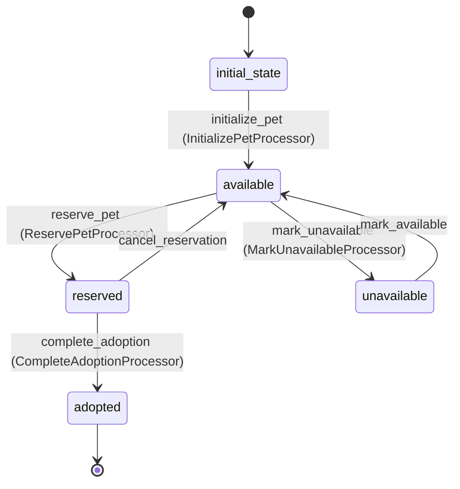

# Pet Workflow

## States
- **initial_state**: Starting state for new pets
- **available**: Pet is available for adoption/sale
- **reserved**: Pet is reserved by a customer
- **adopted**: Pet has been successfully adopted/sold
- **unavailable**: Pet is temporarily unavailable (medical, etc.)

## Transitions

### initial_state → available
- **Name**: initialize_pet
- **Type**: Automatic
- **Processor**: InitializePetProcessor
- **Purpose**: Set up new pet in the system

### available → reserved
- **Name**: reserve_pet
- **Type**: Manual
- **Processor**: ReservePetProcessor
- **Purpose**: Reserve pet for a customer

### reserved → adopted
- **Name**: complete_adoption
- **Type**: Manual
- **Processor**: CompleteAdoptionProcessor
- **Purpose**: Finalize the adoption process

### reserved → available
- **Name**: cancel_reservation
- **Type**: Manual
- **Purpose**: Cancel reservation and make pet available again

### available → unavailable
- **Name**: mark_unavailable
- **Type**: Manual
- **Processor**: MarkUnavailableProcessor
- **Purpose**: Temporarily remove pet from availability

### unavailable → available
- **Name**: mark_available
- **Type**: Manual
- **Purpose**: Return pet to available status

## Processors

### InitializePetProcessor
- **Entity**: Pet
- **Input**: New pet data
- **Purpose**: Validate pet information and set initial availability
- **Output**: Pet ready for adoption
- **Pseudocode**:
```
process(pet):
    validate pet.isValid()
    set default values for optional fields
    log pet creation
    return pet
```

### ReservePetProcessor
- **Entity**: Pet
- **Input**: Pet with reservation details
- **Purpose**: Mark pet as reserved and create reservation record
- **Output**: Reserved pet
- **Pseudocode**:
```
process(pet):
    validate pet is available
    set reservation timestamp
    log reservation action
    return pet
```

### CompleteAdoptionProcessor
- **Entity**: Pet
- **Input**: Pet with adoption completion data
- **Purpose**: Finalize adoption and update related records
- **Output**: Adopted pet
- **Pseudocode**:
```
process(pet):
    validate adoption requirements met
    set adoption completion timestamp
    log successful adoption
    return pet
```

### MarkUnavailableProcessor
- **Entity**: Pet
- **Input**: Pet with unavailability reason
- **Purpose**: Temporarily remove pet from availability
- **Output**: Unavailable pet
- **Pseudocode**:
```
process(pet):
    set unavailability reason
    set unavailable timestamp
    log unavailability action
    return pet
```

## Mermaid State Diagram


