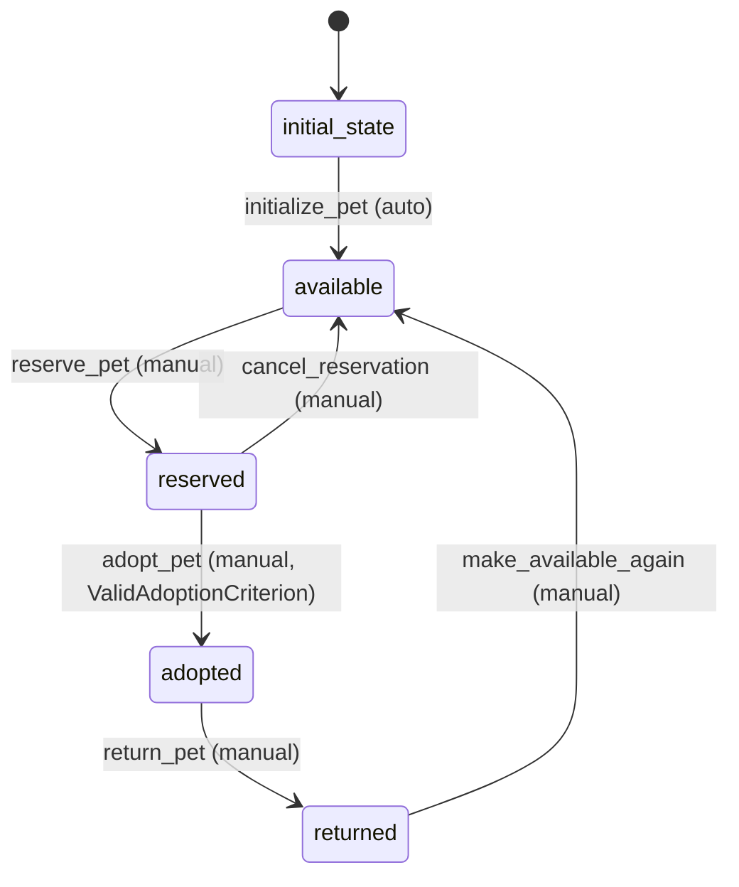

# Pet Workflow

## States
- **initial_state**: Starting state for new pets
- **available**: Pet is ready for adoption
- **reserved**: Pet is reserved for potential adopter
- **adopted**: Pet has been successfully adopted
- **returned**: Pet was returned after adoption

## Transitions

### initial_state → available
- **Name**: initialize_pet
- **Manual**: false (automatic)
- **Processors**: [InitializePetProcessor]
- **Criteria**: none

### available → reserved
- **Name**: reserve_pet
- **Manual**: true
- **Processors**: [ReservePetProcessor]
- **Criteria**: none

### reserved → available
- **Name**: cancel_reservation
- **Manual**: true
- **Processors**: none
- **Criteria**: none

### reserved → adopted
- **Name**: adopt_pet
- **Manual**: true
- **Processors**: [AdoptPetProcessor]
- **Criteria**: [ValidAdoptionCriterion]

### adopted → returned
- **Name**: return_pet
- **Manual**: true
- **Processors**: [ReturnPetProcessor]
- **Criteria**: none

### returned → available
- **Name**: make_available_again
- **Manual**: true
- **Processors**: [ResetPetProcessor]
- **Criteria**: none

## Processors

### InitializePetProcessor
- **Entity**: Pet
- **Purpose**: Set up new pet for adoption system
- **Input**: Pet entity with basic info
- **Output**: Pet ready for adoption
- **Pseudocode**:
```
process(pet):
    validate pet information
    set arrival date to current date
    log pet registration
    return updated pet
```

### ReservePetProcessor
- **Entity**: Pet
- **Purpose**: Reserve pet for potential adopter
- **Input**: Pet entity and reservation details
- **Output**: Pet marked as reserved
- **Pseudocode**:
```
process(pet):
    set reservation timestamp
    log reservation activity
    return updated pet
```

### AdoptPetProcessor
- **Entity**: Pet
- **Purpose**: Complete pet adoption process
- **Input**: Pet entity and adoption details
- **Output**: Pet marked as adopted
- **Pseudocode**:
```
process(pet):
    set adoption date
    create adoption record (updates Adoption entity)
    log successful adoption
    return updated pet
```

### ReturnPetProcessor
- **Entity**: Pet
- **Purpose**: Handle pet return after adoption
- **Input**: Pet entity and return reason
- **Output**: Pet marked as returned
- **Pseudocode**:
```
process(pet):
    set return date and reason
    update adoption record (updates Adoption entity)
    log return activity
    return updated pet
```

### ResetPetProcessor
- **Entity**: Pet
- **Purpose**: Reset returned pet for re-adoption
- **Input**: Pet entity
- **Output**: Pet ready for adoption again
- **Pseudocode**:
```
process(pet):
    clear previous adoption data
    update medical history if needed
    set as available for adoption
    return updated pet
```

## Criteria

### ValidAdoptionCriterion
- **Purpose**: Validate adoption requirements are met
- **Pseudocode**:
```
check(pet):
    return pet is reserved AND 
           adoption fee is paid AND
           adopter is verified
```

## Mermaid State Diagram


