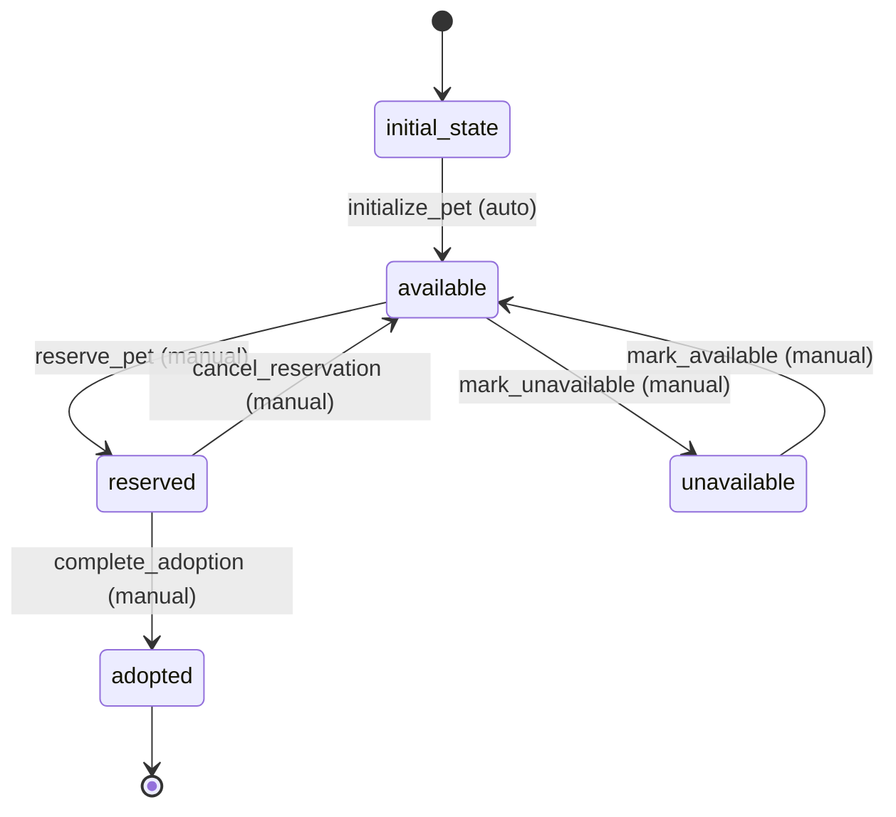

# Pet Workflow

## States
- **initial_state**: Starting state
- **available**: Pet is available for adoption/sale
- **reserved**: Pet is reserved by a customer
- **adopted**: Pet has been adopted/sold
- **unavailable**: Pet is temporarily unavailable

## Transitions

### initial_state → available
- **Name**: initialize_pet
- **Type**: Automatic
- **Processors**: PetInitializationProcessor
- **Criteria**: None

### available → reserved
- **Name**: reserve_pet
- **Type**: Manual
- **Processors**: PetReservationProcessor
- **Criteria**: None

### reserved → adopted
- **Name**: complete_adoption
- **Type**: Manual
- **Processors**: PetAdoptionProcessor
- **Criteria**: None

### reserved → available
- **Name**: cancel_reservation
- **Type**: Manual
- **Processors**: None
- **Criteria**: None

### available → unavailable
- **Name**: mark_unavailable
- **Type**: Manual
- **Processors**: None
- **Criteria**: None

### unavailable → available
- **Name**: mark_available
- **Type**: Manual
- **Processors**: None
- **Criteria**: None

## Mermaid State Diagram


## Processors

### PetInitializationProcessor
- **Entity**: Pet
- **Purpose**: Initialize pet with default values and validate data
- **Input**: New pet entity
- **Output**: Validated pet entity
- **Pseudocode**:
```
process(pet):
    validate pet.isValid()
    set default values if missing
    return pet
```

### PetReservationProcessor
- **Entity**: Pet
- **Purpose**: Mark pet as reserved and record reservation details
- **Input**: Pet entity with reservation info
- **Output**: Updated pet entity
- **Pseudocode**:
```
process(pet):
    validate pet is in available state
    update reservation timestamp
    return pet
```

### PetAdoptionProcessor
- **Entity**: Pet
- **Purpose**: Complete adoption process and update related records
- **Input**: Pet entity with adoption details
- **Output**: Updated pet entity
- **Pseudocode**:
```
process(pet):
    validate pet is in reserved state
    update adoption timestamp
    create adoption record
    return pet
```
