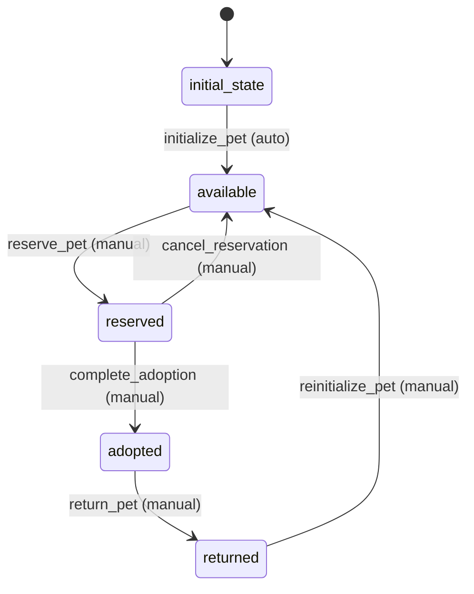

# Pet Workflow

## States
- **initial_state**: Starting state for new pets
- **available**: Pet is ready for adoption
- **reserved**: Pet is reserved for potential adopter
- **adopted**: Pet has been successfully adopted
- **returned**: Pet was returned after adoption

## Transitions

### initial_state → available
- **Name**: initialize_pet
- **Type**: Automatic
- **Processors**: PetInitializationProcessor
- **Criteria**: None

### available → reserved
- **Name**: reserve_pet
- **Type**: Manual
- **Processors**: PetReservationProcessor
- **Criteria**: PetAvailabilityCriterion

### reserved → adopted
- **Name**: complete_adoption
- **Type**: Manual
- **Processors**: PetAdoptionProcessor
- **Criteria**: None

### reserved → available
- **Name**: cancel_reservation
- **Type**: Manual
- **Processors**: None
- **Criteria**: None

### adopted → returned
- **Name**: return_pet
- **Type**: Manual
- **Processors**: PetReturnProcessor
- **Criteria**: None

## Processors

### PetInitializationProcessor
- **Entity**: Pet
- **Purpose**: Initialize pet data and set up for adoption
- **Input**: New pet entity
- **Output**: Pet ready for adoption
- **Pseudocode**:
```
process(pet):
    validate pet data
    set arrival date to current time
    calculate adoption fee based on species and age
    update pet health records
    return updated pet
```

### PetReservationProcessor
- **Entity**: Pet
- **Purpose**: Reserve pet for potential adopter
- **Input**: Pet entity with reservation details
- **Output**: Reserved pet
- **Pseudocode**:
```
process(pet):
    mark pet as reserved
    set reservation timestamp
    create adoption record (null transition)
    return updated pet
```

### PetAdoptionProcessor
- **Entity**: Pet
- **Purpose**: Complete pet adoption process
- **Input**: Pet entity with adoption details
- **Output**: Adopted pet
- **Pseudocode**:
```
process(pet):
    finalize adoption paperwork
    update adoption record status (null transition)
    set adoption date
    return updated pet
```

### PetReturnProcessor
- **Entity**: Pet
- **Purpose**: Handle pet return after adoption
- **Input**: Pet entity with return details
- **Output**: Returned pet ready for re-adoption
- **Pseudocode**:
```
process(pet):
    record return reason
    update adoption record (null transition)
    reset pet for re-adoption
    schedule health check
    return updated pet
```

## Criteria

### PetAvailabilityCriterion
- **Purpose**: Check if pet is available for reservation
- **Pseudocode**:
```
check(pet):
    return pet.healthStatus == "healthy" AND 
           pet.vaccinated == true
```

## Mermaid State Diagram


```mermaid
stateDiagram-v2
    [*] --> initial_state
    initial_state --> available : initialize_pet (auto)
    available --> reserved : reserve_pet (manual)
    reserved --> adopted : complete_adoption (manual)
    reserved --> available : cancel_reservation (manual)
    adopted --> returned : return_pet (manual)
    returned --> available : reinitialize_pet (manual)
```
