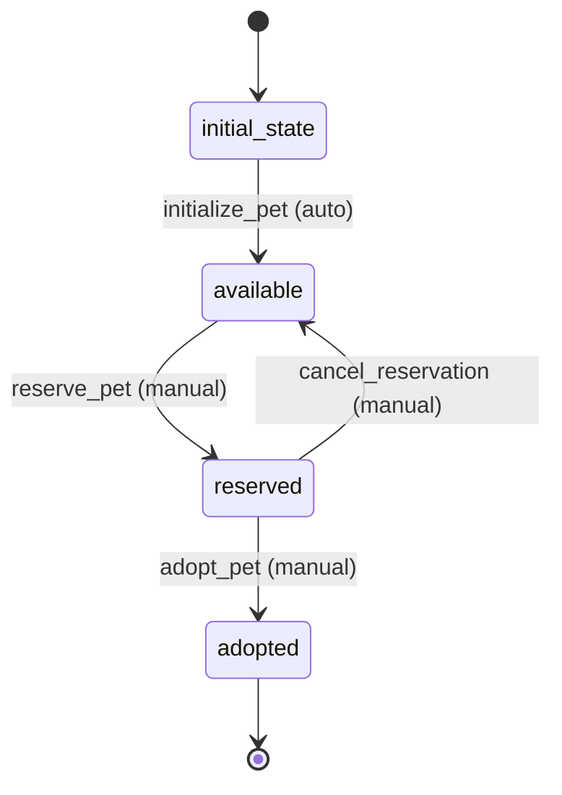

# Pet Workflow

## States
- **initial_state**: Starting state for new pets
- **available**: Pet is available for adoption/purchase
- **reserved**: Pet is reserved by a customer
- **adopted**: Pet has been adopted/purchased

## Transitions

### initial_state → available
- **Name**: initialize_pet
- **Manual**: false (automatic)
- **Processors**: PetInitializationProcessor
- **Criteria**: None

### available → reserved
- **Name**: reserve_pet
- **Manual**: true
- **Processors**: PetReservationProcessor
- **Criteria**: PetAvailabilityCriterion

### reserved → adopted
- **Name**: adopt_pet
- **Manual**: true
- **Processors**: PetAdoptionProcessor
- **Criteria**: None

### reserved → available
- **Name**: cancel_reservation
- **Manual**: true
- **Processors**: ReservationCancellationProcessor
- **Criteria**: None

## Mermaid State Diagram

```mermaid
stateDiagram-v2
    [*] --> initial_state
    initial_state --> available : initialize_pet (auto)
    available --> reserved : reserve_pet (manual)
    reserved --> adopted : adopt_pet (manual)
    reserved --> available : cancel_reservation (manual)
    adopted --> [*]
```

## Processors

### PetInitializationProcessor
- **Entity**: Pet
- **Purpose**: Initialize pet data and validate required fields
- **Input**: New Pet entity
- **Output**: Validated Pet entity
- **Pseudocode**:
```
process(pet):
    validate pet.name is not empty
    validate pet.species is not empty
    validate pet.age > 0
    validate pet.price > 0
    set default values if needed
    return pet
```

### PetReservationProcessor
- **Entity**: Pet
- **Purpose**: Reserve pet for a customer and create order
- **Input**: Pet entity with reservation details
- **Output**: Updated Pet entity
- **Pseudocode**:
```
process(pet):
    create new Order entity with pet details
    update pet.orderId with new order ID
    return pet
```

### PetAdoptionProcessor
- **Entity**: Pet
- **Purpose**: Complete pet adoption and update relationships
- **Input**: Pet entity with adoption details
- **Output**: Updated Pet entity
- **Pseudocode**:
```
process(pet):
    get order from pet.orderId
    update order state to completed
    update pet.ownerId with order.ownerId
    update owner's petIds list
    return pet
```

### ReservationCancellationProcessor
- **Entity**: Pet
- **Purpose**: Cancel pet reservation and cleanup order
- **Input**: Pet entity
- **Output**: Updated Pet entity
- **Pseudocode**:
```
process(pet):
    get order from pet.orderId
    update order state to cancelled
    clear pet.orderId
    return pet
```

## Criteria

### PetAvailabilityCriterion
- **Purpose**: Check if pet is available for reservation
- **Pseudocode**:
```
check(pet):
    return pet.ownerId is null AND pet.orderId is null
```
