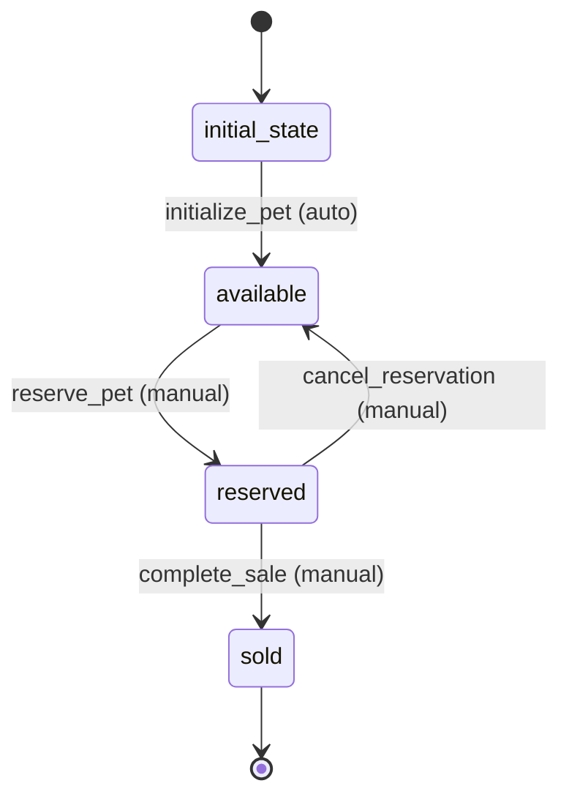

# Pet Workflow

## States
- **initial_state**: Starting state for new pets
- **available**: Pet is ready for adoption/purchase
- **reserved**: Pet is temporarily held for a customer
- **sold**: Pet has been successfully adopted/purchased

## Transitions

### initial_state → available
- **Name**: initialize_pet
- **Type**: Automatic
- **Processors**: PetInitializationProcessor
- **Criteria**: None

### available → reserved
- **Name**: reserve_pet
- **Type**: Manual
- **Processors**: PetReservationProcessor
- **Criteria**: PetAvailabilityCriterion

### reserved → available
- **Name**: cancel_reservation
- **Type**: Manual
- **Processors**: None
- **Criteria**: None

### reserved → sold
- **Name**: complete_sale
- **Type**: Manual
- **Processors**: PetSaleProcessor
- **Criteria**: None

## Processors

### PetInitializationProcessor
- **Entity**: Pet
- **Purpose**: Initialize pet data and validate health status
- **Input**: New pet entity
- **Output**: Validated pet ready for adoption
- **Pseudocode**:
  ```
  process(pet):
    validate pet.healthStatus is not empty
    validate pet.age > 0
    validate pet.price >= 0
    set default values if needed
    return pet
  ```

### PetReservationProcessor
- **Entity**: Pet
- **Purpose**: Mark pet as reserved and create reservation record
- **Input**: Pet entity and reservation details
- **Output**: Reserved pet
- **Pseudocode**:
  ```
  process(pet, reservationData):
    create reservation record with expiry time
    update pet availability status
    notify store of reservation
    return pet
  ```

### PetSaleProcessor
- **Entity**: Pet
- **Purpose**: Complete pet sale and update inventory
- **Input**: Pet entity and sale details
- **Output**: Sold pet
- **Pseudocode**:
  ```
  process(pet, saleData):
    validate payment information
    create sale record
    update store inventory
    send adoption confirmation
    return pet
  ```

## Criteria

### PetAvailabilityCriterion
- **Purpose**: Check if pet is available for reservation
- **Pseudocode**:
  ```
  check(pet):
    return pet.healthStatus == "healthy" AND 
           pet.vaccinated == true AND
           no active reservations exist
  ```

## Mermaid State Diagram


```mermaid
stateDiagram-v2
    [*] --> initial_state
    initial_state --> available : initialize_pet (auto)
    available --> reserved : reserve_pet (manual)
    reserved --> available : cancel_reservation (manual)
    reserved --> sold : complete_sale (manual)
    sold --> [*]
```
