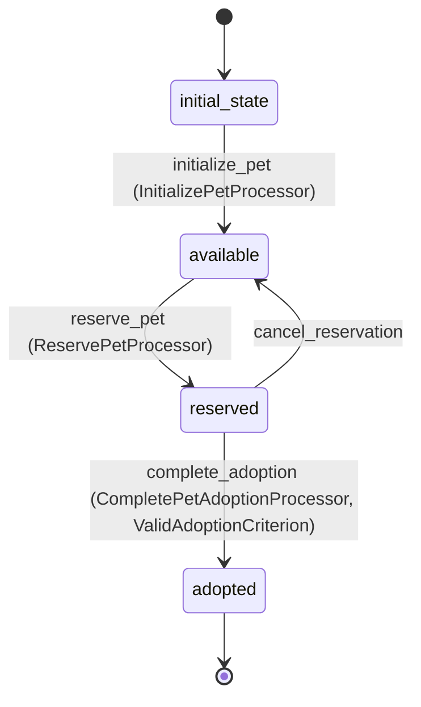

# Pet Workflow

## States
- `initial_state`: Starting state when pet is first created
- `available`: Pet is ready for adoption
- `reserved`: Pet is reserved for a potential adopter
- `adopted`: Pet has been successfully adopted

## Transitions

### initial_state → available
- **Name**: `initialize_pet`
- **Type**: Automatic
- **Processor**: `InitializePetProcessor`
- **Purpose**: Set up pet for adoption availability

### available → reserved
- **Name**: `reserve_pet`
- **Type**: Manual
- **Processor**: `ReservePetProcessor`
- **Purpose**: Reserve pet for potential adopter

### reserved → available
- **Name**: `cancel_reservation`
- **Type**: Manual
- **Purpose**: Cancel reservation and make pet available again

### reserved → adopted
- **Name**: `complete_adoption`
- **Type**: Manual
- **Processor**: `CompletePetAdoptionProcessor`
- **Criterion**: `ValidAdoptionCriterion`
- **Purpose**: Finalize pet adoption

## Processors

### InitializePetProcessor
- **Entity**: Pet
- **Input**: New pet data
- **Purpose**: Validate pet information and set initial availability
- **Output**: Pet ready for adoption
- **Pseudocode**:
```
process(pet):
    validate pet.healthStatus is "healthy"
    set pet.arrivalDate to current timestamp
    return pet
```

### ReservePetProcessor
- **Entity**: Pet
- **Input**: Pet with reservation request
- **Purpose**: Mark pet as reserved and create adoption record
- **Output**: Reserved pet
- **Pseudocode**:
```
process(pet):
    create new Adoption entity with pet.petId
    set adoption.applicationDate to current timestamp
    return pet
```

### CompletePetAdoptionProcessor
- **Entity**: Pet
- **Input**: Pet with completed adoption
- **Purpose**: Finalize adoption and update pet status
- **Output**: Adopted pet
- **Pseudocode**:
```
process(pet):
    find adoption by pet.petId
    set adoption.completionDate to current timestamp
    return pet
```

## Criteria

### ValidAdoptionCriterion
- **Purpose**: Verify adoption can be completed
- **Pseudocode**:
```
check(pet):
    find adoption by pet.petId
    return adoption exists AND adoption.approvalDate is not null
```

## Mermaid State Diagram


```mermaid
stateDiagram-v2
    [*] --> initial_state
    initial_state --> available : initialize_pet (InitializePetProcessor)
    available --> reserved : reserve_pet (ReservePetProcessor)
    reserved --> available : cancel_reservation
    reserved --> adopted : complete_adoption (CompletePetAdoptionProcessor, ValidAdoptionCriterion)
    adopted --> [*]
```
