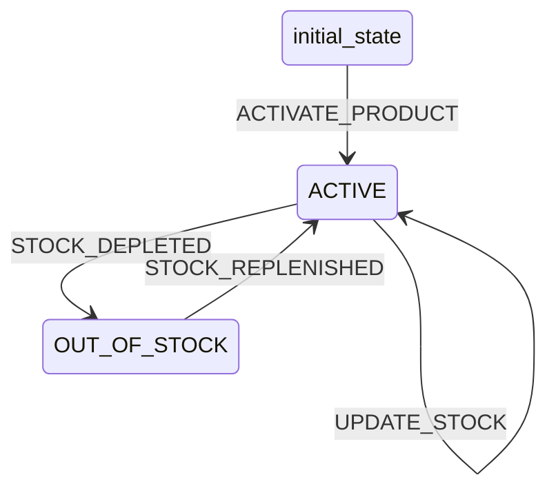

# Product Workflow

## States
- **initial_state**: Starting state
- **ACTIVE**: Product is available for sale
- **OUT_OF_STOCK**: Product has zero quantity available

## Transitions



## Transition Details

### ACTIVATE_PRODUCT (initial_state → ACTIVE)
- **Type**: Automatic
- **Processors**: None
- **Criteria**: None

### STOCK_DEPLETED (ACTIVE → OUT_OF_STOCK)
- **Type**: Manual
- **Processors**: None
- **Criteria**: StockDepletedCriterion

### STOCK_REPLENISHED (OUT_OF_STOCK → ACTIVE)
- **Type**: Manual
- **Processors**: None
- **Criteria**: StockAvailableCriterion

### UPDATE_STOCK (ACTIVE → ACTIVE)
- **Type**: Manual
- **Processors**: UpdateStockProcessor
- **Criteria**: None

## Processors

### UpdateStockProcessor
- **Entity**: Product
- **Purpose**: Update product stock quantity
- **Input**: Product with new quantityAvailable
- **Output**: Updated product
- **Pseudocode**:
```
process(product):
    validate quantityAvailable >= 0
    update product.quantityAvailable
    update product.updatedAt
    return product
```

## Criteria

### StockDepletedCriterion
- **Purpose**: Check if product stock is depleted
- **Pseudocode**:
```
check(product):
    return product.quantityAvailable <= 0
```

### StockAvailableCriterion
- **Purpose**: Check if product has available stock
- **Pseudocode**:
```
check(product):
    return product.quantityAvailable > 0
```
