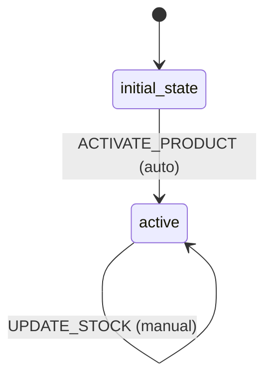

# Product Workflow

## States
- **initial_state**: Entry point
- **active**: Product is available for sale

## Transitions

### initial_state → active
- **Name**: ACTIVATE_PRODUCT
- **Type**: Automatic
- **Processors**: None
- **Criteria**: None

## Mermaid State Diagram


## Processors

### UpdateStockProcessor
- **Entity**: Product
- **Purpose**: Update product stock quantity
- **Input**: Product with new quantityAvailable
- **Output**: Updated Product
- **Transition**: UPDATE_STOCK (null transition - stays in active)

**Pseudocode for process() method:**
```
function process(productWithMetadata):
    product = productWithMetadata.entity
    
    // Validate stock quantity is non-negative
    if product.quantityAvailable < 0:
        throw ValidationException("Stock cannot be negative")
    
    // Update timestamp
    product.updatedAt = currentTimestamp()
    
    return productWithMetadata
```

## Criteria
None required for Product workflow.

## Business Rules
- Products start in active state and remain active
- Stock updates are manual operations
- No complex state transitions needed for demo
