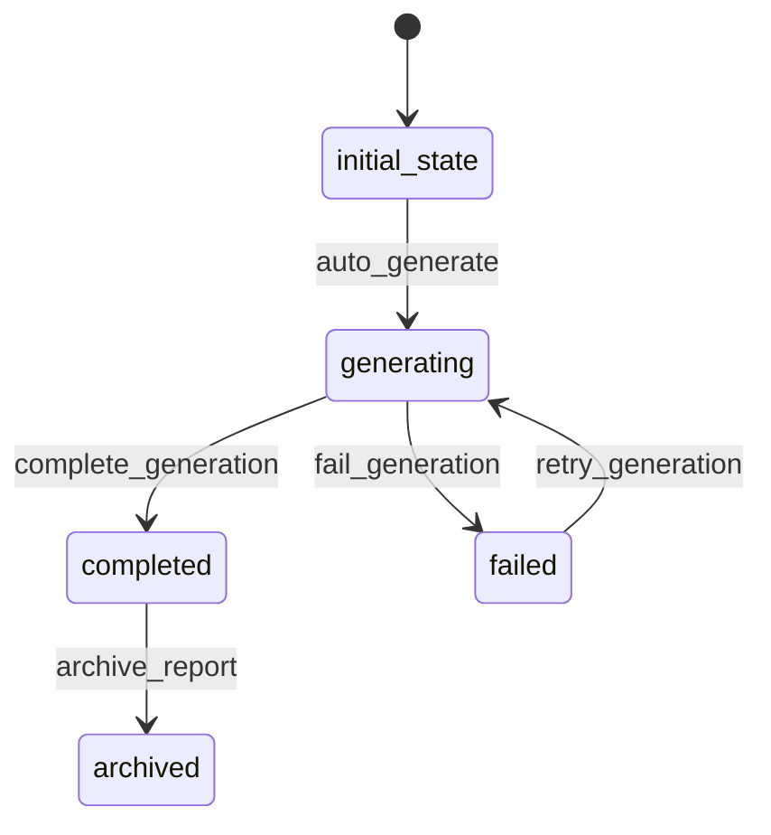

# Report Workflow

## States
- **initial_state**: System entry point
- **generating**: Report is being generated
- **completed**: Report generation completed successfully
- **failed**: Report generation failed
- **archived**: Report has been archived

## Transitions



## Processors

### ReportGenerationProcessor
- **Entity**: Report
- **Purpose**: Initialize report generation process
- **Input**: Report entity with generation parameters
- **Output**: Report with generation metadata
- **Pseudocode**:
```
process(report):
    set generationDate to current timestamp
    validate user has ADMIN or REVIEWER role
    validate dataRange is within limits (max 2 years)
    parse and validate parameters JSON
    return report
```

### ReportCompletionProcessor
- **Entity**: Report
- **Purpose**: Finalize successful report generation
- **Input**: Report entity with generated data
- **Output**: Completed report with file path
- **Pseudocode**:
```
process(report):
    generate report file based on type and format
    set filePath to generated file location
    send notification to requester
    return report
```

## Criteria

### ReportPermissionCriterion
- **Purpose**: Check if user can generate reports
- **Pseudocode**:
```
check(report):
    user = get user by generatedBy email
    return user.role == ADMIN OR user.role == REVIEWER
```

### ReportParametersCriterion
- **Purpose**: Validate report parameters
- **Pseudocode**:
```
check(report):
    return reportType is valid AND
           dataRange is valid date range AND
           format is supported AND
           parameters is valid JSON
```
