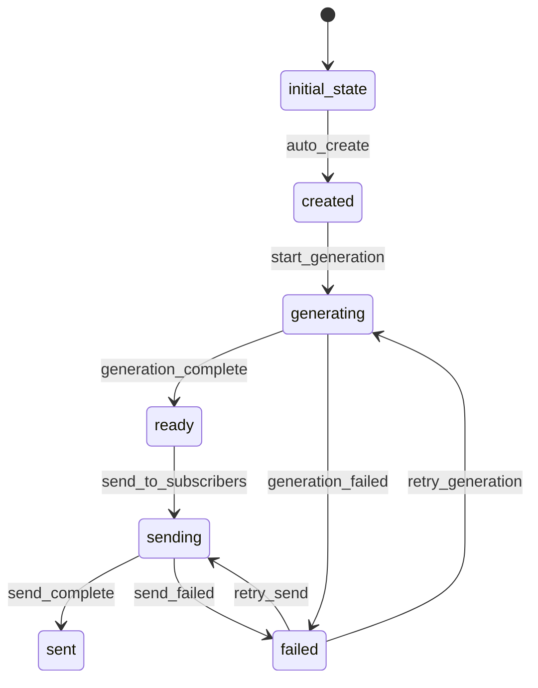

# Report Workflow

## States and Transitions



## Workflow States
- **initial_state**: Starting state (automatic)
- **created**: Report has been created and is ready for generation
- **generating**: Currently generating report content and formatting
- **ready**: Report is generated and ready to be sent
- **sending**: Currently sending report to subscribers
- **sent**: Report has been successfully sent to all subscribers
- **failed**: An error occurred during generation or sending

## Transitions

### auto_create (initial_state → created)
- **Type**: Automatic
- **Processors**: None
- **Criteria**: None

### start_generation (created → generating)
- **Type**: Manual
- **Processors**: ReportContentProcessor
- **Criteria**: None

### generation_complete (generating → ready)
- **Type**: Automatic
- **Processors**: None
- **Criteria**: None

### generation_failed (generating → failed)
- **Type**: Automatic
- **Processors**: None
- **Criteria**: GenerationFailureCriterion

### send_to_subscribers (ready → sending)
- **Type**: Manual
- **Processors**: EmailSendProcessor
- **Criteria**: None

### send_complete (sending → sent)
- **Type**: Automatic
- **Processors**: None
- **Criteria**: None

### send_failed (sending → failed)
- **Type**: Automatic
- **Processors**: None
- **Criteria**: SendFailureCriterion

### retry_generation (failed → generating)
- **Type**: Manual
- **Processors**: ReportContentProcessor
- **Criteria**: None

### retry_send (failed → sending)
- **Type**: Manual
- **Processors**: EmailSendProcessor
- **Criteria**: None

## Processors

### ReportContentProcessor
- **Entity**: Report
- **Input**: Report with basic metadata
- **Purpose**: Generate formatted report content from analysis results
- **Output**: Updated Report with formatted content
- **Pseudocode**:
```
process(report):
    analysisResults = loadAnalysisResults(report.dataSourceId)
    formattedContent = formatReportContent(analysisResults)
    report.summary = generateSummary(analysisResults)
    report.reportFormat = "HTML"
    storeReportContent(report.reportId, formattedContent)
    return report
```

### EmailSendProcessor
- **Entity**: Report
- **Input**: Report with generated content
- **Purpose**: Send report via email to all active subscribers
- **Output**: Updated Report with send statistics
- **Pseudocode**:
```
process(report):
    subscribers = entityService.findByState(Subscriber.class, "active")
    reportContent = loadReportContent(report.reportId)
    sentCount = 0
    for subscriber in subscribers:
        emailService.send(subscriber.email, report.title, reportContent)
        sentCount++
    report.recipientCount = sentCount
    return report
```

## Criteria

### GenerationFailureCriterion
- **Purpose**: Check if report generation failed
- **Pseudocode**:
```
check(report):
    return report.summary == null || hasGenerationError(report.reportId)
```

### SendFailureCriterion
- **Purpose**: Check if email sending failed
- **Pseudocode**:
```
check(report):
    return report.recipientCount == null || report.recipientCount == 0
```
