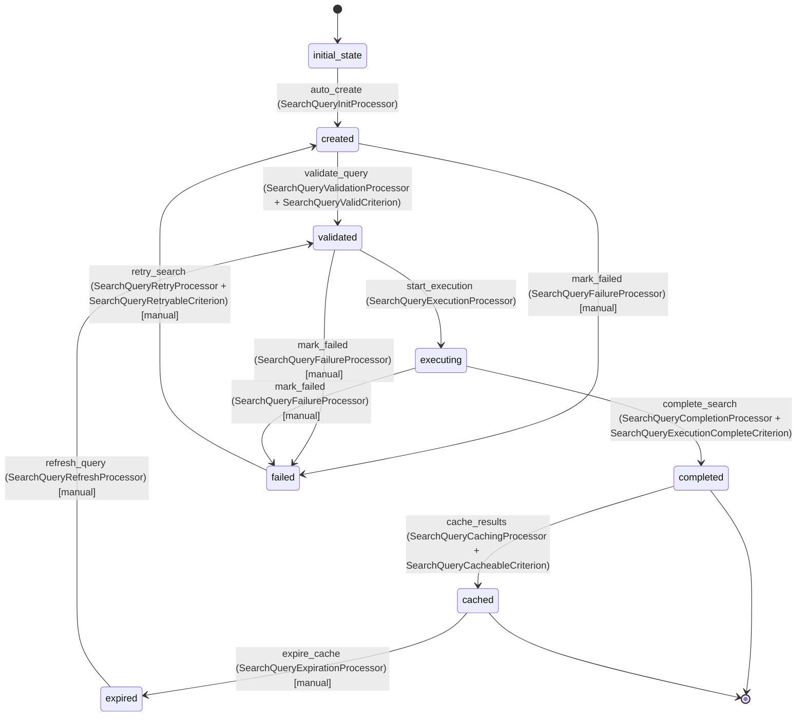

# SearchQuery Workflow

## Overview
The SearchQuery workflow manages the lifecycle of search operations for HN items. It handles query validation, execution, result compilation, and caching for optimal performance.

## Workflow States

### 1. initial_state
- **Description**: Starting state for new search query
- **Purpose**: Entry point for workflow processing

### 2. created
- **Description**: Query has been created with search parameters
- **Purpose**: Initial query setup and validation

### 3. validated
- **Description**: Query parameters have been validated
- **Purpose**: Ensure query is executable before processing

### 4. executing
- **Description**: Search is being executed against the data
- **Purpose**: Active search processing

### 5. completed
- **Description**: Search completed successfully with results
- **Purpose**: Results available for retrieval

### 6. cached
- **Description**: Search results have been cached for reuse
- **Purpose**: Optimize performance for repeated queries

### 7. failed
- **Description**: Search execution failed
- **Purpose**: Handle search errors and enable retry

### 8. expired
- **Description**: Cached results have expired
- **Purpose**: Manage cache lifecycle

## Workflow Transitions

### initial_state → created
- **Transition Name**: `auto_create`
- **Type**: Automatic (manual: false)
- **Processors**: [`SearchQueryInitProcessor`]
- **Criteria**: None
- **Purpose**: Initialize search query processing

### created → validated
- **Transition Name**: `validate_query`
- **Type**: Automatic (manual: false)
- **Processors**: [`SearchQueryValidationProcessor`]
- **Criteria**: [`SearchQueryValidCriterion`]
- **Purpose**: Validate search parameters and constraints

### validated → executing
- **Transition Name**: `start_execution`
- **Type**: Automatic (manual: false)
- **Processors**: [`SearchQueryExecutionProcessor`]
- **Criteria**: None
- **Purpose**: Begin search execution

### executing → completed
- **Transition Name**: `complete_search`
- **Type**: Automatic (manual: false)
- **Processors**: [`SearchQueryCompletionProcessor`]
- **Criteria**: [`SearchQueryExecutionCompleteCriterion`]
- **Purpose**: Mark search as completed with results

### completed → cached
- **Transition Name**: `cache_results`
- **Type**: Automatic (manual: false)
- **Processors**: [`SearchQueryCachingProcessor`]
- **Criteria**: [`SearchQueryCacheableCriterion`]
- **Purpose**: Cache results for future use

### cached → expired
- **Transition Name**: `expire_cache`
- **Type**: Manual (manual: true)
- **Processors**: [`SearchQueryExpirationProcessor`]
- **Criteria**: None
- **Purpose**: Mark cached results as expired

### expired → validated
- **Transition Name**: `refresh_query`
- **Type**: Manual (manual: true)
- **Processors**: [`SearchQueryRefreshProcessor`]
- **Criteria**: None
- **Purpose**: Refresh expired query

### Any State → failed
- **Transition Name**: `mark_failed`
- **Type**: Manual (manual: true)
- **Processors**: [`SearchQueryFailureProcessor`]
- **Criteria**: None
- **Purpose**: Handle search failures

### failed → created
- **Transition Name**: `retry_search`
- **Type**: Manual (manual: true)
- **Processors**: [`SearchQueryRetryProcessor`]
- **Criteria**: [`SearchQueryRetryableCriterion`]
- **Purpose**: Retry failed search

## Processors

### SearchQueryInitProcessor
- **Purpose**: Initialize search query and set metadata
- **Input**: New SearchQuery entity
- **Expected Output**: SearchQuery with initialized metadata
- **Pseudocode**:
```
process(searchQuery):
    set searchQuery.createdAt = current timestamp
    generate unique queryId if not set
    set default values for optional parameters
    initialize result counters to 0
    log query initialization
    return searchQuery
```

### SearchQueryValidationProcessor
- **Purpose**: Validate search parameters and constraints
- **Input**: SearchQuery with search parameters
- **Expected Output**: SearchQuery with validation results
- **Pseudocode**:
```
process(searchQuery):
    validate at least one search parameter is specified
    validate time ranges (fromTime < toTime)
    validate score ranges (minScore <= maxScore)
    validate itemTypes contain only valid values
    validate limit and offset are reasonable
    validate parentId exists if specified
    clean and normalize search keywords
    log validation results
    return searchQuery
```

### SearchQueryExecutionProcessor
- **Purpose**: Execute the search query against HN items
- **Input**: Validated SearchQuery
- **Expected Output**: SearchQuery with search execution started
- **Pseudocode**:
```
process(searchQuery):
    set searchQuery.executedAt = current timestamp
    start_time = current timestamp
    
    build search criteria from query parameters
    if keywords specified:
        add full-text search on title, text, by fields
    if author specified:
        add filter on by field
    if itemTypes specified:
        add filter on type field
    if score range specified:
        add range filter on score field
    if time range specified:
        add range filter on time field
    if parentId specified:
        add hierarchy filter
    
    execute search with pagination (limit, offset)
    collect matching HN item IDs
    count total matches (without limit)
    
    set searchQuery.resultIds = matching IDs
    set searchQuery.resultCount = result count
    set searchQuery.totalMatches = total count
    set searchQuery.executionTimeMs = current timestamp - start_time
    
    log search execution
    return searchQuery
```

### SearchQueryCompletionProcessor
- **Purpose**: Finalize search execution and prepare results
- **Input**: SearchQuery with execution results
- **Expected Output**: SearchQuery marked as completed
- **Pseudocode**:
```
process(searchQuery):
    generate result summary with:
        - number of results
        - execution time
        - search parameters used
    set searchQuery.resultSummary = summary
    
    if results should be cached:
        calculate cache expiration time
        set searchQuery.cachedUntil = expiration time
    
    log search completion
    return searchQuery
```

### SearchQueryCachingProcessor
- **Purpose**: Cache search results for performance optimization
- **Input**: Completed SearchQuery
- **Expected Output**: SearchQuery with cached results
- **Pseudocode**:
```
process(searchQuery):
    cache_key = generate cache key from query parameters
    cache_data = {
        resultIds: searchQuery.resultIds,
        resultCount: searchQuery.resultCount,
        totalMatches: searchQuery.totalMatches,
        executedAt: searchQuery.executedAt
    }
    
    store cache_data with cache_key and expiration
    log cache storage
    return searchQuery
```

### SearchQueryFailureProcessor
- **Purpose**: Handle search execution failures
- **Input**: Failed SearchQuery
- **Expected Output**: SearchQuery with failure information
- **Pseudocode**:
```
process(searchQuery):
    capture failure details and stack trace
    set failure timestamp
    create error summary
    log failure event
    clear partial results if any
    return searchQuery
```

### SearchQueryRetryProcessor
- **Purpose**: Prepare failed search for retry
- **Input**: Failed SearchQuery marked for retry
- **Expected Output**: SearchQuery reset for re-execution
- **Pseudocode**:
```
process(searchQuery):
    clear previous error information
    reset execution timestamps
    clear partial results
    log retry attempt
    return searchQuery
```

### SearchQueryExpirationProcessor
- **Purpose**: Mark cached results as expired
- **Input**: Cached SearchQuery past expiration
- **Expected Output**: SearchQuery marked as expired
- **Pseudocode**:
```
process(searchQuery):
    clear cached result data
    set expiration timestamp
    remove from cache storage
    log cache expiration
    return searchQuery
```

### SearchQueryRefreshProcessor
- **Purpose**: Refresh expired query for re-execution
- **Input**: Expired SearchQuery
- **Expected Output**: SearchQuery prepared for fresh execution
- **Pseudocode**:
```
process(searchQuery):
    clear expired result data
    reset execution metadata
    preserve original query parameters
    log refresh operation
    return searchQuery
```

## Criteria

### SearchQueryValidCriterion
- **Purpose**: Check if search query has valid parameters
- **Pseudocode**:
```
check(searchQuery):
    has_search_params = (searchQuery.keywords != null AND !searchQuery.keywords.isEmpty()) OR
                       searchQuery.author != null OR
                       searchQuery.itemTypes != null OR
                       searchQuery.parentId != null OR
                       searchQuery.minScore != null OR
                       searchQuery.maxScore != null OR
                       searchQuery.fromTime != null OR
                       searchQuery.toTime != null
    
    valid_time_range = searchQuery.fromTime == null OR 
                      searchQuery.toTime == null OR 
                      searchQuery.fromTime <= searchQuery.toTime
    
    valid_score_range = searchQuery.minScore == null OR 
                       searchQuery.maxScore == null OR 
                       searchQuery.minScore <= searchQuery.maxScore
    
    return has_search_params AND valid_time_range AND valid_score_range
```

### SearchQueryExecutionCompleteCriterion
- **Purpose**: Check if search execution is complete
- **Pseudocode**:
```
check(searchQuery):
    return searchQuery.executedAt != null AND
           searchQuery.executionTimeMs != null AND
           searchQuery.resultCount != null AND
           searchQuery.totalMatches != null
```

### SearchQueryCacheableCriterion
- **Purpose**: Check if search results should be cached
- **Pseudocode**:
```
check(searchQuery):
    min_execution_time = 100  // milliseconds
    min_result_count = 10
    
    return searchQuery.executionTimeMs >= min_execution_time OR
           searchQuery.resultCount >= min_result_count
```

### SearchQueryRetryableCriterion
- **Purpose**: Check if failed search can be retried
- **Pseudocode**:
```
check(searchQuery):
    return searchQuery.queryId != null AND
           searchQuery.createdAt != null AND
           (current time - searchQuery.createdAt) < 1 hour
```

## Mermaid State Diagram


