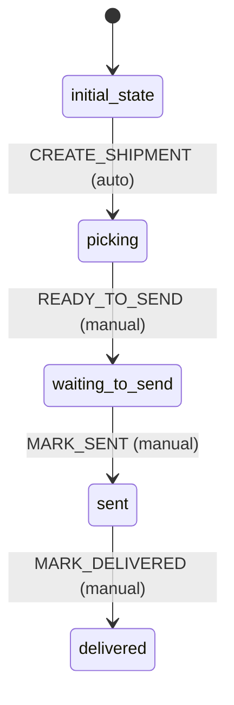

# Shipment Workflow

## States
- **initial_state**: Entry point
- **picking**: Items being picked
- **waiting_to_send**: Ready for shipment
- **sent**: Shipped
- **delivered**: Delivered

## Transitions

### initial_state → picking
- **Name**: CREATE_SHIPMENT
- **Type**: Automatic
- **Processors**: None
- **Criteria**: None

### picking → waiting_to_send
- **Name**: READY_TO_SEND
- **Type**: Manual
- **Processors**: None
- **Criteria**: None

### waiting_to_send → sent
- **Name**: MARK_SENT
- **Type**: Manual
- **Processors**: None
- **Criteria**: None

### sent → delivered
- **Name**: MARK_DELIVERED
- **Type**: Manual
- **Processors**: None
- **Criteria**: None

## Mermaid State Diagram

## Processors
None required for Shipment workflow - state transitions are simple status updates.

## Criteria
None required for Shipment workflow.

## Business Rules
- Created automatically when order is created
- Single shipment per order
- Shipment state mirrors order fulfillment state
- Simple state progression without complex logic
