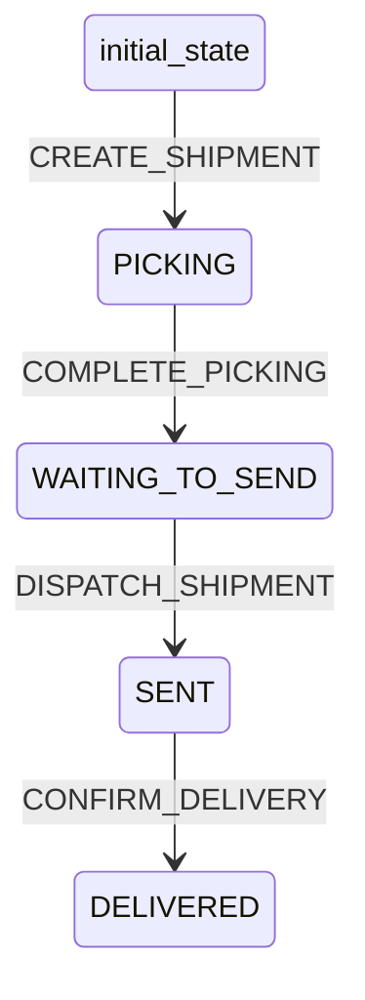

# Shipment Workflow

## States
- **initial_state**: Starting state
- **PICKING**: Items being picked from warehouse
- **WAITING_TO_SEND**: Items picked, waiting to ship
- **SENT**: Shipment dispatched
- **DELIVERED**: Shipment delivered to customer

## Transitions



## Transition Details

### CREATE_SHIPMENT (initial_state → PICKING)
- **Type**: Automatic
- **Processors**: None
- **Criteria**: None

### COMPLETE_PICKING (PICKING → WAITING_TO_SEND)
- **Type**: Manual
- **Processors**: UpdatePickingProcessor
- **Criteria**: None

### DISPATCH_SHIPMENT (WAITING_TO_SEND → SENT)
- **Type**: Manual
- **Processors**: UpdateOrderStatusProcessor
- **Criteria**: None

### CONFIRM_DELIVERY (SENT → DELIVERED)
- **Type**: Manual
- **Processors**: UpdateOrderStatusProcessor
- **Criteria**: None

## Processors

### UpdatePickingProcessor
- **Entity**: Shipment
- **Purpose**: Update picked quantities and order status
- **Input**: Shipment with picked quantities
- **Output**: Updated shipment
- **Pseudocode**:
```
process(shipment):
    update shipment.lines with qtyPicked
    update shipment.updatedAt
    
    find order by shipment.orderId
    update order status to WAITING_TO_SEND
    
    return shipment
```

### UpdateOrderStatusProcessor
- **Entity**: Shipment
- **Purpose**: Update order status based on shipment status
- **Input**: Shipment with new status
- **Output**: Updated shipment
- **Pseudocode**:
```
process(shipment):
    find order by shipment.orderId
    
    if shipment.status == "SENT":
        update order.status to "SENT"
    else if shipment.status == "DELIVERED":
        update order.status to "DELIVERED"
    
    update shipment.updatedAt
    return shipment
```
