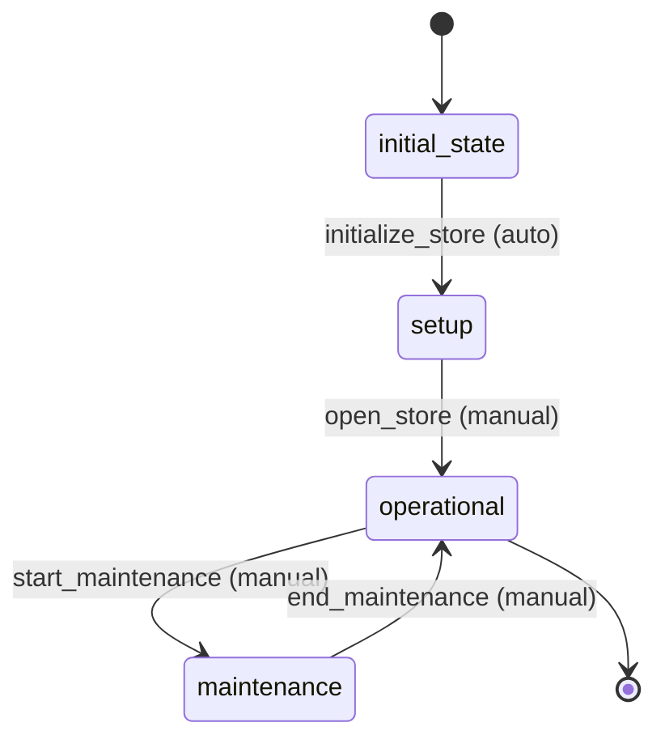

# Store Workflow

## States
- **initial_state**: Starting state for new stores
- **setup**: Store is being configured and prepared
- **operational**: Store is open and serving customers
- **maintenance**: Store is temporarily closed for maintenance

## Transitions

### initial_state → setup
- **Name**: initialize_store
- **Type**: Automatic
- **Processors**: StoreInitializationProcessor
- **Criteria**: None

### setup → operational
- **Name**: open_store
- **Type**: Manual
- **Processors**: StoreOpeningProcessor
- **Criteria**: StoreReadinessCriterion

### operational → maintenance
- **Name**: start_maintenance
- **Type**: Manual
- **Processors**: None
- **Criteria**: None

### maintenance → operational
- **Name**: end_maintenance
- **Type**: Manual
- **Processors**: None
- **Criteria**: None

## Processors

### StoreInitializationProcessor
- **Entity**: Store
- **Purpose**: Initialize store configuration and validate setup
- **Input**: New store entity
- **Output**: Initialized store
- **Pseudocode**:
  ```
  process(store):
    validate store.name is unique
    validate store.capacity > 0
    validate store.address is not empty
    set default operating hours if needed
    create initial inventory records
    return store
  ```

### StoreOpeningProcessor
- **Entity**: Store
- **Purpose**: Complete store opening procedures
- **Input**: Store entity
- **Output**: Operational store
- **Pseudocode**:
  ```
  process(store):
    verify all safety requirements met
    activate inventory management system
    enable customer access
    notify regional management
    return store
  ```

## Criteria

### StoreReadinessCriterion
- **Purpose**: Check if store is ready to open
- **Pseudocode**:
  ```
  check(store):
    return store.managerName is not empty AND
           store.operatingHours is not empty AND
           store.capacity > 0
  ```

## Mermaid State Diagram


