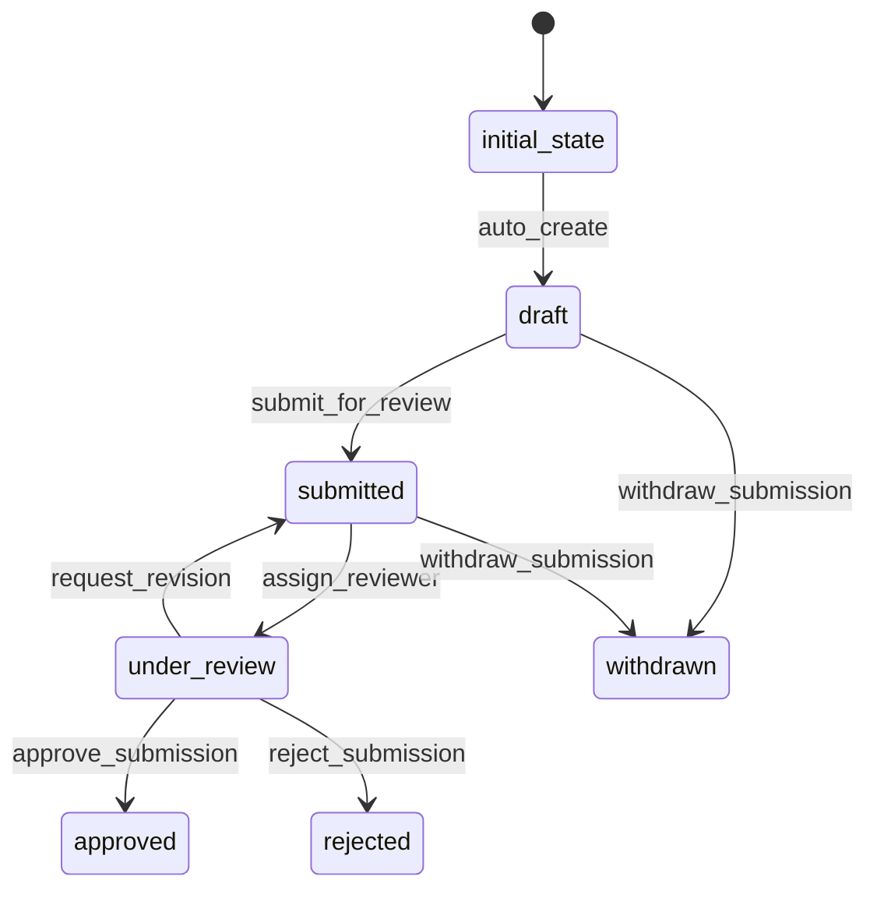

# Submission Workflow

## States
- **initial_state**: System entry point
- **draft**: Submission is being prepared
- **submitted**: Submission has been submitted for review
- **under_review**: Submission is being reviewed
- **approved**: Submission has been approved
- **rejected**: Submission has been rejected
- **withdrawn**: Submission has been withdrawn by submitter

## Transitions



## Processors

### SubmissionCreationProcessor
- **Entity**: Submission
- **Purpose**: Initialize new submission with default values
- **Input**: Submission entity with basic details
- **Output**: Submission with timestamps and validation
- **Pseudocode**:
```
process(submission):
    set submissionDate to current timestamp
    calculate targetDecisionDate (30 days from submission)
    validate submitter exists and is active
    return submission
```

### ReviewerAssignmentProcessor
- **Entity**: Submission
- **Purpose**: Assign reviewer to submission
- **Input**: Submission with reviewer assignment
- **Output**: Submission with assigned reviewer
- **Pseudocode**:
```
process(submission):
    validate reviewer has REVIEWER or ADMIN role
    validate reviewer is not the submitter
    send notification to reviewer
    return submission
```

### DecisionProcessor
- **Entity**: Submission
- **Purpose**: Process final decision (approval/rejection)
- **Input**: Submission with decision details
- **Output**: Submission with decision recorded
- **Pseudocode**:
```
process(submission):
    validate decisionReason is provided
    send notification to submitter
    update related documents status
    return submission
```

## Criteria

### SubmissionValidationCriterion
- **Purpose**: Validate submission before review assignment
- **Pseudocode**:
```
check(submission):
    return title is not empty AND
           description is not empty AND
           submissionType is valid AND
           submitter is active user
```

### ReviewerValidationCriterion
- **Purpose**: Validate reviewer assignment
- **Pseudocode**:
```
check(submission):
    return reviewerEmail is not null AND
           reviewer has REVIEWER or ADMIN role AND
           reviewer is not submitter
```
