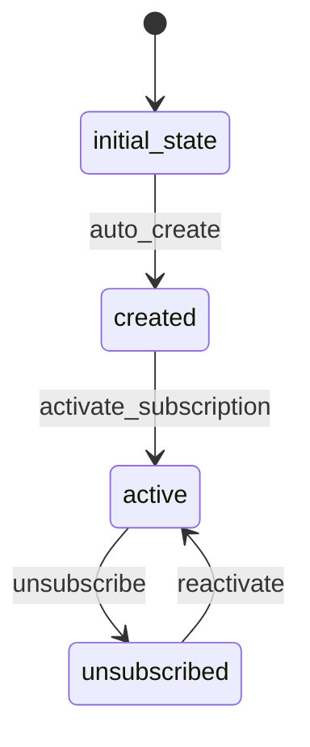

# Subscriber Workflow

## States and Transitions



## Workflow States
- **initial_state**: Starting state (automatic)
- **created**: Subscriber has been created but not yet activated
- **active**: Subscriber is active and receiving reports
- **unsubscribed**: Subscriber has unsubscribed and will not receive reports

## Transitions

### auto_create (initial_state → created)
- **Type**: Automatic
- **Processors**: None
- **Criteria**: None

### activate_subscription (created → active)
- **Type**: Manual
- **Processors**: SubscriptionActivationProcessor
- **Criteria**: None

### unsubscribe (active → unsubscribed)
- **Type**: Manual
- **Processors**: None
- **Criteria**: None

### reactivate (unsubscribed → active)
- **Type**: Manual
- **Processors**: SubscriptionActivationProcessor
- **Criteria**: None

## Processors

### SubscriptionActivationProcessor
- **Entity**: Subscriber
- **Input**: Subscriber with email and preferences
- **Purpose**: Activate subscription and set default preferences
- **Output**: Updated Subscriber with activation timestamp
- **Pseudocode**:
```
process(subscriber):
    subscriber.isActive = true
    subscriber.subscribedAt = now()
    if (subscriber.emailPreferences == null):
        subscriber.emailPreferences = new EmailPreferences()
        subscriber.emailPreferences.frequency = "IMMEDIATE"
        subscriber.emailPreferences.format = "HTML"
    return subscriber
```

## Criteria
None required for this simple workflow.
