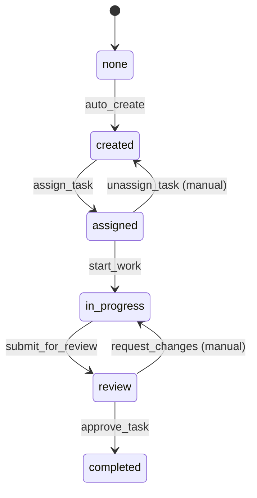

# Task Workflow

## Overview
Task workflow manages the lifecycle of tasks from creation to completion with proper assignment, progress tracking, and quality review.

## States
- **none**: Initial state (system managed)
- **created**: Task has been created but not yet assigned
- **assigned**: Task has been assigned to a user
- **in_progress**: User is actively working on the task
- **review**: Task is completed and awaiting review
- **completed**: Task has been reviewed and approved

## State Diagram


## Transitions

### auto_create (none → created)
- **Type**: Automatic
- **Processors**: TaskCreationProcessor
- **Criteria**: None

### assign_task (created → assigned)  
- **Type**: Manual
- **Processors**: TaskAssignmentProcessor
- **Criteria**: UserAvailabilityCriterion

### start_work (assigned → in_progress)
- **Type**: Manual  
- **Processors**: None
- **Criteria**: None

### submit_for_review (in_progress → review)
- **Type**: Manual
- **Processors**: TaskSubmissionProcessor
- **Criteria**: None

### approve_task (review → completed)
- **Type**: Manual
- **Processors**: TaskCompletionProcessor
- **Criteria**: None

### request_changes (review → in_progress)
- **Type**: Manual
- **Processors**: None
- **Criteria**: None

### unassign_task (assigned → created)
- **Type**: Manual
- **Processors**: None
- **Criteria**: None

## Processors

### TaskCreationProcessor
- **Entity**: Task
- **Input**: New task data
- **Purpose**: Initialize task with default values and validate required fields
- **Output**: Task with created timestamp and initial priority assignment
- **Pseudocode**:
```
process(task):
    task.createdAt = now()
    task.updatedAt = now()
    if task.priority == "HIGH":
        // Auto-assign high priority tasks
        availableUser = findAvailableUser()
        if availableUser:
            task.assigneeId = availableUser.userId
            triggerTransition("assign_task")
    return task
```

### TaskAssignmentProcessor
- **Entity**: Task
- **Input**: Task with assigneeId
- **Purpose**: Assign task to user and update user's task count
- **Output**: Task with assignment details
- **Pseudocode**:
```
process(task):
    user = entityService.findById(task.assigneeId, User.class)
    task.updatedAt = now()
    // Update user entity to track assignment (separate transition)
    user.lastAssignedAt = now()
    entityService.update(user, null) // null transition for user
    return task
```

### TaskSubmissionProcessor
- **Entity**: Task
- **Input**: Task with work completed
- **Purpose**: Record completion time and prepare for review
- **Output**: Task ready for review
- **Pseudocode**:
```
process(task):
    task.updatedAt = now()
    task.submittedAt = now()
    if task.actualHours == null:
        task.actualHours = calculateHoursWorked(task)
    return task
```

### TaskCompletionProcessor
- **Entity**: Task
- **Input**: Reviewed task
- **Purpose**: Finalize task completion and update metrics
- **Output**: Completed task
- **Pseudocode**:
```
process(task):
    task.updatedAt = now()
    task.completedAt = now()
    // Update user completion metrics
    user = entityService.findById(task.assigneeId, User.class)
    user.tasksCompleted = user.tasksCompleted + 1
    entityService.update(user, null)
    return task
```

## Criteria

### UserAvailabilityCriterion
- **Purpose**: Check if assigned user is active and available for new tasks
- **Pseudocode**:
```
check(task):
    if task.assigneeId == null:
        return false
    user = entityService.findById(task.assigneeId, User.class)
    return user != null && user.isActive && user.currentTaskCount < 5
```

## Workflow JSON
```json
{
  "version": "1.0",
  "name": "Task",
  "desc": "Task lifecycle management workflow",
  "initialState": "none",
  "active": true,
  "states": {
    "none": {
      "transitions": [
        {
          "name": "auto_create",
          "next": "created",
          "processors": [
            {
              "name": "TaskCreationProcessor",
              "executionMode": "ASYNC_NEW_TX",
              "config": {
                "attachEntity": true,
                "calculationNodesTags": "cyoda_application",
                "responseTimeoutMs": 3000,
                "retryPolicy": "FIXED"
              }
            }
          ]
        }
      ]
    },
    "created": {
      "transitions": [
        {
          "name": "assign_task",
          "next": "assigned",
          "manual": true,
          "processors": [
            {
              "name": "TaskAssignmentProcessor",
              "executionMode": "ASYNC_NEW_TX",
              "config": {
                "attachEntity": true,
                "calculationNodesTags": "cyoda_application",
                "responseTimeoutMs": 3000,
                "retryPolicy": "FIXED"
              }
            }
          ],
          "criterion": {
            "type": "function",
            "function": {
              "name": "UserAvailabilityCriterion",
              "config": {
                "attachEntity": true,
                "calculationNodesTags": "cyoda_application",
                "responseTimeoutMs": 5000,
                "retryPolicy": "FIXED"
              }
            }
          }
        }
      ]
    },
    "assigned": {
      "transitions": [
        {
          "name": "start_work",
          "next": "in_progress",
          "manual": true
        },
        {
          "name": "unassign_task",
          "next": "created",
          "manual": true
        }
      ]
    },
    "in_progress": {
      "transitions": [
        {
          "name": "submit_for_review",
          "next": "review",
          "manual": true,
          "processors": [
            {
              "name": "TaskSubmissionProcessor",
              "executionMode": "ASYNC_NEW_TX",
              "config": {
                "attachEntity": true,
                "calculationNodesTags": "cyoda_application",
                "responseTimeoutMs": 3000,
                "retryPolicy": "FIXED"
              }
            }
          ]
        }
      ]
    },
    "review": {
      "transitions": [
        {
          "name": "approve_task",
          "next": "completed",
          "manual": true,
          "processors": [
            {
              "name": "TaskCompletionProcessor",
              "executionMode": "ASYNC_NEW_TX",
              "config": {
                "attachEntity": true,
                "calculationNodesTags": "cyoda_application",
                "responseTimeoutMs": 3000,
                "retryPolicy": "FIXED"
              }
            }
          ]
        },
        {
          "name": "request_changes",
          "next": "in_progress",
          "manual": true
        }
      ]
    },
    "completed": {
      "transitions": []
    }
  }
}
```
