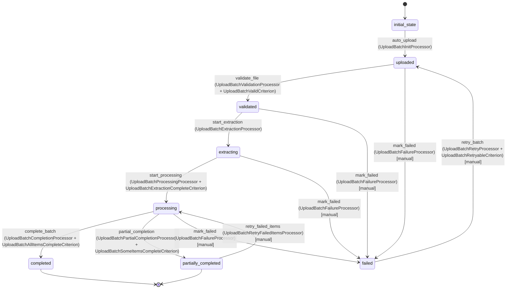

# UploadBatch Workflow

## Overview
The UploadBatch workflow manages the lifecycle of bulk upload operations for HN items. It handles file validation, item extraction, processing coordination, and completion tracking.

## Workflow States

### 1. initial_state
- **Description**: Starting state for new upload batch
- **Purpose**: Entry point for workflow processing

### 2. uploaded
- **Description**: File has been uploaded and basic metadata captured
- **Purpose**: Initial file reception and validation

### 3. validated
- **Description**: File has been validated for format and content
- **Purpose**: Ensure file is processable before extraction

### 4. extracting
- **Description**: Items are being extracted from the JSON file
- **Purpose**: Parse file and create individual HNItem entities

### 5. processing
- **Description**: Individual items are being processed through their workflows
- **Purpose**: Coordinate processing of all items in the batch

### 6. completed
- **Description**: All items have been successfully processed
- **Purpose**: Batch processing finished successfully

### 7. failed
- **Description**: Batch processing failed and requires attention
- **Purpose**: Handle processing errors and enable retry

### 8. partially_completed
- **Description**: Some items processed successfully, others failed
- **Purpose**: Handle mixed success scenarios

## Workflow Transitions

### initial_state → uploaded
- **Transition Name**: `auto_upload`
- **Type**: Automatic (manual: false)
- **Processors**: [`UploadBatchInitProcessor`]
- **Criteria**: None
- **Purpose**: Initialize batch processing

### uploaded → validated
- **Transition Name**: `validate_file`
- **Type**: Automatic (manual: false)
- **Processors**: [`UploadBatchValidationProcessor`]
- **Criteria**: [`UploadBatchValidCriterion`]
- **Purpose**: Validate file format and content

### validated → extracting
- **Transition Name**: `start_extraction`
- **Type**: Automatic (manual: false)
- **Processors**: [`UploadBatchExtractionProcessor`]
- **Criteria**: None
- **Purpose**: Begin extracting items from file

### extracting → processing
- **Transition Name**: `start_processing`
- **Type**: Automatic (manual: false)
- **Processors**: [`UploadBatchProcessingProcessor`]
- **Criteria**: [`UploadBatchExtractionCompleteCriterion`]
- **Purpose**: Begin processing extracted items

### processing → completed
- **Transition Name**: `complete_batch`
- **Type**: Automatic (manual: false)
- **Processors**: [`UploadBatchCompletionProcessor`]
- **Criteria**: [`UploadBatchAllItemsCompleteCriterion`]
- **Purpose**: Mark batch as successfully completed

### processing → partially_completed
- **Transition Name**: `partial_completion`
- **Type**: Automatic (manual: false)
- **Processors**: [`UploadBatchPartialCompletionProcessor`]
- **Criteria**: [`UploadBatchSomeItemsCompleteCriterion`]
- **Purpose**: Handle mixed success scenarios

### Any State → failed
- **Transition Name**: `mark_failed`
- **Type**: Manual (manual: true)
- **Processors**: [`UploadBatchFailureProcessor`]
- **Criteria**: None
- **Purpose**: Handle processing failures

### failed → uploaded
- **Transition Name**: `retry_batch`
- **Type**: Manual (manual: true)
- **Processors**: [`UploadBatchRetryProcessor`]
- **Criteria**: [`UploadBatchRetryableCriterion`]
- **Purpose**: Retry failed batch processing

### partially_completed → processing
- **Transition Name**: `retry_failed_items`
- **Type**: Manual (manual: true)
- **Processors**: [`UploadBatchRetryFailedItemsProcessor`]
- **Criteria**: None
- **Purpose**: Retry only the failed items

## Processors

### UploadBatchInitProcessor
- **Purpose**: Initialize batch processing and set metadata
- **Input**: New UploadBatch entity
- **Expected Output**: UploadBatch with initialized metadata
- **Pseudocode**:
```
process(uploadBatch):
    set uploadBatch.uploadedAt = current timestamp
    calculate and set uploadBatch.fileMd5Hash
    set uploadBatch.contentType from file headers
    set uploadBatch.processingStartedAt = current timestamp
    initialize counters to 0
    log batch initialization
    return uploadBatch
```

### UploadBatchValidationProcessor
- **Purpose**: Validate uploaded file format and basic structure
- **Input**: UploadBatch with file metadata
- **Expected Output**: UploadBatch with validation results
- **Pseudocode**:
```
process(uploadBatch):
    validate file is valid JSON
    validate file size is within limits
    validate content type is JSON
    count total items in file
    set uploadBatch.totalItemsInFile = item count
    validate each item has required fields (hnId, type)
    log validation results
    return uploadBatch
```

### UploadBatchExtractionProcessor
- **Purpose**: Extract individual HN items from the JSON file
- **Input**: Validated UploadBatch
- **Expected Output**: UploadBatch with items extracted and created
- **Pseudocode**:
```
process(uploadBatch):
    parse JSON file into array of items
    for each item in file:
        create HNItem entity from JSON data
        set HNItem.sourceType = "BULK_UPLOAD"
        set HNItem.batchId = uploadBatch.batchId
        save HNItem entity (triggers HNItem workflow)
        increment uploadBatch.itemsProcessed
    
    set uploadBatch.processingCompletedAt = current timestamp
    log extraction completion
    return uploadBatch
```

### UploadBatchProcessingProcessor
- **Purpose**: Monitor and coordinate processing of all batch items
- **Input**: UploadBatch with extracted items
- **Expected Output**: UploadBatch with processing status updated
- **Pseudocode**:
```
process(uploadBatch):
    query all HNItems with batchId = uploadBatch.batchId
    count items by workflow state:
        completed_items = count where state = "completed"
        failed_items = count where state = "failed"
        processing_items = count where state in ["ingested", "validated", etc.]
    
    update uploadBatch counters:
        itemsProcessed = completed_items
        itemsErrored = failed_items
    
    estimate completion time based on processing rate
    log processing progress
    return uploadBatch
```

### UploadBatchCompletionProcessor
- **Purpose**: Finalize successful batch processing
- **Input**: UploadBatch with all items completed
- **Expected Output**: UploadBatch marked as completed
- **Pseudocode**:
```
process(uploadBatch):
    set uploadBatch.processingCompletedAt = current timestamp
    generate completion summary
    set uploadBatch.resultSummary = summary
    log successful completion
    send completion notification if configured
    return uploadBatch
```

### UploadBatchPartialCompletionProcessor
- **Purpose**: Handle batches with mixed success/failure
- **Input**: UploadBatch with some items failed
- **Expected Output**: UploadBatch marked as partially completed
- **Pseudocode**:
```
process(uploadBatch):
    query failed items and collect error details
    create error summary with failure reasons
    set uploadBatch.errorSummary = summary
    set uploadBatch.processingCompletedAt = current timestamp
    log partial completion with error details
    return uploadBatch
```

### UploadBatchFailureProcessor
- **Purpose**: Handle batch processing failures
- **Input**: Failed UploadBatch
- **Expected Output**: UploadBatch with failure information
- **Pseudocode**:
```
process(uploadBatch):
    capture failure details and stack trace
    increment uploadBatch.retryCount
    set uploadBatch.lastRetryAt = current timestamp
    create detailed error report
    log failure event
    return uploadBatch
```

### UploadBatchRetryProcessor
- **Purpose**: Prepare failed batch for retry
- **Input**: Failed UploadBatch marked for retry
- **Expected Output**: UploadBatch reset for reprocessing
- **Pseudocode**:
```
process(uploadBatch):
    reset processing counters
    clear previous error messages
    set new processingStartedAt timestamp
    log retry attempt
    return uploadBatch
```

### UploadBatchRetryFailedItemsProcessor
- **Purpose**: Retry only the failed items in a partially completed batch
- **Input**: Partially completed UploadBatch
- **Expected Output**: UploadBatch with failed items marked for retry
- **Pseudocode**:
```
process(uploadBatch):
    query all failed HNItems with batchId = uploadBatch.batchId
    for each failed item:
        trigger retry transition on HNItem workflow
    
    reset uploadBatch to processing state
    log retry of failed items
    return uploadBatch
```

## Criteria

### UploadBatchValidCriterion
- **Purpose**: Check if uploaded file is valid for processing
- **Pseudocode**:
```
check(uploadBatch):
    return uploadBatch.fileName != null AND
           uploadBatch.fileSize > 0 AND
           uploadBatch.fileMd5Hash != null AND
           uploadBatch.contentType.contains("json") AND
           uploadBatch.totalItemsInFile > 0
```

### UploadBatchExtractionCompleteCriterion
- **Purpose**: Check if item extraction is complete
- **Pseudocode**:
```
check(uploadBatch):
    return uploadBatch.totalItemsInFile > 0 AND
           uploadBatch.itemsProcessed >= 0 AND
           uploadBatch.processingCompletedAt != null
```

### UploadBatchAllItemsCompleteCriterion
- **Purpose**: Check if all items in batch are successfully processed
- **Pseudocode**:
```
check(uploadBatch):
    totalItems = uploadBatch.totalItemsInFile
    processedItems = uploadBatch.itemsProcessed
    erroredItems = uploadBatch.itemsErrored
    
    return totalItems > 0 AND
           (processedItems + erroredItems) >= totalItems AND
           erroredItems == 0
```

### UploadBatchSomeItemsCompleteCriterion
- **Purpose**: Check if some items completed but others failed
- **Pseudocode**:
```
check(uploadBatch):
    totalItems = uploadBatch.totalItemsInFile
    processedItems = uploadBatch.itemsProcessed
    erroredItems = uploadBatch.itemsErrored
    
    return totalItems > 0 AND
           (processedItems + erroredItems) >= totalItems AND
           processedItems > 0 AND
           erroredItems > 0
```

### UploadBatchRetryableCriterion
- **Purpose**: Check if failed batch can be retried
- **Pseudocode**:
```
check(uploadBatch):
    maxRetries = 3
    retryWindow = 24 hours
    
    return uploadBatch.retryCount < maxRetries AND
           (current time - uploadBatch.lastRetryAt) < retryWindow AND
           uploadBatch.fileName != null
```

## Mermaid State Diagram


