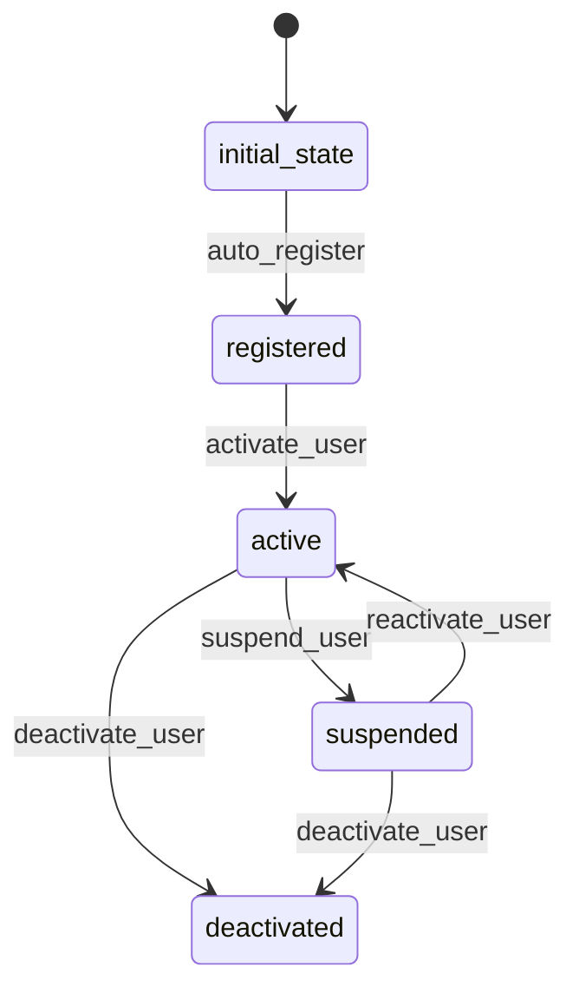

# User Workflow

## States
- **initial_state**: System entry point
- **registered**: User has completed registration
- **active**: User account is active and verified
- **suspended**: User account is temporarily suspended
- **deactivated**: User account is permanently deactivated

## Transitions



## Processors

### UserRegistrationProcessor
- **Entity**: User
- **Purpose**: Process user registration and set initial role
- **Input**: User entity with registration details
- **Output**: User with validated data and default role
- **Pseudocode**:
```
process(user):
    validate email format and uniqueness
    set default role to EXTERNAL_SUBMITTER
    set registrationDate to current timestamp
    set isActive to false
    return user
```

### UserActivationProcessor
- **Entity**: User
- **Purpose**: Activate user account after verification
- **Input**: User entity in registered state
- **Output**: Activated user
- **Pseudocode**:
```
process(user):
    set isActive to true
    send welcome email notification
    return user
```

## Criteria

### UserValidationCriterion
- **Purpose**: Validate user data before activation
- **Pseudocode**:
```
check(user):
    return email is valid format AND
           firstName is not empty AND
           lastName is not empty AND
           organization is not empty
```

## Workflow JSON
```json
{
  "version": "1.0",
  "name": "User",
  "desc": "User registration and account management workflow",
  "initialState": "initial_state",
  "active": true,
  "states": {
    "initial_state": {
      "transitions": [
        {
          "name": "auto_register",
          "next": "registered",
          "manual": false,
          "processors": [
            {
              "name": "UserRegistrationProcessor",
              "executionMode": "SYNC",
              "config": {
                "calculationNodesTags": "cyoda_application",
                "attachEntity": true
              }
            }
          ]
        }
      ]
    },
    "registered": {
      "transitions": [
        {
          "name": "activate_user",
          "next": "active",
          "manual": true,
          "criterion": {
            "type": "function",
            "function": {
              "name": "UserValidationCriterion",
              "config": {
                "calculationNodesTags": "cyoda_application",
                "attachEntity": true
              }
            }
          },
          "processors": [
            {
              "name": "UserActivationProcessor",
              "executionMode": "SYNC",
              "config": {
                "calculationNodesTags": "cyoda_application",
                "attachEntity": true
              }
            }
          ]
        }
      ]
    },
    "active": {
      "transitions": [
        {
          "name": "suspend_user",
          "next": "suspended",
          "manual": true
        },
        {
          "name": "deactivate_user",
          "next": "deactivated",
          "manual": true
        }
      ]
    },
    "suspended": {
      "transitions": [
        {
          "name": "reactivate_user",
          "next": "active",
          "manual": true
        },
        {
          "name": "deactivate_user",
          "next": "deactivated",
          "manual": true
        }
      ]
    },
    "deactivated": {
      "transitions": []
    }
  }
}
```
