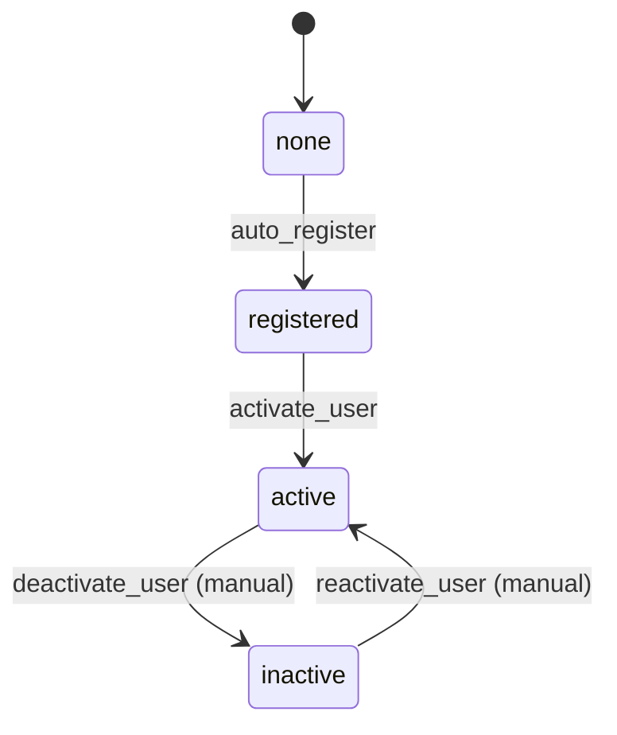

# User Workflow

## Overview
User workflow manages the lifecycle of user accounts from registration to activation and deactivation.

## States
- **none**: Initial state (system managed)
- **registered**: User has been registered but not yet activated
- **active**: User account is active and can be assigned tasks
- **inactive**: User account is deactivated

## State Diagram

```mermaid
stateDiagram-v2
    [*] --> none
    none --> registered : auto_register
    registered --> active : activate_user
    active --> inactive : deactivate_user (manual)
    inactive --> active : reactivate_user (manual)
```

## Transitions

### auto_register (none → registered)
- **Type**: Automatic
- **Processors**: UserRegistrationProcessor
- **Criteria**: None

### activate_user (registered → active)
- **Type**: Manual
- **Processors**: UserActivationProcessor
- **Criteria**: None

### deactivate_user (active → inactive)
- **Type**: Manual
- **Processors**: UserDeactivationProcessor
- **Criteria**: NoActiveTasksCriterion

### reactivate_user (inactive → active)
- **Type**: Manual
- **Processors**: None
- **Criteria**: None

## Processors

### UserRegistrationProcessor
- **Entity**: User
- **Input**: New user data
- **Purpose**: Initialize user account with default settings
- **Output**: User with registration timestamp
- **Pseudocode**:
```
process(user):
    user.createdAt = now()
    user.isActive = false // Start inactive until activated
    if user.role == null:
        user.role = "DEVELOPER" // Default role
    validateEmailFormat(user.email)
    return user
```

### UserActivationProcessor
- **Entity**: User
- **Input**: Registered user
- **Purpose**: Activate user account and enable task assignment
- **Output**: Active user
- **Pseudocode**:
```
process(user):
    user.isActive = true
    user.activatedAt = now()
    return user
```

### UserDeactivationProcessor
- **Entity**: User
- **Input**: Active user
- **Purpose**: Deactivate user and handle task reassignment
- **Output**: Inactive user
- **Pseudocode**:
```
process(user):
    user.isActive = false
    user.deactivatedAt = now()
    // Find and reassign active tasks
    activeTasks = entityService.findByAssigneeId(user.userId, Task.class)
    for task in activeTasks:
        task.assigneeId = null
        entityService.update(task, "unassign_task")
    return user
```

## Criteria

### NoActiveTasksCriterion
- **Purpose**: Ensure user has no active tasks before deactivation
- **Pseudocode**:
```
check(user):
    activeTasks = entityService.findByAssigneeId(user.userId, Task.class)
    activeCount = activeTasks.filter(task -> 
        task.meta.state in ["assigned", "in_progress", "review"]).count()
    return activeCount == 0
```

## Workflow JSON
```json
{
  "version": "1.0",
  "name": "User",
  "desc": "User account lifecycle management workflow",
  "initialState": "none",
  "active": true,
  "states": {
    "none": {
      "transitions": [
        {
          "name": "auto_register",
          "next": "registered",
          "processors": [
            {
              "name": "UserRegistrationProcessor",
              "executionMode": "ASYNC_NEW_TX",
              "config": {
                "attachEntity": true,
                "calculationNodesTags": "cyoda_application",
                "responseTimeoutMs": 3000,
                "retryPolicy": "FIXED"
              }
            }
          ]
        }
      ]
    },
    "registered": {
      "transitions": [
        {
          "name": "activate_user",
          "next": "active",
          "manual": true,
          "processors": [
            {
              "name": "UserActivationProcessor",
              "executionMode": "ASYNC_NEW_TX",
              "config": {
                "attachEntity": true,
                "calculationNodesTags": "cyoda_application",
                "responseTimeoutMs": 3000,
                "retryPolicy": "FIXED"
              }
            }
          ]
        }
      ]
    },
    "active": {
      "transitions": [
        {
          "name": "deactivate_user",
          "next": "inactive",
          "manual": true,
          "processors": [
            {
              "name": "UserDeactivationProcessor",
              "executionMode": "ASYNC_NEW_TX",
              "config": {
                "attachEntity": true,
                "calculationNodesTags": "cyoda_application",
                "responseTimeoutMs": 3000,
                "retryPolicy": "FIXED"
              }
            }
          ],
          "criterion": {
            "type": "function",
            "function": {
              "name": "NoActiveTasksCriterion",
              "config": {
                "attachEntity": true,
                "calculationNodesTags": "cyoda_application",
                "responseTimeoutMs": 5000,
                "retryPolicy": "FIXED"
              }
            }
          }
        }
      ]
    },
    "inactive": {
      "transitions": [
        {
          "name": "reactivate_user",
          "next": "active",
          "manual": true
        }
      ]
    }
  }
}
```
