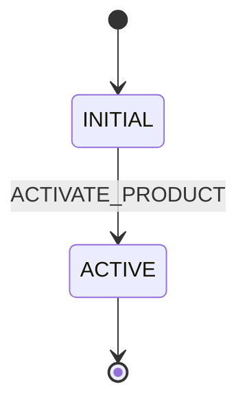
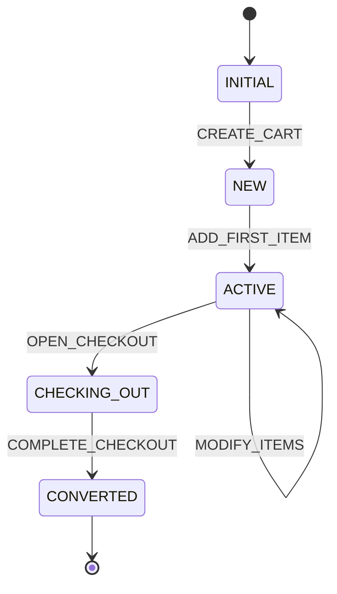
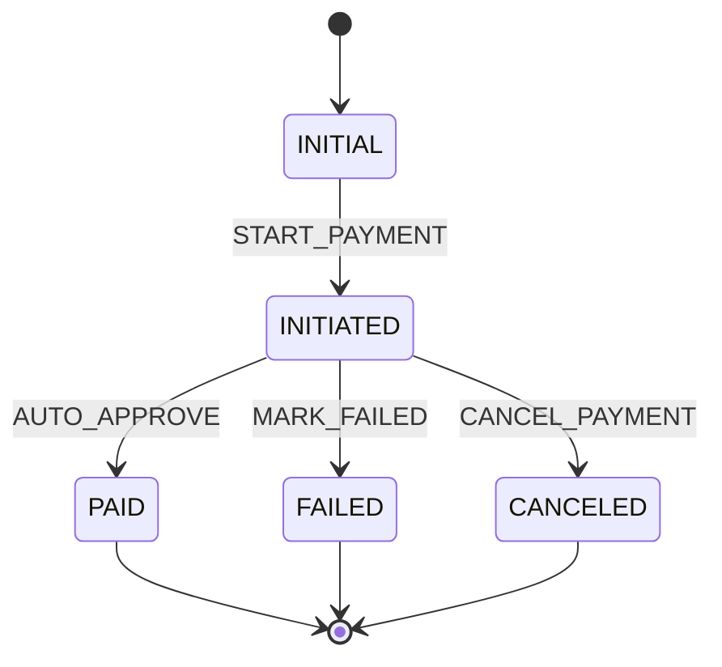
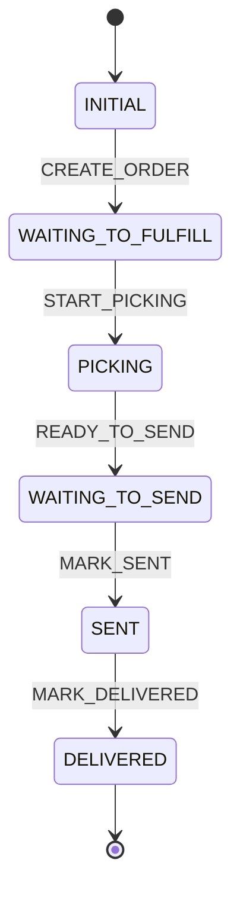
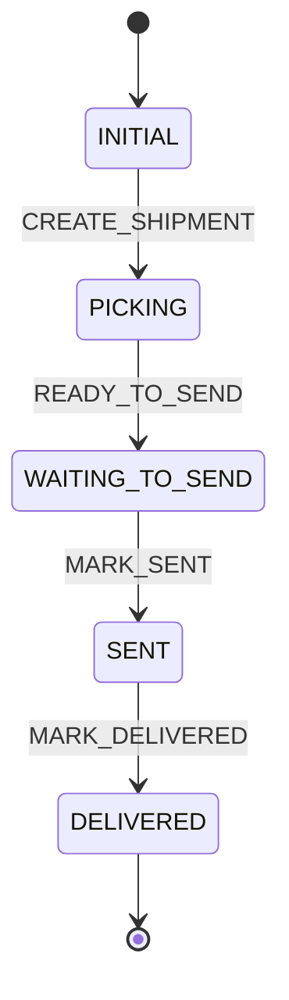

# Workflow Requirements

## Overview
This document defines the detailed workflow requirements for the Cyoda OMS Backend system. Each entity has its own workflow that manages state transitions and business logic through processors and criteria.

## Workflow Definitions

### 1. Product Workflow

**Workflow Name**: ProductFlow
**Entity**: Product
**Description**: Manages product lifecycle from creation to active catalog status.

**States**:
- `INITIAL`: System initial state (automatic)
- `ACTIVE`: Product is active in catalog

**Transitions**:
1. `ACTIVATE_PRODUCT`: INITIAL → ACTIVE (automatic)
   - **Processor**: None
   - **Criterion**: None
   - **Description**: Automatically activates product upon creation

---

### 2. Cart Workflow

**Workflow Name**: CartFlow
**Entity**: Cart
**Description**: Manages shopping cart lifecycle from creation through checkout conversion.

**States**:
- `INITIAL`: System initial state (automatic)
- `NEW`: Cart created but empty
- `ACTIVE`: Cart has items and can be modified
- `CHECKING_OUT`: Cart is in checkout process
- `CONVERTED`: Cart has been converted to order

**Transitions**:
1. `CREATE_CART`: INITIAL → NEW (automatic)
   - **Processor**: None
   - **Criterion**: None
   - **Description**: Creates empty cart

2. `ADD_FIRST_ITEM`: NEW → ACTIVE (automatic)
   - **Processor**: CartRecalculateTotalsProcessor
   - **Criterion**: None
   - **Description**: Adds first item and recalculates totals

3. `MODIFY_ITEMS`: ACTIVE → ACTIVE (manual, loop)
   - **Processor**: CartRecalculateTotalsProcessor
   - **Criterion**: None
   - **Description**: Add, update, or remove items and recalculate totals

4. `OPEN_CHECKOUT`: ACTIVE → CHECKING_OUT (manual)
   - **Processor**: None
   - **Criterion**: None
   - **Description**: Initiates checkout process

5. `COMPLETE_CHECKOUT`: CHECKING_OUT → CONVERTED (automatic)
   - **Processor**: None
   - **Criterion**: None
   - **Description**: Marks cart as converted after order creation

---

### 3. Payment Workflow

**Workflow Name**: PaymentFlow
**Entity**: Payment
**Description**: Manages dummy payment processing with automatic approval after 3 seconds.

**States**:
- `INITIAL`: System initial state (automatic)
- `INITIATED`: Payment has been started
- `PAID`: Payment completed successfully
- `FAILED`: Payment failed
- `CANCELED`: Payment was canceled

**Transitions**:
1. `START_PAYMENT`: INITIAL → INITIATED (automatic)
   - **Processor**: PaymentCreateDummyProcessor
   - **Criterion**: None
   - **Description**: Creates dummy payment in initiated state

2. `AUTO_APPROVE`: INITIATED → PAID (automatic)
   - **Processor**: PaymentAutoMarkPaidProcessor
   - **Criterion**: None
   - **Description**: Automatically marks payment as paid after ~3 seconds

3. `MARK_FAILED`: INITIATED → FAILED (manual)
   - **Processor**: None
   - **Criterion**: None
   - **Description**: Marks payment as failed (for testing)

4. `CANCEL_PAYMENT`: INITIATED → CANCELED (manual)
   - **Processor**: None
   - **Criterion**: None
   - **Description**: Cancels payment (for testing)

---

### 4. Order Workflow

**Workflow Name**: OrderFlow
**Entity**: Order
**Description**: Manages order lifecycle from creation through delivery.

**States**:
- `INITIAL`: System initial state (automatic)
- `WAITING_TO_FULFILL`: Order created, waiting to start fulfillment
- `PICKING`: Order is being picked in warehouse
- `WAITING_TO_SEND`: Order picked, waiting to ship
- `SENT`: Order has been shipped
- `DELIVERED`: Order has been delivered

**Transitions**:
1. `CREATE_ORDER`: INITIAL → WAITING_TO_FULFILL (automatic)
   - **Processor**: OrderCreateFromPaidProcessor
   - **Criterion**: None
   - **Description**: Creates order from paid cart, decrements stock, creates shipment

2. `START_PICKING`: WAITING_TO_FULFILL → PICKING (manual)
   - **Processor**: None
   - **Criterion**: None
   - **Description**: Starts picking process

3. `READY_TO_SEND`: PICKING → WAITING_TO_SEND (manual)
   - **Processor**: None
   - **Criterion**: None
   - **Description**: Picking completed, ready to ship

4. `MARK_SENT`: WAITING_TO_SEND → SENT (manual)
   - **Processor**: None
   - **Criterion**: None
   - **Description**: Order has been shipped

5. `MARK_DELIVERED`: SENT → DELIVERED (manual)
   - **Processor**: None
   - **Criterion**: None
   - **Description**: Order has been delivered

---

### 5. Shipment Workflow

**Workflow Name**: ShipmentFlow
**Entity**: Shipment
**Description**: Manages shipment lifecycle synchronized with order status.

**States**:
- `INITIAL`: System initial state (automatic)
- `PICKING`: Items are being picked from warehouse
- `WAITING_TO_SEND`: Items picked, waiting to ship
- `SENT`: Shipment has been sent
- `DELIVERED`: Shipment has been delivered

**Transitions**:
1. `CREATE_SHIPMENT`: INITIAL → PICKING (automatic)
   - **Processor**: None
   - **Criterion**: None
   - **Description**: Creates shipment when order is created

2. `READY_TO_SEND`: PICKING → WAITING_TO_SEND (manual)
   - **Processor**: ShipmentUpdateOrderStatusProcessor
   - **Criterion**: None
   - **Description**: Updates order status to WAITING_TO_SEND

3. `MARK_SENT`: WAITING_TO_SEND → SENT (manual)
   - **Processor**: ShipmentUpdateOrderStatusProcessor
   - **Criterion**: None
   - **Description**: Updates order status to SENT

4. `MARK_DELIVERED`: SENT → DELIVERED (manual)
   - **Processor**: ShipmentUpdateOrderStatusProcessor
   - **Criterion**: None
   - **Description**: Updates order status to DELIVERED

## Workflow Coordination

### Cart to Order Flow
1. Cart reaches CHECKING_OUT state
2. Payment is created and auto-approved
3. Order is created from cart (CREATE_ORDER transition)
4. Cart transitions to CONVERTED state
5. Shipment is automatically created in PICKING state

### Order and Shipment Synchronization
- Order and Shipment states are synchronized through ShipmentUpdateOrderStatusProcessor
- Shipment state changes trigger corresponding Order state updates
- Single shipment per order model simplifies state management

## Transition Types

### Automatic Transitions
- Triggered by system events or processors
- No manual intervention required
- Examples: INITIAL → first state, payment auto-approval

### Manual Transitions
- Triggered by API calls or user actions
- Require explicit transition name in API calls
- Examples: cart modifications, order status updates

### Loop Transitions
- Transitions that return to the same state or previous state
- Always marked as manual
- Example: MODIFY_ITEMS (ACTIVE → ACTIVE)
