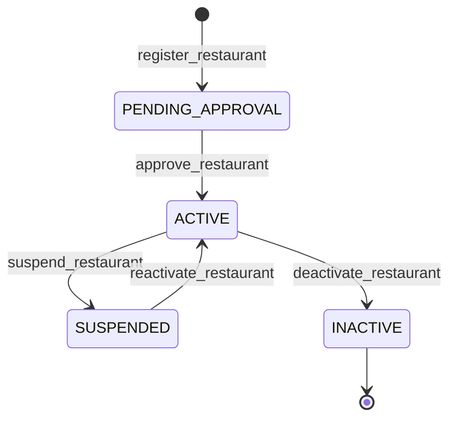
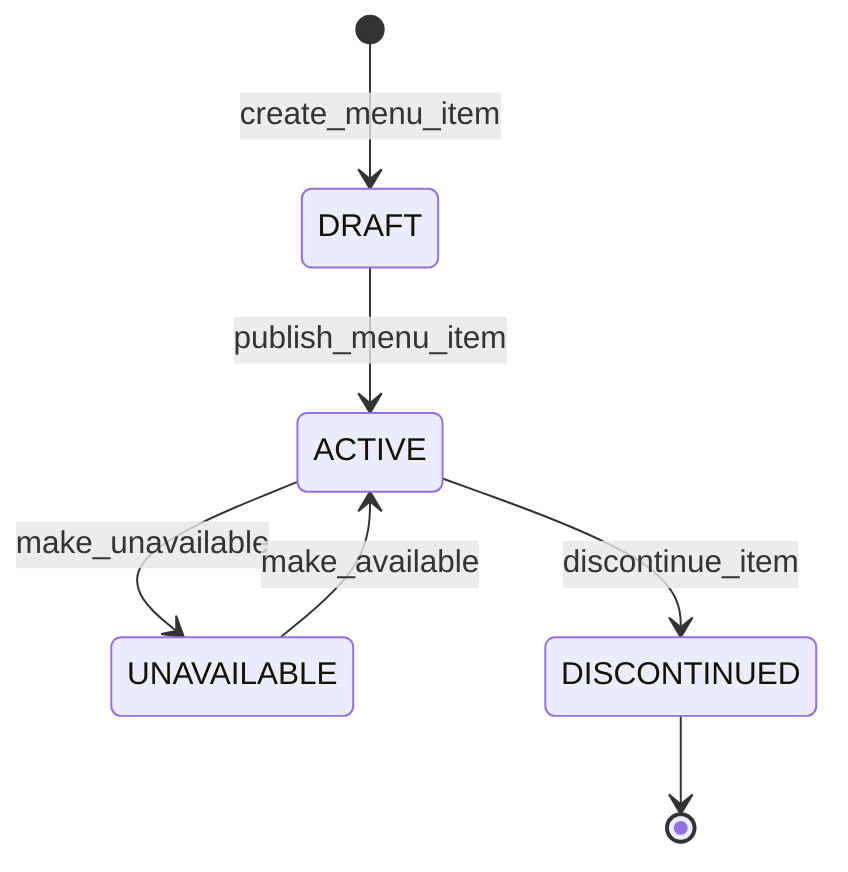
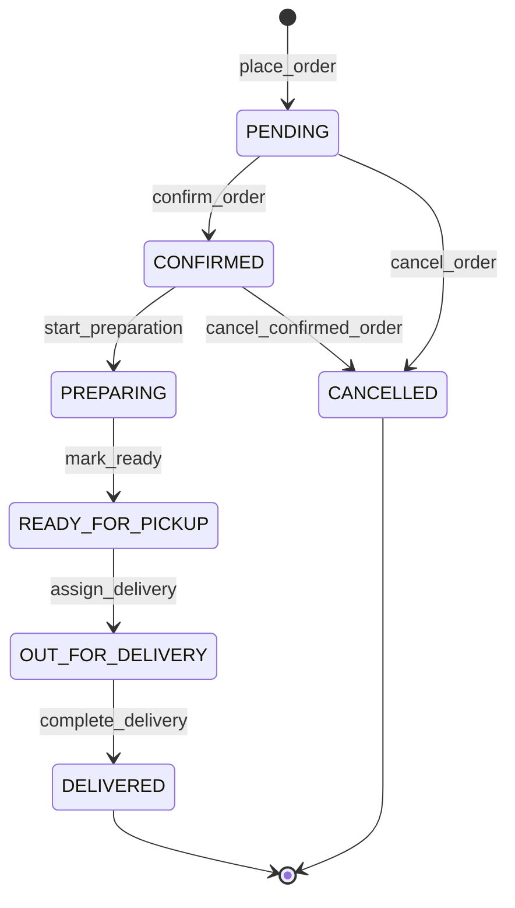
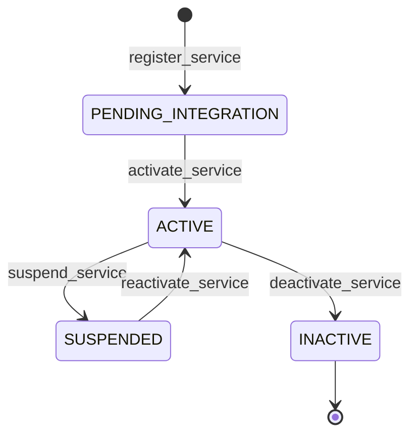
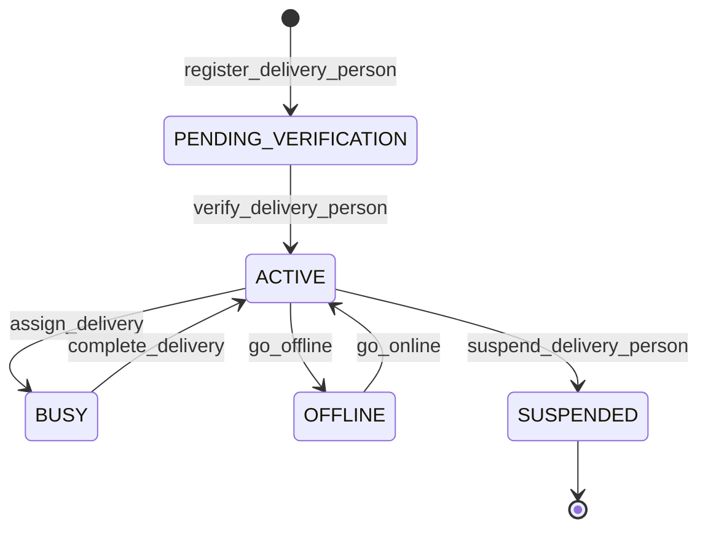

# Workflows Requirements

## Overview
This document defines the detailed workflow requirements for all entities in the food delivery aggregation system. Each entity has its own workflow with states, transitions, processors, and criteria.

## Workflow Definitions

### 1. Restaurant Workflow

**Workflow Name:** restaurant_workflow  
**Description:** Manages the lifecycle of restaurant entities from registration to operation

**States:**
- `none` (initial state)
- `PENDING_APPROVAL` - Restaurant registered but awaiting approval
- `ACTIVE` - Restaurant is active and accepting orders
- `SUSPENDED` - Restaurant temporarily suspended
- `INACTIVE` - Restaurant permanently deactivated

**Transitions:**

1. **none → PENDING_APPROVAL**
   - Name: `register_restaurant`
   - Type: Automatic (initial transition)
   - Processor: `RestaurantRegistrationProcessor`
   - Criterion: None
   - Description: Initial registration of restaurant

2. **PENDING_APPROVAL → ACTIVE**
   - Name: `approve_restaurant`
   - Type: Manual
   - Processor: `RestaurantApprovalProcessor`
   - Criterion: `RestaurantApprovalCriterion`
   - Description: Approve restaurant after verification

3. **ACTIVE → SUSPENDED**
   - Name: `suspend_restaurant`
   - Type: Manual
   - Processor: `RestaurantSuspensionProcessor`
   - Criterion: None
   - Description: Temporarily suspend restaurant operations

4. **SUSPENDED → ACTIVE**
   - Name: `reactivate_restaurant`
   - Type: Manual
   - Processor: `RestaurantReactivationProcessor`
   - Criterion: `RestaurantReactivationCriterion`
   - Description: Reactivate suspended restaurant

5. **ACTIVE → INACTIVE**
   - Name: `deactivate_restaurant`
   - Type: Manual
   - Processor: `RestaurantDeactivationProcessor`
   - Criterion: None
   - Description: Permanently deactivate restaurant

### 2. MenuItem Workflow

**Workflow Name:** menu_item_workflow  
**Description:** Manages the lifecycle of menu items from creation to discontinuation

**States:**
- `none` (initial state)
- `DRAFT` - Menu item created but not yet published
- `ACTIVE` - Menu item is available for ordering
- `UNAVAILABLE` - Menu item temporarily unavailable
- `DISCONTINUED` - Menu item permanently removed

**Transitions:**

1. **none → DRAFT**
   - Name: `create_menu_item`
   - Type: Automatic (initial transition)
   - Processor: `MenuItemCreationProcessor`
   - Criterion: None
   - Description: Initial creation of menu item

2. **DRAFT → ACTIVE**
   - Name: `publish_menu_item`
   - Type: Manual
   - Processor: `MenuItemPublishProcessor`
   - Criterion: `MenuItemValidationCriterion`
   - Description: Publish menu item for ordering

3. **ACTIVE → UNAVAILABLE**
   - Name: `make_unavailable`
   - Type: Manual
   - Processor: None
   - Criterion: None
   - Description: Temporarily make item unavailable

4. **UNAVAILABLE → ACTIVE**
   - Name: `make_available`
   - Type: Manual
   - Processor: `MenuItemAvailabilityProcessor`
   - Criterion: `MenuItemAvailabilityCriterion`
   - Description: Make item available again

5. **ACTIVE → DISCONTINUED**
   - Name: `discontinue_item`
   - Type: Manual
   - Processor: `MenuItemDiscontinuationProcessor`
   - Criterion: None
   - Description: Permanently discontinue menu item

### 3. Order Workflow

**Workflow Name:** order_workflow  
**Description:** Manages the complete order lifecycle from placement to delivery

**States:**
- `none` (initial state)
- `PENDING` - Order placed but not yet confirmed
- `CONFIRMED` - Order confirmed by restaurant
- `PREPARING` - Order is being prepared
- `READY_FOR_PICKUP` - Order ready for delivery pickup
- `OUT_FOR_DELIVERY` - Order is being delivered
- `DELIVERED` - Order successfully delivered
- `CANCELLED` - Order cancelled

**Transitions:**

1. **none → PENDING**
   - Name: `place_order`
   - Type: Automatic (initial transition)
   - Processor: `OrderPlacementProcessor`
   - Criterion: None
   - Description: Initial order placement

2. **PENDING → CONFIRMED**
   - Name: `confirm_order`
   - Type: Manual
   - Processor: `OrderConfirmationProcessor`
   - Criterion: `OrderValidationCriterion`
   - Description: Restaurant confirms the order

3. **CONFIRMED → PREPARING**
   - Name: `start_preparation`
   - Type: Manual
   - Processor: `OrderPreparationProcessor`
   - Criterion: None
   - Description: Start preparing the order

4. **PREPARING → READY_FOR_PICKUP**
   - Name: `mark_ready`
   - Type: Manual
   - Processor: `OrderReadyProcessor`
   - Criterion: None
   - Description: Order is ready for pickup

5. **READY_FOR_PICKUP → OUT_FOR_DELIVERY**
   - Name: `assign_delivery`
   - Type: Manual
   - Processor: `DeliveryAssignmentProcessor`
   - Criterion: `DeliveryAvailabilityCriterion`
   - Description: Assign order to delivery person

6. **OUT_FOR_DELIVERY → DELIVERED**
   - Name: `complete_delivery`
   - Type: Manual
   - Processor: `DeliveryCompletionProcessor`
   - Criterion: None
   - Description: Mark order as delivered

7. **PENDING → CANCELLED**
   - Name: `cancel_order`
   - Type: Manual
   - Processor: `OrderCancellationProcessor`
   - Criterion: `OrderCancellationCriterion`
   - Description: Cancel pending order

8. **CONFIRMED → CANCELLED**
   - Name: `cancel_confirmed_order`
   - Type: Manual
   - Processor: `OrderCancellationProcessor`
   - Criterion: `OrderCancellationCriterion`
   - Description: Cancel confirmed order

### 4. DeliveryService Workflow

**Workflow Name:** delivery_service_workflow  
**Description:** Manages delivery service integration and operational status

**States:**
- `none` (initial state)
- `PENDING_INTEGRATION` - Service registered but integration not complete
- `ACTIVE` - Service is active and accepting orders
- `SUSPENDED` - Service temporarily suspended
- `INACTIVE` - Service permanently deactivated

**Transitions:**

1. **none → PENDING_INTEGRATION**
   - Name: `register_service`
   - Type: Automatic (initial transition)
   - Processor: `DeliveryServiceRegistrationProcessor`
   - Criterion: None
   - Description: Initial service registration

2. **PENDING_INTEGRATION → ACTIVE**
   - Name: `activate_service`
   - Type: Manual
   - Processor: `DeliveryServiceActivationProcessor`
   - Criterion: `DeliveryServiceIntegrationCriterion`
   - Description: Activate service after successful integration

3. **ACTIVE → SUSPENDED**
   - Name: `suspend_service`
   - Type: Manual
   - Processor: `DeliveryServiceSuspensionProcessor`
   - Criterion: None
   - Description: Temporarily suspend service

4. **SUSPENDED → ACTIVE**
   - Name: `reactivate_service`
   - Type: Manual
   - Processor: `DeliveryServiceReactivationProcessor`
   - Criterion: `DeliveryServiceReactivationCriterion`
   - Description: Reactivate suspended service

5. **ACTIVE → INACTIVE**
   - Name: `deactivate_service`
   - Type: Manual
   - Processor: `DeliveryServiceDeactivationProcessor`
   - Criterion: None
   - Description: Permanently deactivate service

### 5. DeliveryPerson Workflow

**Workflow Name:** delivery_person_workflow  
**Description:** Manages delivery person status and availability

**States:**
- `none` (initial state)
- `PENDING_VERIFICATION` - Delivery person registered but awaiting verification
- `ACTIVE` - Delivery person is available for deliveries
- `BUSY` - Delivery person is currently on a delivery
- `OFFLINE` - Delivery person is offline/unavailable
- `SUSPENDED` - Delivery person temporarily suspended

**Transitions:**

1. **none → PENDING_VERIFICATION**
   - Name: `register_delivery_person`
   - Type: Automatic (initial transition)
   - Processor: `DeliveryPersonRegistrationProcessor`
   - Criterion: None
   - Description: Initial delivery person registration

2. **PENDING_VERIFICATION → ACTIVE**
   - Name: `verify_delivery_person`
   - Type: Manual
   - Processor: `DeliveryPersonVerificationProcessor`
   - Criterion: `DeliveryPersonVerificationCriterion`
   - Description: Verify and activate delivery person

3. **ACTIVE → BUSY**
   - Name: `assign_delivery`
   - Type: Manual
   - Processor: `DeliveryPersonAssignmentProcessor`
   - Criterion: None
   - Description: Assign delivery to person

4. **BUSY → ACTIVE**
   - Name: `complete_delivery`
   - Type: Manual
   - Processor: `DeliveryPersonCompletionProcessor`
   - Criterion: None
   - Description: Complete delivery and return to active

5. **ACTIVE → OFFLINE**
   - Name: `go_offline`
   - Type: Manual
   - Processor: None
   - Criterion: None
   - Description: Go offline/unavailable

6. **OFFLINE → ACTIVE**
   - Name: `go_online`
   - Type: Manual
   - Processor: `DeliveryPersonOnlineProcessor`
   - Criterion: `DeliveryPersonAvailabilityCriterion`
   - Description: Come back online

7. **ACTIVE → SUSPENDED**
   - Name: `suspend_delivery_person`
   - Type: Manual
   - Processor: `DeliveryPersonSuspensionProcessor`
   - Criterion: None
   - Description: Suspend delivery person

## Workflow Configuration Notes

- All workflows start with an automatic transition from the `none` state
- Manual transitions require explicit API calls with transition names
- Processors handle business logic during transitions
- Criteria evaluate conditions before allowing transitions
- Loop transitions (returning to previous states) are marked as manual
- Each entity workflow is independent but may interact through processors
