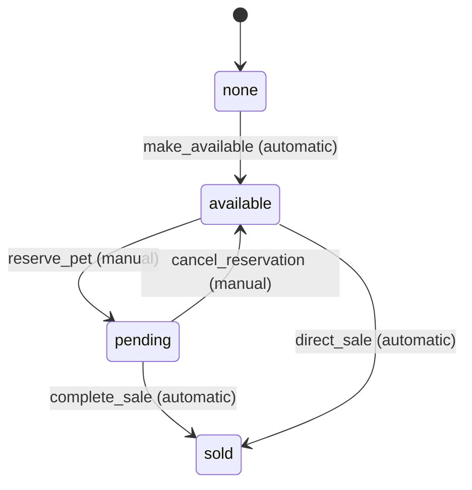
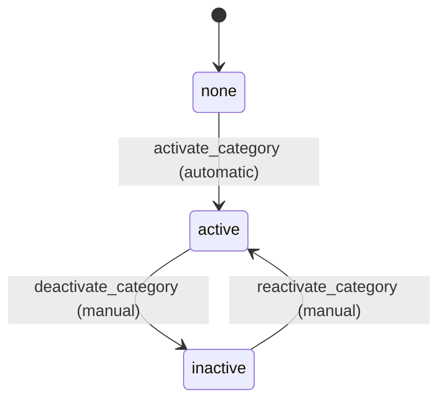
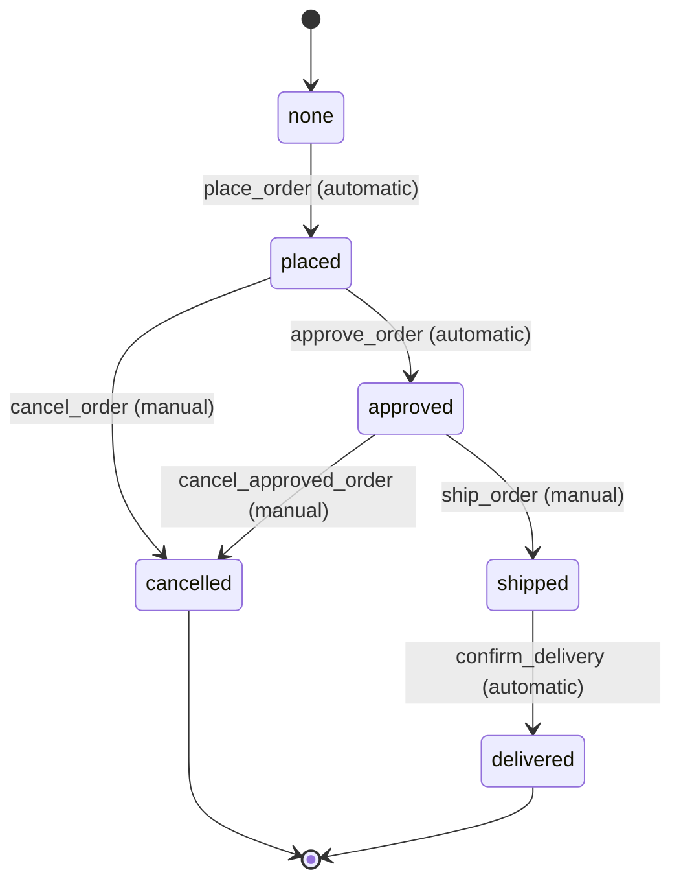
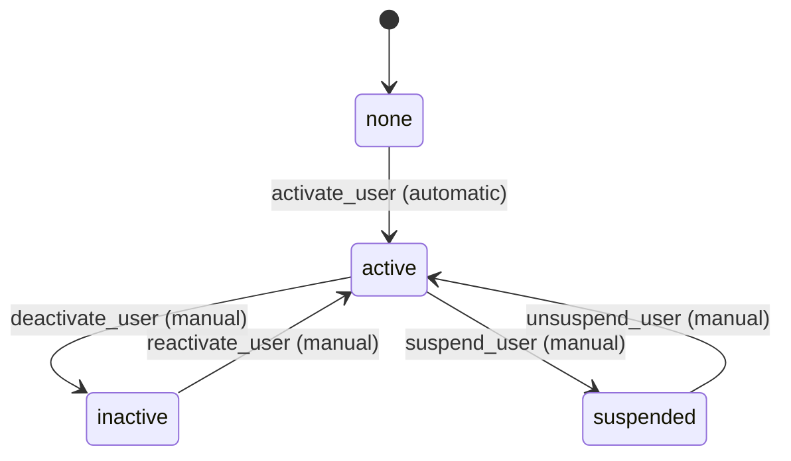

# Purrfect Pets - Workflow Requirements

## Overview
This document defines the workflow states and transitions for each entity in the Purrfect Pets system. Each entity has its own finite state machine (FSM) that manages its lifecycle.

## 1. Pet Workflow

### States
- `none` (initial): Pet entity created but not yet available
- `available`: Pet is available for purchase
- `pending`: Pet is reserved/pending purchase
- `sold`: Pet has been sold

### Transitions

**Transition Details**:
1. `make_available` (none → available)
   - Type: Automatic
   - Processor: PetAvailabilityProcessor
   - Criterion: None
   - Purpose: Make newly created pet available for purchase

2. `reserve_pet` (available → pending)
   - Type: Manual
   - Processor: PetReservationProcessor
   - Criterion: None
   - Purpose: Reserve pet when customer shows interest

3. `cancel_reservation` (pending → available)
   - Type: Manual
   - Processor: None
   - Criterion: None
   - Purpose: Cancel reservation and make pet available again

4. `complete_sale` (pending → sold)
   - Type: Automatic
   - Processor: PetSaleProcessor
   - Criterion: PetPaymentCriterion
   - Purpose: Complete sale when payment is confirmed

5. `direct_sale` (available → sold)
   - Type: Automatic
   - Processor: PetSaleProcessor
   - Criterion: PetPaymentCriterion
   - Purpose: Direct sale without reservation

## 2. Category Workflow

### States
- `none` (initial): Category created but not active
- `active`: Category is active and visible
- `inactive`: Category is inactive/hidden

### Transitions

**Transition Details**:
1. `activate_category` (none → active)
   - Type: Automatic
   - Processor: CategoryActivationProcessor
   - Criterion: None
   - Purpose: Activate newly created category

2. `deactivate_category` (active → inactive)
   - Type: Manual
   - Processor: None
   - Criterion: None
   - Purpose: Deactivate category (hide from customers)

3. `reactivate_category` (inactive → active)
   - Type: Manual
   - Processor: None
   - Criterion: None
   - Purpose: Reactivate previously inactive category

## 3. Order Workflow

### States
- `none` (initial): Order created but not placed
- `placed`: Order has been placed by customer
- `approved`: Order has been approved for processing
- `shipped`: Order has been shipped
- `delivered`: Order has been delivered
- `cancelled`: Order has been cancelled

### Transitions

**Transition Details**:
1. `place_order` (none → placed)
   - Type: Automatic
   - Processor: OrderPlacementProcessor
   - Criterion: None
   - Purpose: Place the order and reserve pets

2. `approve_order` (placed → approved)
   - Type: Automatic
   - Processor: OrderApprovalProcessor
   - Criterion: OrderValidationCriterion
   - Purpose: Approve order after validation

3. `cancel_order` (placed → cancelled)
   - Type: Manual
   - Processor: OrderCancellationProcessor
   - Criterion: None
   - Purpose: Cancel order before approval

4. `ship_order` (approved → shipped)
   - Type: Manual
   - Processor: OrderShippingProcessor
   - Criterion: None
   - Purpose: Ship the approved order

5. `cancel_approved_order` (approved → cancelled)
   - Type: Manual
   - Processor: OrderCancellationProcessor
   - Criterion: None
   - Purpose: Cancel approved order (with penalties)

6. `confirm_delivery` (shipped → delivered)
   - Type: Automatic
   - Processor: OrderDeliveryProcessor
   - Criterion: OrderDeliveryCriterion
   - Purpose: Confirm order delivery

## 4. User Workflow

### States
- `none` (initial): User account created but not active
- `active`: User account is active
- `inactive`: User account is temporarily inactive
- `suspended`: User account is suspended

### Transitions

**Transition Details**:
1. `activate_user` (none → active)
   - Type: Automatic
   - Processor: UserActivationProcessor
   - Criterion: None
   - Purpose: Activate newly registered user

2. `deactivate_user` (active → inactive)
   - Type: Manual
   - Processor: None
   - Criterion: None
   - Purpose: Temporarily deactivate user account

3. `suspend_user` (active → suspended)
   - Type: Manual
   - Processor: UserSuspensionProcessor
   - Criterion: None
   - Purpose: Suspend user for policy violations

4. `reactivate_user` (inactive → active)
   - Type: Manual
   - Processor: None
   - Criterion: None
   - Purpose: Reactivate inactive user account

5. `unsuspend_user` (suspended → active)
   - Type: Manual
   - Processor: UserUnsuspensionProcessor
   - Criterion: None
   - Purpose: Remove suspension from user account

## Workflow Integration Notes

1. **Cross-Entity Dependencies**:
   - When Order transitions to `placed`, referenced Pets should transition to `pending`
   - When Order transitions to `cancelled`, referenced Pets should transition back to `available`
   - When Order transitions to `delivered`, referenced Pets should transition to `sold`

2. **Automatic Transitions**:
   - All initial transitions from `none` state are automatic
   - Payment-related transitions are automatic when criteria are met
   - Delivery confirmation is automatic based on shipping updates

3. **Manual Transitions**:
   - Administrative actions (suspend, cancel, ship) are manual
   - Customer-initiated actions (cancel order) are manual
   - Loop transitions (reactivate, unsuspend) are manual

4. **Processor and Criterion Usage**:
   - Processors are used for business logic and entity updates
   - Criteria are used for validation and conditional checks
   - Not all transitions require processors or criteria
