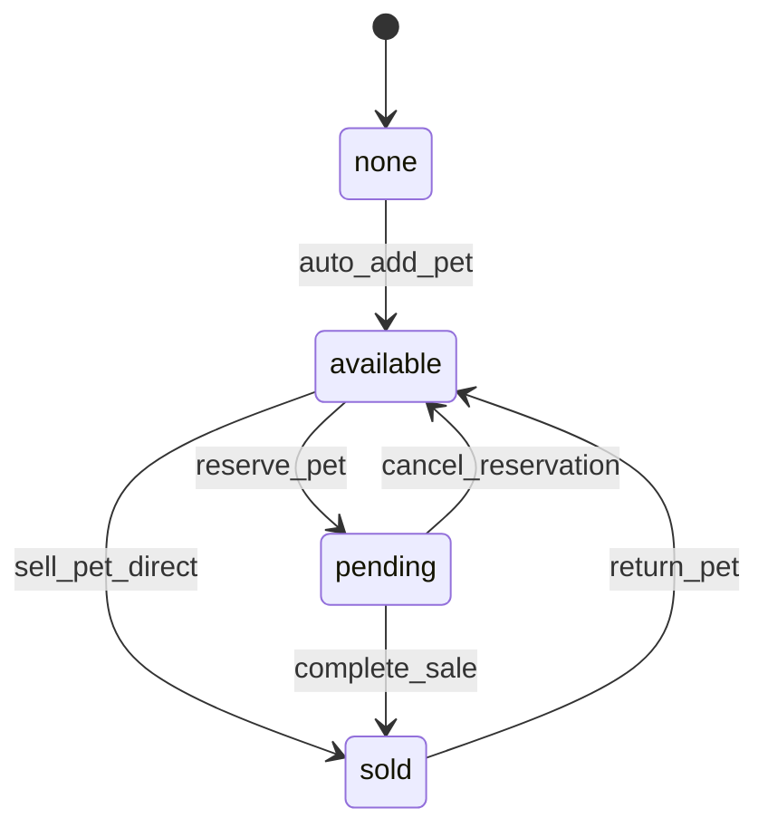
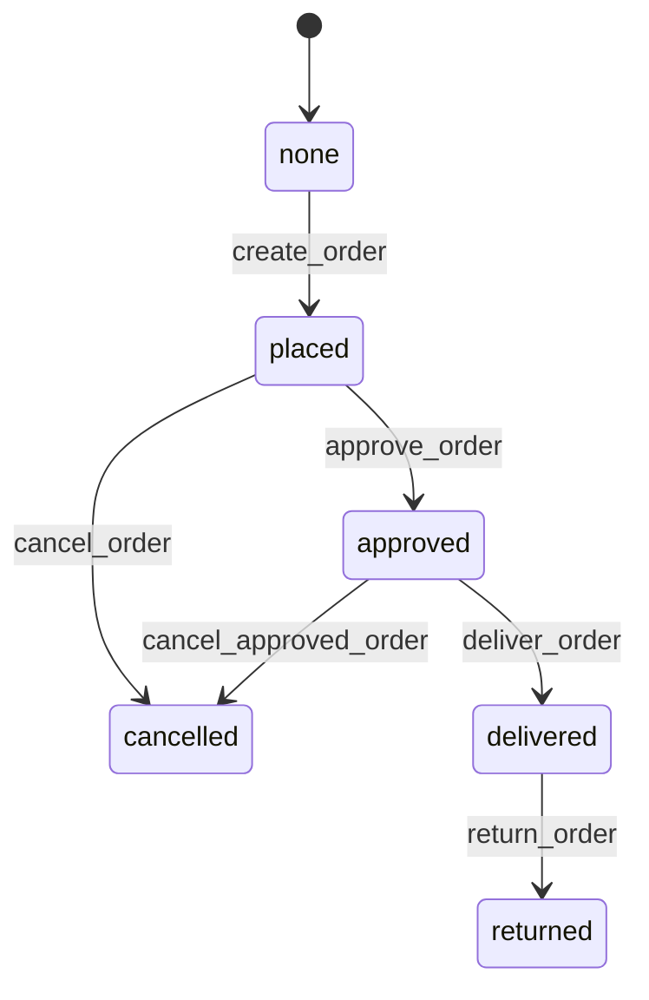
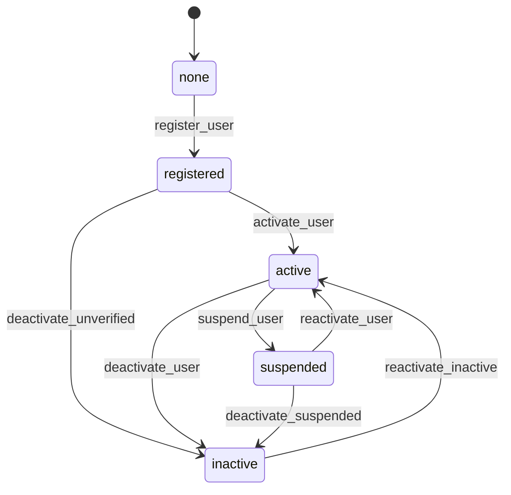

# Purrfect Pets - Workflow Requirements

## Overview
This document defines the workflow requirements for the Purrfect Pets application. Each entity has its own workflow that manages state transitions and business logic.

## 1. Pet Workflow

**Workflow Name:** pet_workflow  
**Entity:** Pet  
**Initial State:** none  

### States and Transitions

### Transition Details

#### 1. auto_add_pet (none → available)
- **Type:** Automatic
- **Trigger:** When a new pet is created
- **Processor:** PetRegistrationProcessor
- **Criterion:** None
- **Description:** Automatically moves new pets to available state after registration

#### 2. reserve_pet (available → pending)
- **Type:** Manual
- **Trigger:** When a customer wants to reserve a pet
- **Processor:** PetReservationProcessor
- **Criterion:** PetAvailabilityCriterion
- **Description:** Reserves a pet for a customer

#### 3. sell_pet_direct (available → sold)
- **Type:** Manual
- **Trigger:** When a pet is sold directly without reservation
- **Processor:** PetSaleProcessor
- **Criterion:** PetAvailabilityCriterion
- **Description:** Directly sells an available pet

#### 4. cancel_reservation (pending → available)
- **Type:** Manual
- **Trigger:** When a reservation is cancelled
- **Processor:** PetReservationCancelProcessor
- **Criterion:** None
- **Description:** Cancels pet reservation and makes it available again

#### 5. complete_sale (pending → sold)
- **Type:** Manual
- **Trigger:** When a reserved pet sale is completed
- **Processor:** PetSaleProcessor
- **Criterion:** PetReservationValidCriterion
- **Description:** Completes the sale of a reserved pet

#### 6. return_pet (sold → available)
- **Type:** Manual
- **Trigger:** When a sold pet is returned
- **Processor:** PetReturnProcessor
- **Criterion:** PetReturnEligibilityCriterion
- **Description:** Processes pet return and makes it available again

## 2. Order Workflow

**Workflow Name:** order_workflow  
**Entity:** Order  
**Initial State:** none  

### States and Transitions

### Transition Details

#### 1. create_order (none → placed)
- **Type:** Automatic
- **Trigger:** When a new order is created
- **Processor:** OrderCreationProcessor
- **Criterion:** None
- **Description:** Automatically places new orders after creation

#### 2. approve_order (placed → approved)
- **Type:** Manual
- **Trigger:** When an order is approved by staff
- **Processor:** OrderApprovalProcessor
- **Criterion:** OrderValidationCriterion
- **Description:** Approves a placed order for processing

#### 3. cancel_order (placed → cancelled)
- **Type:** Manual
- **Trigger:** When a placed order is cancelled
- **Processor:** OrderCancellationProcessor
- **Criterion:** None
- **Description:** Cancels a placed order

#### 4. deliver_order (approved → delivered)
- **Type:** Manual
- **Trigger:** When an approved order is delivered
- **Processor:** OrderDeliveryProcessor
- **Criterion:** OrderReadyForDeliveryCriterion
- **Description:** Marks order as delivered

#### 5. cancel_approved_order (approved → cancelled)
- **Type:** Manual
- **Trigger:** When an approved order needs to be cancelled
- **Processor:** OrderCancellationProcessor
- **Criterion:** OrderCancellationAllowedCriterion
- **Description:** Cancels an approved order with special handling

#### 6. return_order (delivered → returned)
- **Type:** Manual
- **Trigger:** When a delivered order is returned
- **Processor:** OrderReturnProcessor
- **Criterion:** OrderReturnEligibilityCriterion
- **Description:** Processes order return

## 3. User Workflow

**Workflow Name:** user_workflow  
**Entity:** User  
**Initial State:** none  

### States and Transitions

### Transition Details

#### 1. register_user (none → registered)
- **Type:** Automatic
- **Trigger:** When a new user registers
- **Processor:** UserRegistrationProcessor
- **Criterion:** None
- **Description:** Automatically registers new users

#### 2. activate_user (registered → active)
- **Type:** Manual
- **Trigger:** When user verifies email or admin activates
- **Processor:** UserActivationProcessor
- **Criterion:** UserVerificationCriterion
- **Description:** Activates a registered user account

#### 3. deactivate_unverified (registered → inactive)
- **Type:** Manual
- **Trigger:** When unverified account expires
- **Processor:** UserDeactivationProcessor
- **Criterion:** None
- **Description:** Deactivates unverified user accounts

#### 4. suspend_user (active → suspended)
- **Type:** Manual
- **Trigger:** When user violates terms or admin suspends
- **Processor:** UserSuspensionProcessor
- **Criterion:** UserSuspensionCriterion
- **Description:** Suspends an active user account

#### 5. deactivate_user (active → inactive)
- **Type:** Manual
- **Trigger:** When user requests account deletion or admin deactivates
- **Processor:** UserDeactivationProcessor
- **Criterion:** None
- **Description:** Deactivates an active user account

#### 6. reactivate_user (suspended → active)
- **Type:** Manual
- **Trigger:** When suspension period ends or admin reactivates
- **Processor:** UserReactivationProcessor
- **Criterion:** UserReactivationCriterion
- **Description:** Reactivates a suspended user account

#### 7. deactivate_suspended (suspended → inactive)
- **Type:** Manual
- **Trigger:** When suspended account is permanently deactivated
- **Processor:** UserDeactivationProcessor
- **Criterion:** None
- **Description:** Permanently deactivates a suspended account

#### 8. reactivate_inactive (inactive → active)
- **Type:** Manual
- **Trigger:** When inactive user requests reactivation
- **Processor:** UserReactivationProcessor
- **Criterion:** UserReactivationEligibilityCriterion
- **Description:** Reactivates an inactive user account

## Workflow Configuration Notes

1. **Initial Transitions:** All workflows start with an automatic transition from "none" to the first business state
2. **Manual vs Automatic:** First transitions are always automatic; loop transitions (returning to previous states) are manual
3. **Processor Naming:** All processors follow the pattern {Entity}{Action}Processor (e.g., PetRegistrationProcessor)
4. **Criterion Naming:** All criteria follow the pattern {Entity}{Condition}Criterion (e.g., PetAvailabilityCriterion)
5. **State Management:** Entity states are managed by the workflow system and accessed via entity.meta.state
6. **Transition Triggers:** Manual transitions require explicit API calls with transition names

## Cross-Entity Workflow Interactions

### Pet-Order Interaction
- When an order is created, the associated pet should transition to "pending" state
- When an order is delivered, the associated pet should transition to "sold" state
- When an order is cancelled, the associated pet should return to "available" state

### User-Order Interaction
- Orders can only be created for "active" users
- User suspension should not affect existing orders but prevents new orders
- User deactivation should cancel all "placed" orders

These interactions are handled by processors that update related entities during transitions.
