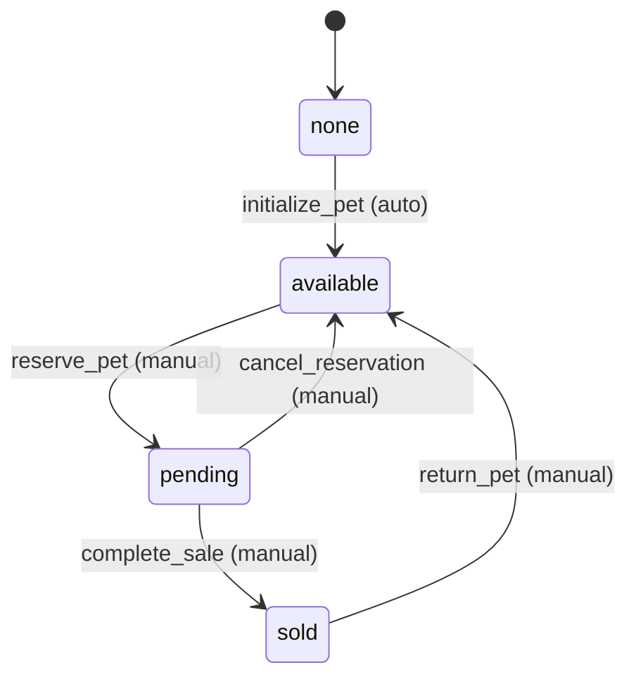
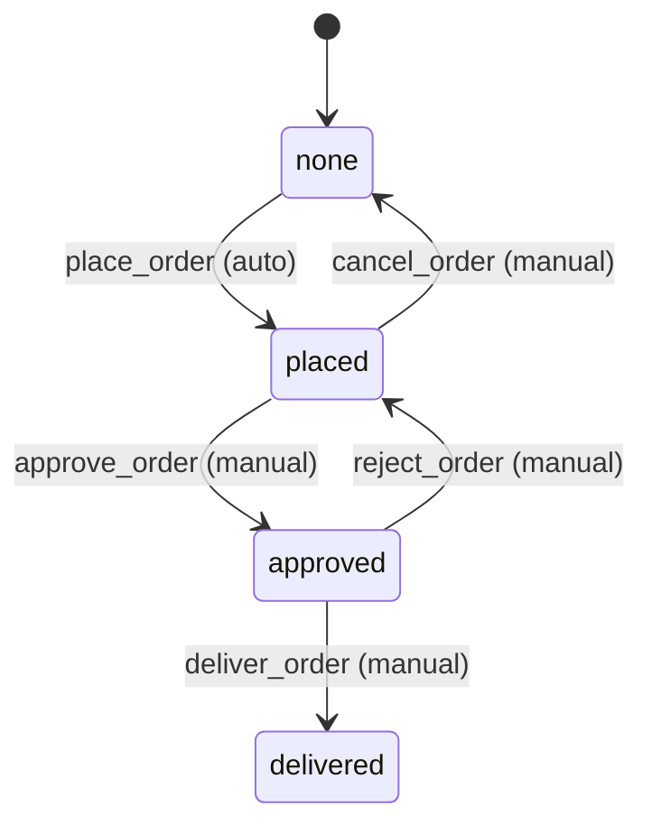
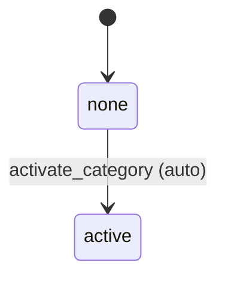
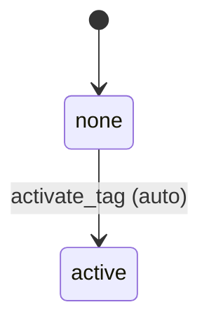

# Purrfect Pets - Workflow Requirements

## Overview
Each entity in the Purrfect Pets system has its own workflow that manages state transitions. The workflows define how entities move through different states based on business rules and user actions.

## 1. Pet Workflow

### States:
- **none** (initial state)
- **available** - Pet is available for purchase
- **pending** - Pet has been reserved/ordered but not yet sold
- **sold** - Pet has been sold and is no longer available

### Transitions:

#### none → available
- **Name**: `initialize_pet`
- **Type**: Automatic (first transition is always automatic)
- **Processor**: `PetInitializationProcessor`
- **Criterion**: None
- **Description**: Initialize a new pet and make it available

#### available → pending
- **Name**: `reserve_pet`
- **Type**: Manual
- **Processor**: `PetReservationProcessor`
- **Criterion**: `PetAvailabilityCriterion`
- **Description**: Reserve a pet when an order is placed

#### pending → sold
- **Name**: `complete_sale`
- **Type**: Manual
- **Processor**: `PetSaleProcessor`
- **Criterion**: `OrderCompletionCriterion`
- **Description**: Mark pet as sold when order is completed

#### pending → available
- **Name**: `cancel_reservation`
- **Type**: Manual
- **Processor**: `PetReservationCancellationProcessor`
- **Criterion**: None
- **Description**: Return pet to available status if reservation is cancelled

#### sold → available
- **Name**: `return_pet`
- **Type**: Manual
- **Processor**: `PetReturnProcessor`
- **Criterion**: `PetReturnCriterion`
- **Description**: Return a sold pet back to available status (rare case)

### Mermaid Diagram:

## 2. Order Workflow

### States:
- **none** (initial state)
- **placed** - Order has been placed by customer
- **approved** - Order has been approved and is being processed
- **delivered** - Order has been delivered to customer

### Transitions:

#### none → placed
- **Name**: `place_order`
- **Type**: Automatic (first transition is always automatic)
- **Processor**: `OrderPlacementProcessor`
- **Criterion**: None
- **Description**: Create a new order

#### placed → approved
- **Name**: `approve_order`
- **Type**: Manual
- **Processor**: `OrderApprovalProcessor`
- **Criterion**: `OrderValidationCriterion`
- **Description**: Approve the order for processing

#### approved → delivered
- **Name**: `deliver_order`
- **Type**: Manual
- **Processor**: `OrderDeliveryProcessor`
- **Criterion**: `DeliveryReadinessCriterion`
- **Description**: Mark order as delivered

#### placed → none
- **Name**: `cancel_order`
- **Type**: Manual
- **Processor**: `OrderCancellationProcessor`
- **Criterion**: None
- **Description**: Cancel a placed order (only from placed state)

#### approved → placed
- **Name**: `reject_order`
- **Type**: Manual
- **Processor**: `OrderRejectionProcessor`
- **Criterion**: None
- **Description**: Reject an approved order back to placed status

### Mermaid Diagram:

## 3. Category Workflow

### States:
- **none** (initial state)
- **active** - Category is active and can be used

### Transitions:

#### none → active
- **Name**: `activate_category`
- **Type**: Automatic (first transition is always automatic)
- **Processor**: `CategoryActivationProcessor`
- **Criterion**: None
- **Description**: Activate a new category

### Mermaid Diagram:

## 4. Tag Workflow

### States:
- **none** (initial state)
- **active** - Tag is active and can be used

### Transitions:

#### none → active
- **Name**: `activate_tag`
- **Type**: Automatic (first transition is always automatic)
- **Processor**: `TagActivationProcessor`
- **Criterion**: None
- **Description**: Activate a new tag

### Mermaid Diagram:

## Workflow Interaction Rules

### Cross-Entity Dependencies:
1. **Pet → Order**: When a pet moves to `pending` state, it should trigger order-related processing
2. **Order → Pet**: When an order is cancelled, the associated pet should return to `available`
3. **Order → Pet**: When an order is delivered, the associated pet should move to `sold`

### Business Rules:
1. **Pet Availability**: A pet can only be reserved if it's in `available` state
2. **Order Validation**: Orders can only be approved if the associated pet is in `pending` state
3. **Delivery Readiness**: Orders can only be delivered if they are in `approved` state
4. **Return Policy**: Pets can only be returned within a specific timeframe (handled by criterion)

### Processor and Criterion Naming Convention:
- **Processors**: `{Entity}{Action}Processor` (e.g., `PetReservationProcessor`)
- **Criteria**: `{Entity}{Condition}Criterion` (e.g., `PetAvailabilityCriterion`)

### Manual vs Automatic Transitions:
- **Automatic**: Only the first transition from `none` state
- **Manual**: All other transitions require explicit user action or system trigger
- **Loop Transitions**: Any transition that goes back to a previous state is marked as manual

This workflow design ensures proper state management while maintaining business logic integrity and supporting the pet store's operational requirements.
