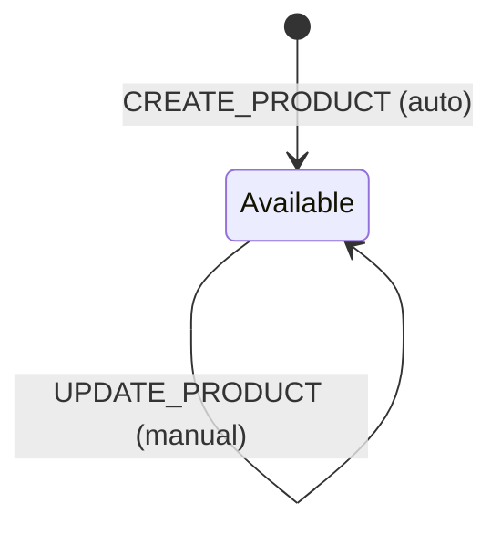
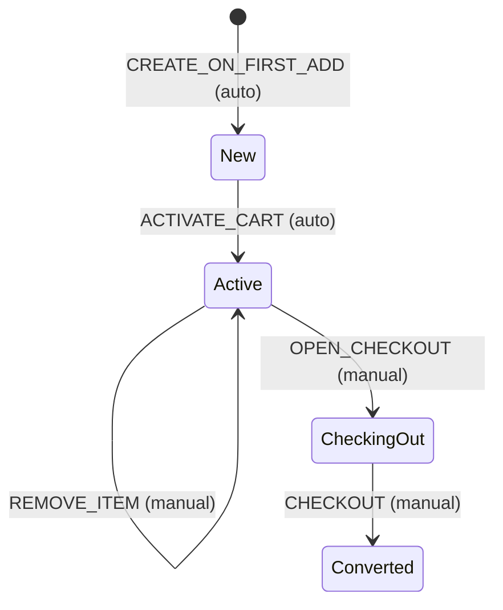
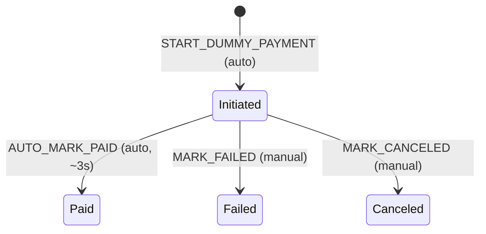
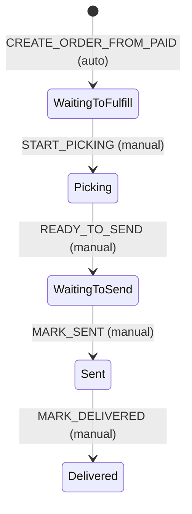
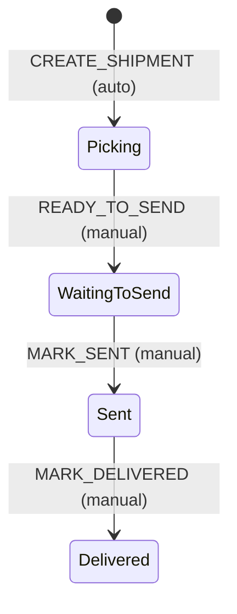

# Workflow Requirements

## Overview
This document defines the detailed workflow requirements for the Cyoda OMS Backend system. Each entity has its own workflow that manages state transitions through business processes.

## 1. Product Workflow

**Workflow Name:** ProductFlow
**Entity:** Product
**Purpose:** Manages product lifecycle from creation to availability

### States
- **Initial** → **Available**

### Transitions
1. **CREATE_PRODUCT** (Initial → Available)
   - **Type:** Automatic
   - **Processor:** None
   - **Criterion:** None
   - **Description:** Automatically moves new products to available state

### Mermaid State Diagram

## 2. Cart Workflow

**Workflow Name:** CartFlow
**Entity:** Cart
**Purpose:** Manages shopping cart lifecycle from creation through checkout

### States
- **Initial** → **New** → **Active** → **CheckingOut** → **Converted**

### Transitions
1. **CREATE_ON_FIRST_ADD** (Initial → New)
   - **Type:** Automatic
   - **Processor:** None
   - **Criterion:** None
   - **Description:** Creates cart when first item is added

2. **ACTIVATE_CART** (New → Active)
   - **Type:** Automatic
   - **Processor:** CartRecalculateTotalsProcessor
   - **Criterion:** None
   - **Description:** Activates cart and calculates initial totals

3. **ADD_ITEM** (Active → Active)
   - **Type:** Manual
   - **Processor:** CartRecalculateTotalsProcessor
   - **Criterion:** None
   - **Description:** Adds item to cart and recalculates totals

4. **UPDATE_ITEM** (Active → Active)
   - **Type:** Manual
   - **Processor:** CartRecalculateTotalsProcessor
   - **Criterion:** None
   - **Description:** Updates item quantity and recalculates totals

5. **REMOVE_ITEM** (Active → Active)
   - **Type:** Manual
   - **Processor:** CartRecalculateTotalsProcessor
   - **Criterion:** None
   - **Description:** Removes item from cart and recalculates totals

6. **OPEN_CHECKOUT** (Active → CheckingOut)
   - **Type:** Manual
   - **Processor:** None
   - **Criterion:** CartHasItemsCriterion
   - **Description:** Moves cart to checkout state if it has items

7. **CHECKOUT** (CheckingOut → Converted)
   - **Type:** Manual
   - **Processor:** None
   - **Criterion:** CartHasGuestContactCriterion
   - **Description:** Converts cart to order when guest contact is provided

### Mermaid State Diagram

## 3. Payment Workflow

**Workflow Name:** PaymentFlow
**Entity:** Payment
**Purpose:** Manages dummy payment processing with automatic approval

### States
- **Initial** → **Initiated** → **Paid** | **Failed** | **Canceled**

### Transitions
1. **START_DUMMY_PAYMENT** (Initial → Initiated)
   - **Type:** Automatic
   - **Processor:** PaymentCreateDummyPaymentProcessor
   - **Criterion:** None
   - **Description:** Creates payment in initiated state

2. **AUTO_MARK_PAID** (Initiated → Paid)
   - **Type:** Automatic
   - **Processor:** PaymentAutoMarkPaidProcessor
   - **Criterion:** None
   - **Description:** Automatically marks payment as paid after ~3 seconds

3. **MARK_FAILED** (Initiated → Failed)
   - **Type:** Manual
   - **Processor:** None
   - **Criterion:** None
   - **Description:** Manually mark payment as failed (for testing)

4. **MARK_CANCELED** (Initiated → Canceled)
   - **Type:** Manual
   - **Processor:** None
   - **Criterion:** None
   - **Description:** Manually cancel payment

### Mermaid State Diagram

## 4. Order Workflow

**Workflow Name:** OrderFlow
**Entity:** Order
**Purpose:** Manages order lifecycle from creation through delivery

### States
- **Initial** → **WaitingToFulfill** → **Picking** → **WaitingToSend** → **Sent** → **Delivered**

### Transitions
1. **CREATE_ORDER_FROM_PAID** (Initial → WaitingToFulfill)
   - **Type:** Automatic
   - **Processor:** OrderCreateFromPaidProcessor
   - **Criterion:** None
   - **Description:** Creates order from paid cart and payment

2. **START_PICKING** (WaitingToFulfill → Picking)
   - **Type:** Manual
   - **Processor:** None
   - **Criterion:** None
   - **Description:** Starts picking process

3. **READY_TO_SEND** (Picking → WaitingToSend)
   - **Type:** Manual
   - **Processor:** None
   - **Criterion:** None
   - **Description:** Picking completed, ready to send

4. **MARK_SENT** (WaitingToSend → Sent)
   - **Type:** Manual
   - **Processor:** None
   - **Criterion:** None
   - **Description:** Order has been sent

5. **MARK_DELIVERED** (Sent → Delivered)
   - **Type:** Manual
   - **Processor:** None
   - **Criterion:** None
   - **Description:** Order has been delivered

### Mermaid State Diagram

## 5. Shipment Workflow

**Workflow Name:** ShipmentFlow
**Entity:** Shipment
**Purpose:** Manages shipment lifecycle synchronized with order

### States
- **Initial** → **Picking** → **WaitingToSend** → **Sent** → **Delivered**

### Transitions
1. **CREATE_SHIPMENT** (Initial → Picking)
   - **Type:** Automatic
   - **Processor:** None
   - **Criterion:** None
   - **Description:** Creates shipment when order is created

2. **READY_TO_SEND** (Picking → WaitingToSend)
   - **Type:** Manual
   - **Processor:** None
   - **Criterion:** None
   - **Description:** Picking completed, ready to send

3. **MARK_SENT** (WaitingToSend → Sent)
   - **Type:** Manual
   - **Processor:** None
   - **Criterion:** None
   - **Description:** Shipment has been sent

4. **MARK_DELIVERED** (Sent → Delivered)
   - **Type:** Manual
   - **Processor:** None
   - **Criterion:** None
   - **Description:** Shipment has been delivered

### Mermaid State Diagram

## Workflow Coordination

### Cart to Order Flow
1. Cart reaches **Converted** state
2. Payment reaches **Paid** state
3. Order **CREATE_ORDER_FROM_PAID** transition is triggered
4. Shipment **CREATE_SHIPMENT** transition is triggered

### Order and Shipment Synchronization
- Order and Shipment states are synchronized
- Shipment state changes drive Order state changes
- Both entities progress through: Picking → WaitingToSend → Sent → Delivered

## Naming Conventions

### Processors
- **CartRecalculateTotalsProcessor** - Recalculates cart totals
- **PaymentCreateDummyPaymentProcessor** - Creates dummy payment
- **PaymentAutoMarkPaidProcessor** - Auto-marks payment as paid
- **OrderCreateFromPaidProcessor** - Creates order from paid cart

### Criteria
- **CartHasItemsCriterion** - Checks if cart has items
- **CartHasGuestContactCriterion** - Checks if cart has guest contact

### Transition Types
- **Automatic** - Triggered by system events
- **Manual** - Triggered by user actions or API calls

## Implementation Notes

1. **First Transition Rule**: Each workflow's first transition from Initial state is always automatic
2. **Loop Transitions**: Self-transitions (like cart item updates) are marked as manual
3. **State Synchronization**: Order and Shipment workflows are synchronized
4. **Processor Limitations**: Processors cannot update the current entity being processed
5. **Criterion Purity**: Criteria must be pure functions without side effects
