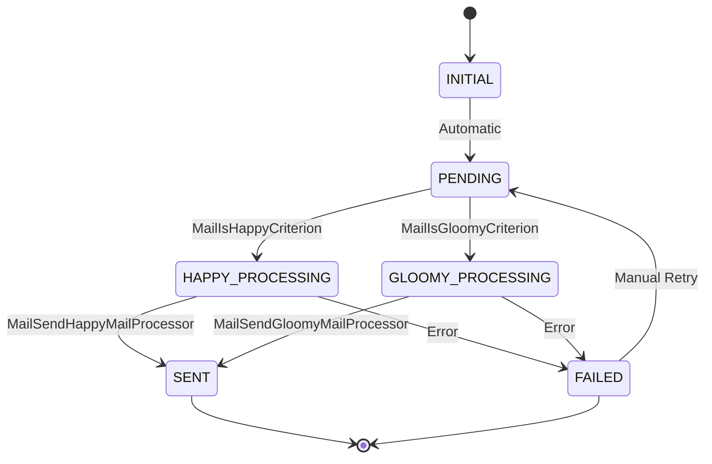

# Workflow Requirements

## Mail Workflow

### Overview
The Mail workflow manages the lifecycle of email processing from creation to delivery. The workflow determines whether to send happy or gloomy mail based on the entity's `isHappy` attribute and processes the mail accordingly.

### Workflow Name
`Mail`

### States

| State | Description | Type |
|-------|-------------|------|
| INITIAL | Starting state when mail entity is created | Initial |
| PENDING | Mail is ready for processing and type determination | Intermediate |
| HAPPY_PROCESSING | Mail identified as happy and being processed | Intermediate |
| GLOOMY_PROCESSING | Mail identified as gloomy and being processed | Intermediate |
| SENT | Mail has been successfully sent | Final |
| FAILED | Mail processing or sending failed | Final |

### Transitions

| From State | To State | Type | Processor | Criterion | Description |
|------------|----------|------|-----------|-----------|-------------|
| INITIAL | PENDING | Automatic | - | - | Initial transition to start processing |
| PENDING | HAPPY_PROCESSING | Automatic | - | MailIsHappyCriterion | Route to happy mail processing |
| PENDING | GLOOMY_PROCESSING | Automatic | - | MailIsGloomyCriterion | Route to gloomy mail processing |
| HAPPY_PROCESSING | SENT | Automatic | MailSendHappyMailProcessor | - | Send happy mail to recipients |
| GLOOMY_PROCESSING | SENT | Automatic | MailSendGloomyMailProcessor | - | Send gloomy mail to recipients |
| HAPPY_PROCESSING | FAILED | Automatic | - | - | Handle happy mail sending failure |
| GLOOMY_PROCESSING | FAILED | Automatic | - | - | Handle gloomy mail sending failure |
| FAILED | PENDING | Manual | - | - | Retry mail processing |

### Workflow State Diagram

### Workflow Rules

1. **Initial Transition**: Every mail starts in INITIAL state and automatically moves to PENDING
2. **Type Determination**: From PENDING state, the workflow uses criteria to determine mail type:
   - If `isHappy` is true → HAPPY_PROCESSING
   - If `isHappy` is false → GLOOMY_PROCESSING
3. **Processing**: Each processing state has a dedicated processor for sending the appropriate mail type
4. **Error Handling**: Failed processing moves to FAILED state
5. **Retry Mechanism**: Manual transition from FAILED back to PENDING allows retry
6. **Final States**: SENT and FAILED are terminal states (except for retry)

### Business Logic Flow

1. **Mail Creation**: New mail entity enters INITIAL state
2. **Preparation**: Automatic transition to PENDING for processing preparation
3. **Type Routing**: Criteria evaluate `isHappy` attribute to route to appropriate processing state
4. **Mail Processing**: Processors handle the actual mail sending logic
5. **Completion**: Successful processing leads to SENT state
6. **Error Recovery**: Failed processing can be retried manually

### Transition Details

#### Automatic Transitions
- **INITIAL → PENDING**: No conditions, always executes
- **PENDING → HAPPY_PROCESSING**: When MailIsHappyCriterion returns true
- **PENDING → GLOOMY_PROCESSING**: When MailIsGloomyCriterion returns true
- **HAPPY_PROCESSING → SENT**: When MailSendHappyMailProcessor completes successfully
- **GLOOMY_PROCESSING → SENT**: When MailSendGloomyMailProcessor completes successfully

#### Manual Transitions
- **FAILED → PENDING**: Requires manual intervention to retry failed mail processing
