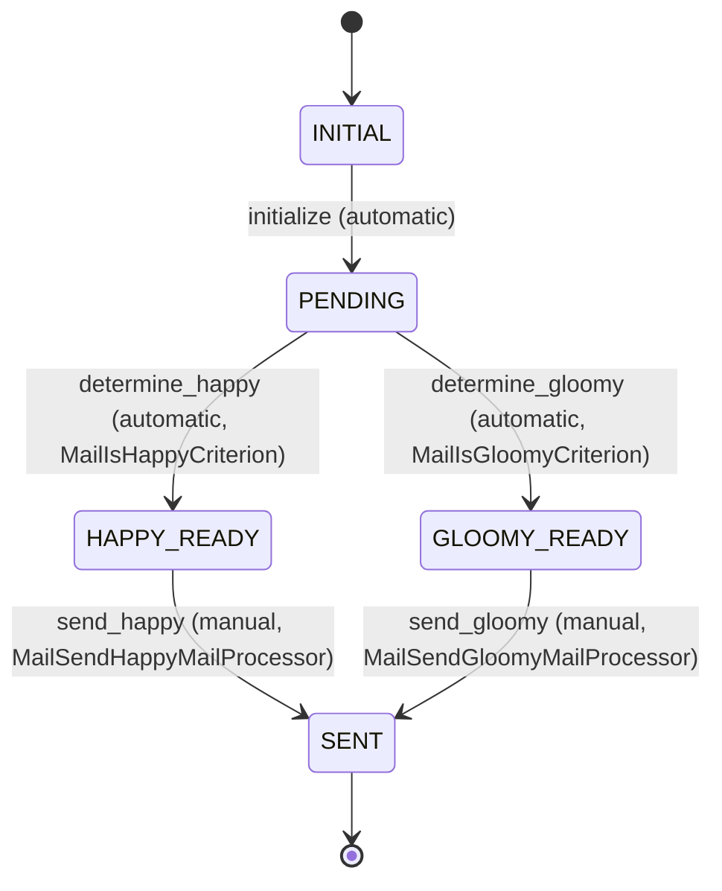

# Workflows Requirements

## Mail Workflow

### Overview
The Mail workflow manages the lifecycle of email processing, from creation through content determination to final delivery.

### Workflow Name
`Mail`

### States

| State | Description |
|-------|-------------|
| INITIAL | Starting state when a mail entity is created |
| PENDING | Mail is created and waiting for content type determination |
| HAPPY_READY | Mail is determined to be happy and ready for sending |
| GLOOMY_READY | Mail is determined to be gloomy and ready for sending |
| SENT | Mail has been successfully sent |

### Transitions

| From State | To State | Transition Name | Type | Processor | Criterion | Description |
|------------|----------|----------------|------|-----------|-----------|-------------|
| INITIAL | PENDING | initialize | Automatic | - | - | Initial transition from creation to pending state |
| PENDING | HAPPY_READY | determine_happy | Automatic | - | MailIsHappyCriterion | Transition when mail is determined to be happy |
| PENDING | GLOOMY_READY | determine_gloomy | Automatic | - | MailIsGloomyCriterion | Transition when mail is determined to be gloomy |
| HAPPY_READY | SENT | send_happy | Manual | MailSendHappyMailProcessor | - | Send happy mail to recipients |
| GLOOMY_READY | SENT | send_gloomy | Manual | MailSendGloomyMailProcessor | - | Send gloomy mail to recipients |

### Workflow State Diagram

### Workflow Logic
1. **Initialization**: Mail entities start in INITIAL state and automatically move to PENDING
2. **Content Determination**: Based on the `isHappy` attribute, the mail automatically transitions to either HAPPY_READY or GLOOMY_READY state
3. **Manual Sending**: From the ready states, manual transitions trigger the actual email sending process
4. **Completion**: After successful sending, the mail reaches the SENT state

### Business Rules
- The content type determination (happy vs gloomy) is automatic based on the entity's `isHappy` attribute
- Email sending is a manual process that requires explicit triggering
- Once sent, the mail workflow is complete
