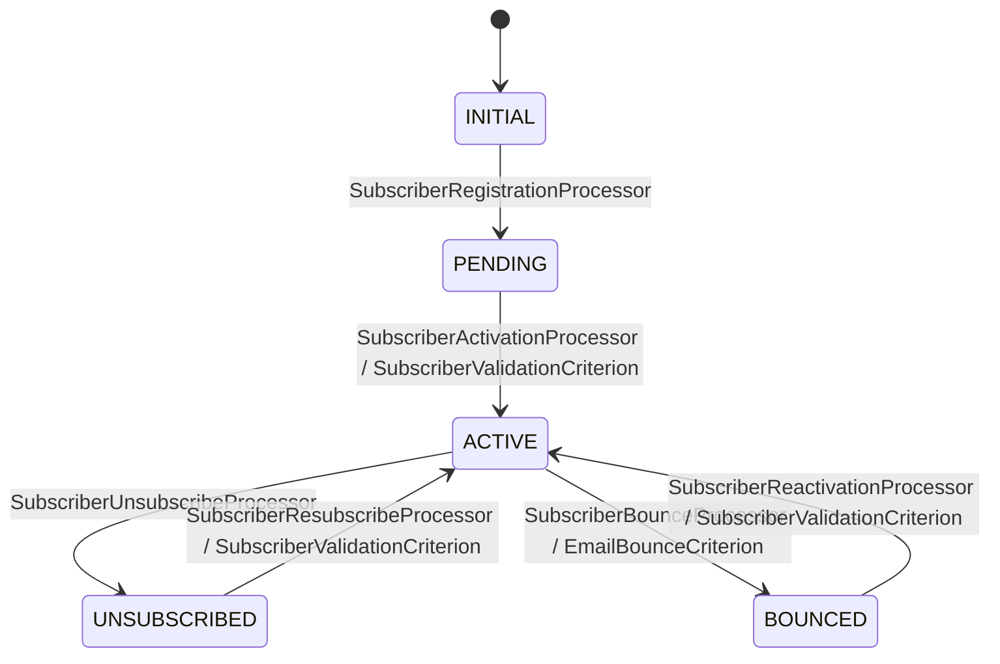
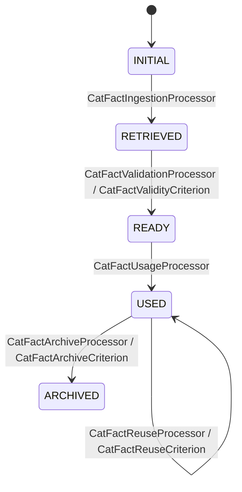
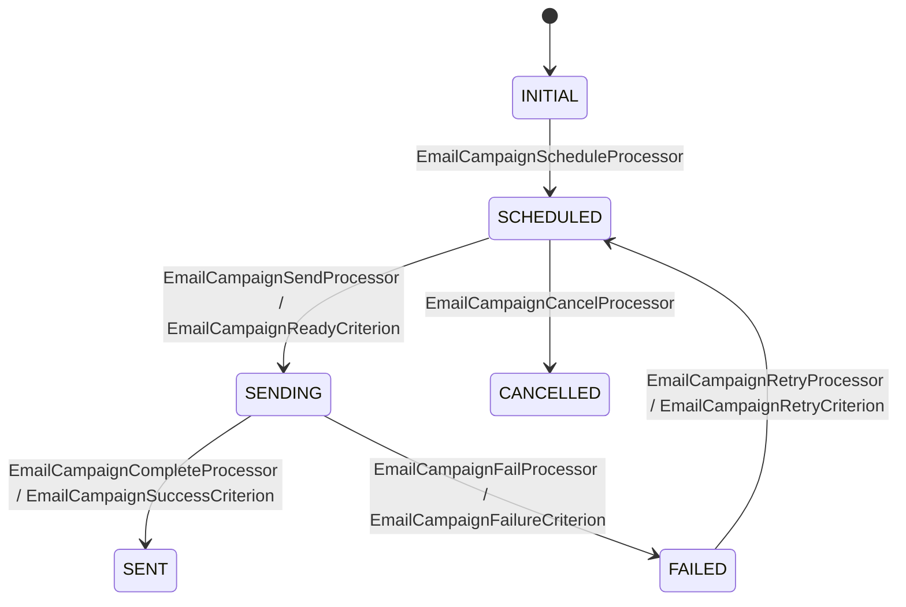

# Workflows Specification

## Overview
This document defines the workflows for each entity in the Weekly Cat Fact Subscription application. Each workflow represents the lifecycle and state transitions of the entities.

## 1. Subscriber Workflow

### States
- `INITIAL` - System initial state (not user-facing)
- `PENDING` - User has signed up but not yet confirmed
- `ACTIVE` - Confirmed subscriber receiving emails
- `UNSUBSCRIBED` - User has unsubscribed
- `BOUNCED` - Email delivery failed

### Transitions

| From | To | Type | Processor | Criterion | Description |
|------|----|----|-----------|-----------|-------------|
| INITIAL | PENDING | Automatic | SubscriberRegistrationProcessor | - | User signs up for subscription |
| PENDING | ACTIVE | Manual | SubscriberActivationProcessor | SubscriberValidationCriterion | User confirms subscription |
| ACTIVE | UNSUBSCRIBED | Manual | SubscriberUnsubscribeProcessor | - | User unsubscribes |
| ACTIVE | BOUNCED | Automatic | SubscriberBounceProcessor | EmailBounceCriterion | Email delivery fails |
| BOUNCED | ACTIVE | Manual | SubscriberReactivationProcessor | SubscriberValidationCriterion | User reactivates subscription |
| UNSUBSCRIBED | ACTIVE | Manual | SubscriberResubscribeProcessor | SubscriberValidationCriterion | User resubscribes |

### Mermaid State Diagram

```mermaid
stateDiagram-v2
    [*] --> INITIAL
    INITIAL --> PENDING : SubscriberRegistrationProcessor
    PENDING --> ACTIVE : SubscriberActivationProcessor / SubscriberValidationCriterion
    ACTIVE --> UNSUBSCRIBED : SubscriberUnsubscribeProcessor
    ACTIVE --> BOUNCED : SubscriberBounceProcessor / EmailBounceCriterion
    BOUNCED --> ACTIVE : SubscriberReactivationProcessor / SubscriberValidationCriterion
    UNSUBSCRIBED --> ACTIVE : SubscriberResubscribeProcessor / SubscriberValidationCriterion
```

## 2. CatFact Workflow

### States
- `INITIAL` - System initial state (not user-facing)
- `RETRIEVED` - Fact retrieved from API
- `READY` - Fact is ready for use in campaigns
- `USED` - Fact has been used in campaigns
- `ARCHIVED` - Fact is archived

### Transitions

| From | To | Type | Processor | Criterion | Description |
|------|----|----|-----------|-----------|-------------|
| INITIAL | RETRIEVED | Automatic | CatFactIngestionProcessor | - | Fact retrieved from Cat Fact API |
| RETRIEVED | READY | Automatic | CatFactValidationProcessor | CatFactValidityCriterion | Fact validated and ready for use |
| READY | USED | Automatic | CatFactUsageProcessor | - | Fact used in email campaign |
| USED | USED | Manual | CatFactReuseProcessor | CatFactReuseCriterion | Fact reused in another campaign |
| USED | ARCHIVED | Manual | CatFactArchiveProcessor | CatFactArchiveCriterion | Fact archived after multiple uses |

### Mermaid State Diagram

```mermaid
stateDiagram-v2
    [*] --> INITIAL
    INITIAL --> RETRIEVED : CatFactIngestionProcessor
    RETRIEVED --> READY : CatFactValidationProcessor / CatFactValidityCriterion
    READY --> USED : CatFactUsageProcessor
    USED --> USED : CatFactReuseProcessor / CatFactReuseCriterion
    USED --> ARCHIVED : CatFactArchiveProcessor / CatFactArchiveCriterion
```

## 3. EmailCampaign Workflow

### States
- `INITIAL` - System initial state (not user-facing)
- `SCHEDULED` - Campaign scheduled for sending
- `SENDING` - Campaign is currently being sent
- `SENT` - Campaign successfully sent
- `FAILED` - Campaign failed to send
- `CANCELLED` - Campaign was cancelled

### Transitions

| From | To | Type | Processor | Criterion | Description |
|------|----|----|-----------|-----------|-------------|
| INITIAL | SCHEDULED | Automatic | EmailCampaignScheduleProcessor | - | Campaign created and scheduled |
| SCHEDULED | SENDING | Automatic | EmailCampaignSendProcessor | EmailCampaignReadyCriterion | Campaign starts sending |
| SCHEDULED | CANCELLED | Manual | EmailCampaignCancelProcessor | - | Campaign cancelled before sending |
| SENDING | SENT | Automatic | EmailCampaignCompleteProcessor | EmailCampaignSuccessCriterion | Campaign successfully sent |
| SENDING | FAILED | Automatic | EmailCampaignFailProcessor | EmailCampaignFailureCriterion | Campaign failed during sending |
| FAILED | SCHEDULED | Manual | EmailCampaignRetryProcessor | EmailCampaignRetryCriterion | Retry failed campaign |

### Mermaid State Diagram

```mermaid
stateDiagram-v2
    [*] --> INITIAL
    INITIAL --> SCHEDULED : EmailCampaignScheduleProcessor
    SCHEDULED --> SENDING : EmailCampaignSendProcessor / EmailCampaignReadyCriterion
    SCHEDULED --> CANCELLED : EmailCampaignCancelProcessor
    SENDING --> SENT : EmailCampaignCompleteProcessor / EmailCampaignSuccessCriterion
    SENDING --> FAILED : EmailCampaignFailProcessor / EmailCampaignFailureCriterion
    FAILED --> SCHEDULED : EmailCampaignRetryProcessor / EmailCampaignRetryCriterion
```

## Workflow Integration Points

### Weekly Cat Fact Process Flow
1. **CatFact Ingestion**: CatFactIngestionProcessor retrieves new facts weekly
2. **Campaign Creation**: EmailCampaignScheduleProcessor creates weekly campaigns
3. **Campaign Execution**: EmailCampaignSendProcessor sends emails to active subscribers
4. **Subscriber Updates**: SubscriberBounceProcessor handles delivery failures
5. **Reporting**: All processors update metrics for tracking

### Cross-Entity Interactions
- EmailCampaignSendProcessor updates Subscriber.lastEmailSent and totalEmailsReceived
- SubscriberBounceProcessor transitions subscribers to BOUNCED state
- CatFactUsageProcessor marks facts as USED when included in campaigns
- EmailCampaignCompleteProcessor updates campaign metrics and subscriber statistics

## Naming Conventions
- All processors follow PascalCase naming: EntityNameActionProcessor
- All criteria follow PascalCase naming: EntityNameConditionCriterion
- Transition names are descriptive and action-oriented
