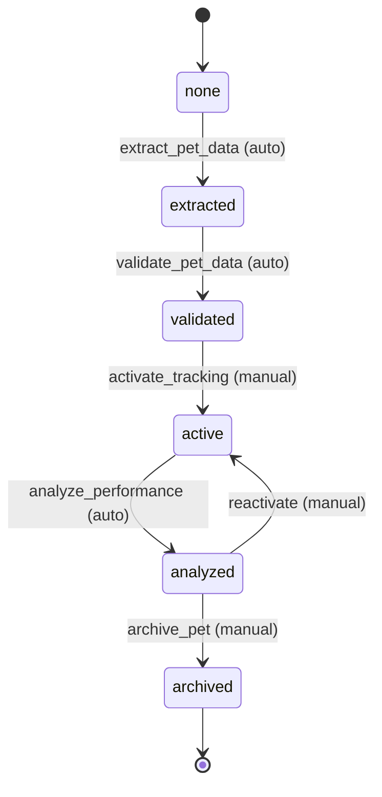
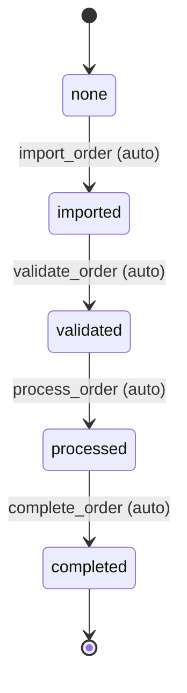
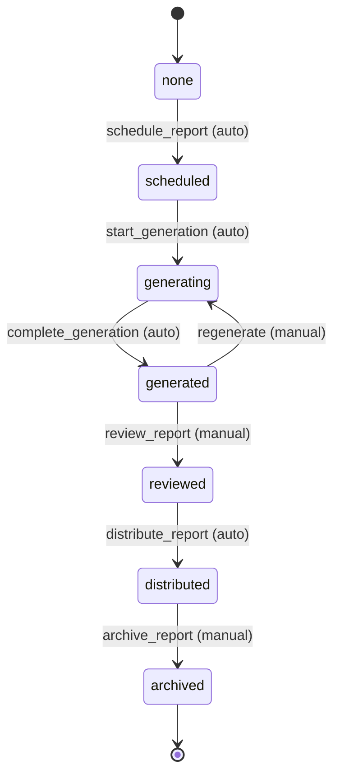
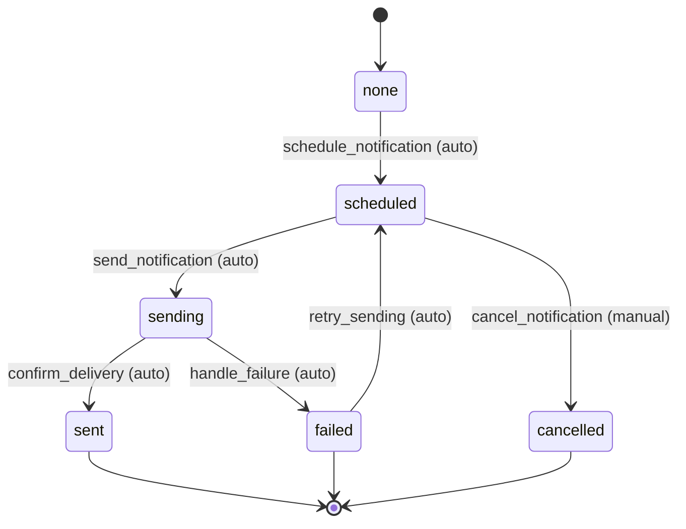

# Workflow Requirements

## Overview
This document defines the workflow requirements for the Product Performance Analysis and Reporting System. Each entity has its own workflow with states, transitions, processors, and criteria.

## Workflow Definitions

### 1. Pet Workflow

**Purpose**: Manages the lifecycle of pet products from data extraction to performance analysis.

**States**:
- `none` (Initial): Starting state for new pet records
- `extracted`: Pet data successfully extracted from API
- `validated`: Pet data validated and enriched
- `active`: Pet is actively tracked for performance
- `analyzed`: Performance metrics calculated
- `archived`: Pet no longer actively tracked

**Transitions**:

1. **extract_pet_data** (none → extracted)
   - Type: Automatic
   - Processor: PetDataExtractionProcessor
   - Description: Extract pet data from Pet Store API

2. **validate_pet_data** (extracted → validated)
   - Type: Automatic
   - Processor: PetDataValidationProcessor
   - Criterion: PetDataValidityCriterion
   - Description: Validate and enrich pet data

3. **activate_tracking** (validated → active)
   - Type: Manual
   - Description: Start performance tracking for pet

4. **analyze_performance** (active → analyzed)
   - Type: Automatic
   - Processor: PetPerformanceAnalysisProcessor
   - Criterion: PetAnalysisReadyCriterion
   - Description: Calculate performance metrics

5. **reactivate** (analyzed → active)
   - Type: Manual
   - Description: Return to active tracking

6. **archive_pet** (analyzed → archived)
   - Type: Manual
   - Criterion: PetArchivalCriterion
   - Description: Archive inactive pet

```mermaid
stateDiagram-v2
    [*] --> none
    none --> extracted : extract_pet_data (auto)
    extracted --> validated : validate_pet_data (auto)
    validated --> active : activate_tracking (manual)
    active --> analyzed : analyze_performance (auto)
    analyzed --> active : reactivate (manual)
    analyzed --> archived : archive_pet (manual)
    archived --> [*]
```

### 2. Order Workflow

**Purpose**: Manages order processing and sales tracking for performance analysis.

**States**:
- `none` (Initial): Starting state for new orders
- `imported`: Order data imported from API
- `validated`: Order data validated
- `processed`: Order processed for analytics
- `completed`: Order fully processed

**Transitions**:

1. **import_order** (none → imported)
   - Type: Automatic
   - Processor: OrderImportProcessor
   - Description: Import order data from Pet Store API

2. **validate_order** (imported → validated)
   - Type: Automatic
   - Processor: OrderValidationProcessor
   - Criterion: OrderValidityCriterion
   - Description: Validate order data and link to pet

3. **process_order** (validated → processed)
   - Type: Automatic
   - Processor: OrderProcessingProcessor
   - Description: Process order for analytics

4. **complete_order** (processed → completed)
   - Type: Automatic
   - Processor: OrderCompletionProcessor
   - Description: Mark order as completed

```mermaid
stateDiagram-v2
    [*] --> none
    none --> imported : import_order (auto)
    imported --> validated : validate_order (auto)
    validated --> processed : process_order (auto)
    processed --> completed : complete_order (auto)
    completed --> [*]
```

### 3. Report Workflow

**Purpose**: Manages report generation, analysis, and distribution lifecycle.

**States**:
- `none` (Initial): Starting state for new reports
- `scheduled`: Report generation scheduled
- `generating`: Report being generated
- `generated`: Report successfully created
- `reviewed`: Report reviewed and approved
- `distributed`: Report sent to recipients
- `archived`: Report archived for historical reference

**Transitions**:

1. **schedule_report** (none → scheduled)
   - Type: Automatic
   - Processor: ReportSchedulingProcessor
   - Description: Schedule weekly report generation

2. **start_generation** (scheduled → generating)
   - Type: Automatic
   - Processor: ReportGenerationProcessor
   - Criterion: ReportGenerationReadyCriterion
   - Description: Begin report generation process

3. **complete_generation** (generating → generated)
   - Type: Automatic
   - Processor: ReportCompletionProcessor
   - Description: Finalize report generation

4. **review_report** (generated → reviewed)
   - Type: Manual
   - Processor: ReportReviewProcessor
   - Description: Review and approve report

5. **distribute_report** (reviewed → distributed)
   - Type: Automatic
   - Processor: ReportDistributionProcessor
   - Description: Send report to recipients

6. **archive_report** (distributed → archived)
   - Type: Manual
   - Criterion: ReportArchivalCriterion
   - Description: Archive completed report

7. **regenerate** (generated → generating)
   - Type: Manual
   - Description: Regenerate report if issues found

```mermaid
stateDiagram-v2
    [*] --> none
    none --> scheduled : schedule_report (auto)
    scheduled --> generating : start_generation (auto)
    generating --> generated : complete_generation (auto)
    generated --> reviewed : review_report (manual)
    generated --> generating : regenerate (manual)
    reviewed --> distributed : distribute_report (auto)
    distributed --> archived : archive_report (manual)
    archived --> [*]
```

### 4. EmailNotification Workflow

**Purpose**: Manages email notification delivery lifecycle.

**States**:
- `none` (Initial): Starting state for new notifications
- `scheduled`: Notification scheduled for delivery
- `sending`: Notification being sent
- `sent`: Notification successfully delivered
- `failed`: Notification delivery failed
- `cancelled`: Notification cancelled

**Transitions**:

1. **schedule_notification** (none → scheduled)
   - Type: Automatic
   - Processor: NotificationSchedulingProcessor
   - Description: Schedule email notification

2. **send_notification** (scheduled → sending)
   - Type: Automatic
   - Processor: EmailSendingProcessor
   - Criterion: EmailSendingReadyCriterion
   - Description: Send email notification

3. **confirm_delivery** (sending → sent)
   - Type: Automatic
   - Processor: DeliveryConfirmationProcessor
   - Description: Confirm successful delivery

4. **handle_failure** (sending → failed)
   - Type: Automatic
   - Processor: DeliveryFailureProcessor
   - Criterion: DeliveryFailureCriterion
   - Description: Handle delivery failure

5. **retry_sending** (failed → scheduled)
   - Type: Automatic
   - Processor: RetryProcessor
   - Criterion: RetryEligibilityCriterion
   - Description: Retry failed notification

6. **cancel_notification** (scheduled → cancelled)
   - Type: Manual
   - Description: Cancel scheduled notification

```mermaid
stateDiagram-v2
    [*] --> none
    none --> scheduled : schedule_notification (auto)
    scheduled --> sending : send_notification (auto)
    scheduled --> cancelled : cancel_notification (manual)
    sending --> sent : confirm_delivery (auto)
    sending --> failed : handle_failure (auto)
    failed --> scheduled : retry_sending (auto)
    sent --> [*]
    failed --> [*]
    cancelled --> [*]
```

## Workflow Integration

### Cross-Entity Triggers
- Pet analysis completion triggers Report generation
- Report completion triggers EmailNotification creation
- Order processing updates Pet performance metrics

### Scheduling
- Pet data extraction: Every Monday (automated)
- Report generation: Weekly (automated)
- Performance analysis: Daily (automated)

### Error Handling
- Failed transitions remain in current state
- Retry mechanisms for critical processes
- Manual intervention points for error resolution

## Transition Naming Conventions
- Use snake_case for transition names
- Start with action verb (extract, validate, process, etc.)
- Be descriptive and specific to business context
- Align with processor and criterion naming
