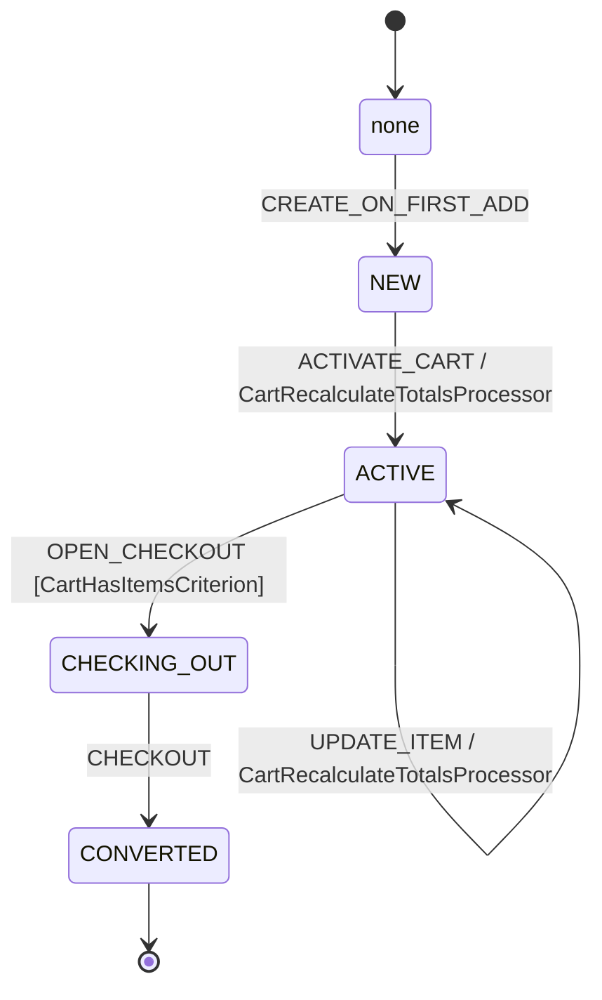
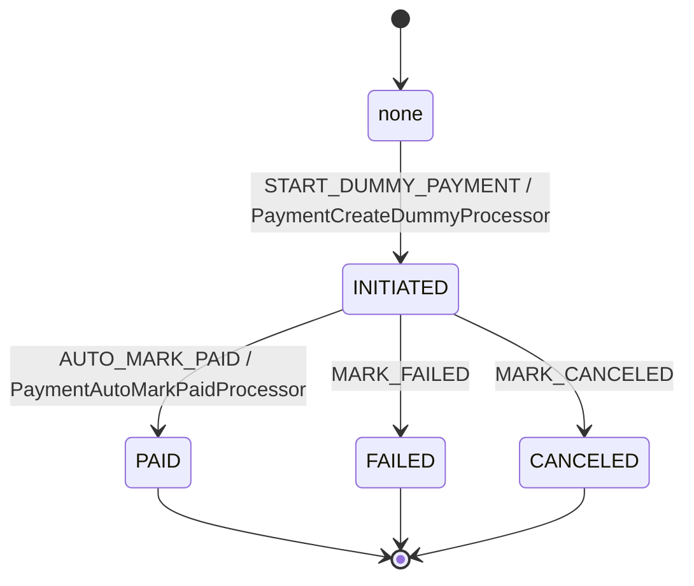
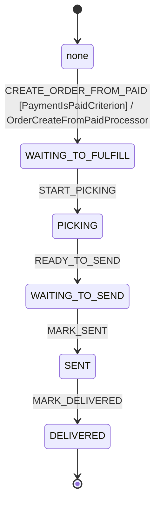
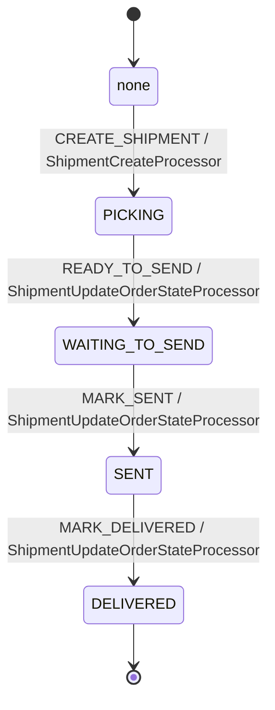

# Workflow Requirements

## Overview

This document defines the detailed workflow requirements for the Cyoda OMS Backend system. Each entity has its own workflow that manages state transitions and business logic through processors and criteria.

## Workflow Definitions

### 1. CartFlow

**Entity**: Cart
**Purpose**: Manages shopping cart lifecycle from creation to conversion

**States**: `none` → `NEW` → `ACTIVE` → `CHECKING_OUT` → `CONVERTED`

**Transitions**:

1. **CREATE_ON_FIRST_ADD** (automatic)
   - From: `none` (initial state)
   - To: `NEW`
   - Trigger: First item added to cart
   - Processor: None
   - Criterion: None

2. **ACTIVATE_CART** (automatic)
   - From: `NEW`
   - To: `ACTIVE`
   - Trigger: Cart created with first item
   - Processor: `CartRecalculateTotalsProcessor`
   - Criterion: None

3. **ADD_ITEM** (manual)
   - From: `ACTIVE`
   - To: `ACTIVE` (loop)
   - Trigger: Add/increment item in cart
   - Processor: `CartRecalculateTotalsProcessor`
   - Criterion: None

4. **UPDATE_ITEM** (manual)
   - From: `ACTIVE`
   - To: `ACTIVE` (loop)
   - Trigger: Update item quantity (remove if qty=0)
   - Processor: `CartRecalculateTotalsProcessor`
   - Criterion: None

5. **OPEN_CHECKOUT** (manual)
   - From: `ACTIVE`
   - To: `CHECKING_OUT`
   - Trigger: User initiates checkout
   - Processor: None
   - Criterion: `CartHasItemsCriterion`

6. **CHECKOUT** (manual)
   - From: `CHECKING_OUT`
   - To: `CONVERTED`
   - Trigger: Successful order creation
   - Processor: None
   - Criterion: None

```mermaid
stateDiagram-v2
    [*] --> none
    none --> NEW : CREATE_ON_FIRST_ADD
    NEW --> ACTIVE : ACTIVATE_CART / CartRecalculateTotalsProcessor
    ACTIVE --> ACTIVE : ADD_ITEM / CartRecalculateTotalsProcessor
    ACTIVE --> ACTIVE : UPDATE_ITEM / CartRecalculateTotalsProcessor
    ACTIVE --> CHECKING_OUT : OPEN_CHECKOUT [CartHasItemsCriterion]
    CHECKING_OUT --> CONVERTED : CHECKOUT
    CONVERTED --> [*]
```

---

### 2. PaymentFlow

**Entity**: Payment
**Purpose**: Manages dummy payment processing with auto-approval

**States**: `none` → `INITIATED` → `PAID` | `FAILED` | `CANCELED`

**Transitions**:

1. **START_DUMMY_PAYMENT** (automatic)
   - From: `none` (initial state)
   - To: `INITIATED`
   - Trigger: Payment creation
   - Processor: `PaymentCreateDummyProcessor`
   - Criterion: None

2. **AUTO_MARK_PAID** (automatic)
   - From: `INITIATED`
   - To: `PAID`
   - Trigger: Auto-approval after ~3 seconds
   - Processor: `PaymentAutoMarkPaidProcessor`
   - Criterion: None

3. **MARK_FAILED** (manual)
   - From: `INITIATED`
   - To: `FAILED`
   - Trigger: Manual failure (for testing)
   - Processor: None
   - Criterion: None

4. **MARK_CANCELED** (manual)
   - From: `INITIATED`
   - To: `CANCELED`
   - Trigger: Manual cancellation
   - Processor: None
   - Criterion: None

```mermaid
stateDiagram-v2
    [*] --> none
    none --> INITIATED : START_DUMMY_PAYMENT / PaymentCreateDummyProcessor
    INITIATED --> PAID : AUTO_MARK_PAID / PaymentAutoMarkPaidProcessor
    INITIATED --> FAILED : MARK_FAILED
    INITIATED --> CANCELED : MARK_CANCELED
    PAID --> [*]
    FAILED --> [*]
    CANCELED --> [*]
```

---

### 3. OrderLifecycle

**Entity**: Order
**Purpose**: Manages order fulfillment from creation to delivery

**States**: `none` → `WAITING_TO_FULFILL` → `PICKING` → `WAITING_TO_SEND` → `SENT` → `DELIVERED`

**Transitions**:

1. **CREATE_ORDER_FROM_PAID** (automatic)
   - From: `none` (initial state)
   - To: `WAITING_TO_FULFILL`
   - Trigger: Order creation from paid cart
   - Processor: `OrderCreateFromPaidProcessor`
   - Criterion: `PaymentIsPaidCriterion`

2. **START_PICKING** (automatic)
   - From: `WAITING_TO_FULFILL`
   - To: `PICKING`
   - Trigger: Shipment created and picking started
   - Processor: None
   - Criterion: None

3. **READY_TO_SEND** (manual)
   - From: `PICKING`
   - To: `WAITING_TO_SEND`
   - Trigger: Picking completed
   - Processor: None
   - Criterion: None

4. **MARK_SENT** (manual)
   - From: `WAITING_TO_SEND`
   - To: `SENT`
   - Trigger: Shipment dispatched
   - Processor: None
   - Criterion: None

5. **MARK_DELIVERED** (manual)
   - From: `SENT`
   - To: `DELIVERED`
   - Trigger: Delivery confirmed
   - Processor: None
   - Criterion: None

```mermaid
stateDiagram-v2
    [*] --> none
    none --> WAITING_TO_FULFILL : CREATE_ORDER_FROM_PAID [PaymentIsPaidCriterion] / OrderCreateFromPaidProcessor
    WAITING_TO_FULFILL --> PICKING : START_PICKING
    PICKING --> WAITING_TO_SEND : READY_TO_SEND
    WAITING_TO_SEND --> SENT : MARK_SENT
    SENT --> DELIVERED : MARK_DELIVERED
    DELIVERED --> [*]
```

---

### 4. ShipmentFlow

**Entity**: Shipment
**Purpose**: Manages shipment processing and drives order state changes

**States**: `none` → `PICKING` → `WAITING_TO_SEND` → `SENT` → `DELIVERED`

**Transitions**:

1. **CREATE_SHIPMENT** (automatic)
   - From: `none` (initial state)
   - To: `PICKING`
   - Trigger: Shipment creation during order processing
   - Processor: `ShipmentCreateProcessor`
   - Criterion: None

2. **READY_TO_SEND** (manual)
   - From: `PICKING`
   - To: `WAITING_TO_SEND`
   - Trigger: Picking completed
   - Processor: `ShipmentUpdateOrderStateProcessor`
   - Criterion: None

3. **MARK_SENT** (manual)
   - From: `WAITING_TO_SEND`
   - To: `SENT`
   - Trigger: Shipment dispatched
   - Processor: `ShipmentUpdateOrderStateProcessor`
   - Criterion: None

4. **MARK_DELIVERED** (manual)
   - From: `SENT`
   - To: `DELIVERED`
   - Trigger: Delivery confirmed
   - Processor: `ShipmentUpdateOrderStateProcessor`
   - Criterion: None

```mermaid
stateDiagram-v2
    [*] --> none
    none --> PICKING : CREATE_SHIPMENT / ShipmentCreateProcessor
    PICKING --> WAITING_TO_SEND : READY_TO_SEND / ShipmentUpdateOrderStateProcessor
    WAITING_TO_SEND --> SENT : MARK_SENT / ShipmentUpdateOrderStateProcessor
    SENT --> DELIVERED : MARK_DELIVERED / ShipmentUpdateOrderStateProcessor
    DELIVERED --> [*]
```

## Workflow Integration

### Cross-Entity Workflow Coordination

1. **Cart → Payment**: Cart in CHECKING_OUT state enables payment creation
2. **Payment → Order**: Payment in PAID state triggers order creation
3. **Order → Shipment**: Order creation automatically creates shipment
4. **Shipment → Order**: Shipment state changes drive order state updates

### Business Rules

1. **First Transition**: All workflows start with automatic transition from `none` (initial state)
2. **Manual Transitions**: Loop transitions and user-triggered actions are marked as manual
3. **Automatic Transitions**: System-driven transitions (like payment auto-approval) are automatic
4. **State Synchronization**: Shipment state changes automatically update corresponding order state

### Processor and Criterion Naming Convention

- **Processors**: `{Entity}{Action}Processor` (e.g., `CartRecalculateTotalsProcessor`)
- **Criteria**: `{Entity}{Condition}Criterion` (e.g., `PaymentIsPaidCriterion`)
- All names use PascalCase starting with entity name
