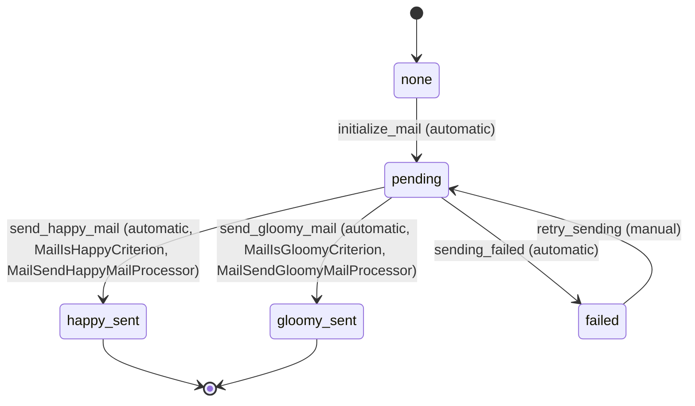

# Workflows

## Mail Workflow

### Description
The Mail workflow manages the lifecycle of mail sending operations. It determines whether a mail is happy or gloomy and processes it accordingly through the appropriate sending mechanism.

### Workflow Name
`mail_workflow`

### Initial State
`none`

### States and Transitions

#### States:
1. **none** - Initial state when mail entity is created
2. **pending** - Mail is ready for processing
3. **happy_sent** - Happy mail has been successfully sent
4. **gloomy_sent** - Gloomy mail has been successfully sent
5. **failed** - Mail sending failed

#### Transitions:

1. **initialize_mail** (none → pending)
   - Type: Automatic
   - Processor: None
   - Criterion: None
   - Description: Automatically moves mail from initial state to pending for processing

2. **send_happy_mail** (pending → happy_sent)
   - Type: Automatic
   - Processor: MailSendHappyMailProcessor
   - Criterion: MailIsHappyCriterion
   - Description: Sends happy mail when isHappy is true

3. **send_gloomy_mail** (pending → gloomy_sent)
   - Type: Automatic
   - Processor: MailSendGloomyMailProcessor
   - Criterion: MailIsGloomyCriterion
   - Description: Sends gloomy mail when isHappy is false

4. **retry_sending** (failed → pending)
   - Type: Manual
   - Processor: None
   - Criterion: None
   - Description: Allows manual retry of failed mail sending

### Mermaid State Diagram

```mermaid
stateDiagram-v2
    [*] --> none
    none --> pending : initialize_mail (automatic)
    pending --> happy_sent : send_happy_mail (automatic, MailIsHappyCriterion, MailSendHappyMailProcessor)
    pending --> gloomy_sent : send_gloomy_mail (automatic, MailIsGloomyCriterion, MailSendGloomyMailProcessor)
    pending --> failed : sending_failed (automatic)
    failed --> pending : retry_sending (manual)
    happy_sent --> [*]
    gloomy_sent --> [*]
```

### Workflow Rules
- The workflow starts from the `none` state and automatically transitions to `pending`
- From `pending`, the workflow uses criteria to determine whether to send happy or gloomy mail
- Both happy and gloomy sending transitions are automatic and mutually exclusive
- If sending fails, the mail can be manually retried from the `failed` state
- Terminal states are `happy_sent` and `gloomy_sent`

### Transition Details

| Transition | From State | To State | Type | Processor | Criterion |
|------------|------------|----------|------|-----------|-----------|
| initialize_mail | none | pending | Automatic | None | None |
| send_happy_mail | pending | happy_sent | Automatic | MailSendHappyMailProcessor | MailIsHappyCriterion |
| send_gloomy_mail | pending | gloomy_sent | Automatic | MailSendGloomyMailProcessor | MailIsGloomyCriterion |
| retry_sending | failed | pending | Manual | None | None |
