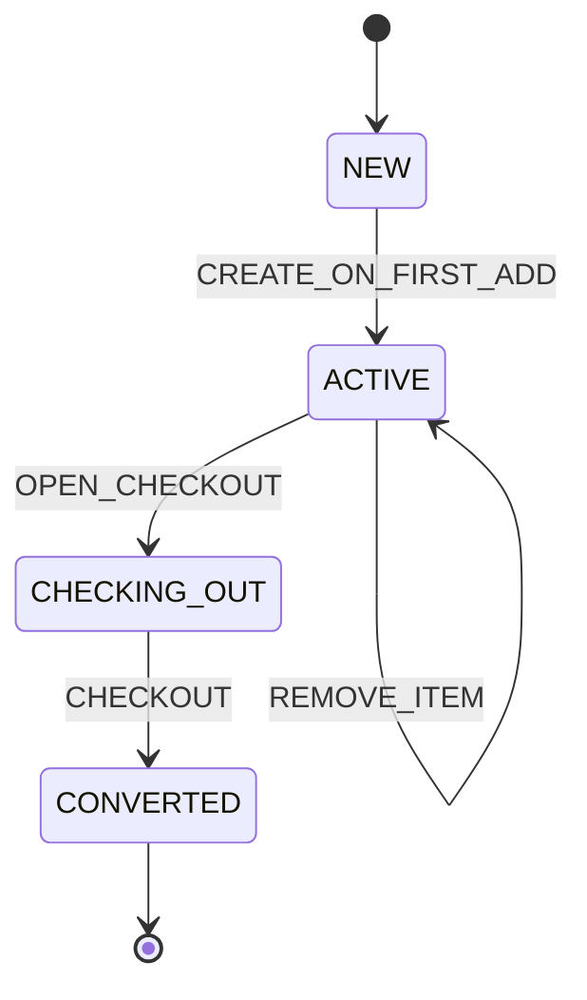
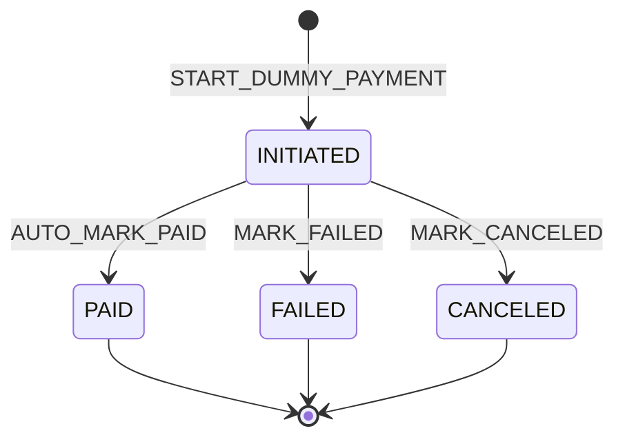
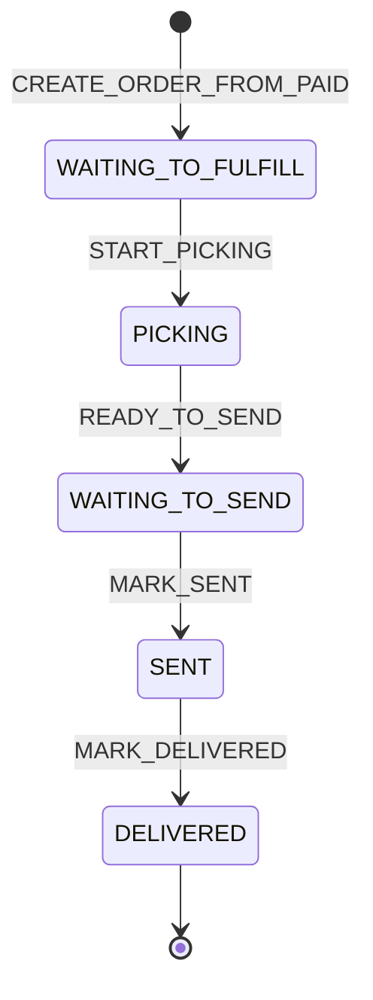
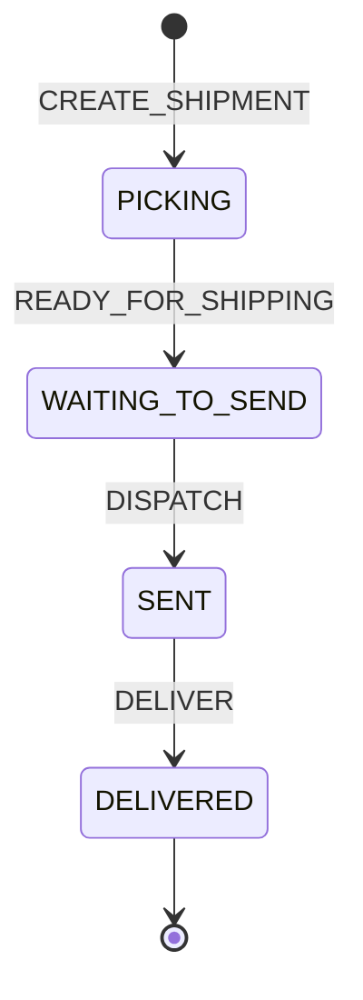

# Workflows

This document defines the workflows for the Cyoda OMS Backend system.

## CartFlow

**Description**: Manages the shopping cart lifecycle from creation to conversion.

**States**: NEW → ACTIVE → CHECKING_OUT → CONVERTED

**Transitions**:

1. **CREATE_ON_FIRST_ADD** (NEW → ACTIVE)
   - **Type**: Automatic
   - **Processor**: CartRecalculateTotalsProcessor
   - **Description**: Creates cart and adds first line item, recalculates totals

2. **ADD_ITEM** (ACTIVE → ACTIVE)
   - **Type**: Manual
   - **Processor**: CartRecalculateTotalsProcessor
   - **Description**: Adds or increments item quantity, recalculates totals

3. **DECREMENT_ITEM** (ACTIVE → ACTIVE)
   - **Type**: Manual
   - **Processor**: CartRecalculateTotalsProcessor
   - **Description**: Decrements item quantity or removes if zero, recalculates totals

4. **REMOVE_ITEM** (ACTIVE → ACTIVE)
   - **Type**: Manual
   - **Processor**: CartRecalculateTotalsProcessor
   - **Description**: Removes item completely, recalculates totals

5. **OPEN_CHECKOUT** (ACTIVE → CHECKING_OUT)
   - **Type**: Manual
   - **Description**: Transitions cart to checkout state

6. **CHECKOUT** (CHECKING_OUT → CONVERTED)
   - **Type**: Manual
   - **Description**: Finalizes cart and signals order creation orchestration

```mermaid
stateDiagram-v2
    [*] --> NEW
    NEW --> ACTIVE : CREATE_ON_FIRST_ADD
    ACTIVE --> ACTIVE : ADD_ITEM
    ACTIVE --> ACTIVE : DECREMENT_ITEM
    ACTIVE --> ACTIVE : REMOVE_ITEM
    ACTIVE --> CHECKING_OUT : OPEN_CHECKOUT
    CHECKING_OUT --> CONVERTED : CHECKOUT
    CONVERTED --> [*]
```

---

## PaymentFlow

**Description**: Dummy payment processing with auto-approval after 3 seconds.

**States**: INITIATED → PAID | FAILED | CANCELED

**Transitions**:

1. **START_DUMMY_PAYMENT** (none → INITIATED)
   - **Type**: Manual
   - **Processor**: PaymentCreateDummyProcessor
   - **Description**: Creates payment record in INITIATED state

2. **AUTO_MARK_PAID** (INITIATED → PAID)
   - **Type**: Automatic
   - **Processor**: PaymentAutoMarkPaidProcessor
   - **Description**: Auto-transitions to PAID after ~3 seconds

3. **MARK_FAILED** (INITIATED → FAILED)
   - **Type**: Manual
   - **Description**: Marks payment as failed (for error scenarios)

4. **MARK_CANCELED** (INITIATED → CANCELED)
   - **Type**: Manual
   - **Description**: Cancels payment (for cancellation scenarios)

```mermaid
stateDiagram-v2
    [*] --> INITIATED : START_DUMMY_PAYMENT
    INITIATED --> PAID : AUTO_MARK_PAID
    INITIATED --> FAILED : MARK_FAILED
    INITIATED --> CANCELED : MARK_CANCELED
    PAID --> [*]
    FAILED --> [*]
    CANCELED --> [*]
```

---

## OrderLifecycle

**Description**: Order processing lifecycle with single shipment per order.

**States**: WAITING_TO_FULFILL → PICKING → WAITING_TO_SEND → SENT → DELIVERED

**Transitions**:

1. **CREATE_ORDER_FROM_PAID** (none → WAITING_TO_FULFILL)
   - **Type**: Automatic
   - **Processor**: OrderCreateFromPaidProcessor
   - **Criterion**: PaymentPaidCriterion
   - **Description**: Creates order from cart snapshot, decrements stock, creates shipment

2. **START_PICKING** (WAITING_TO_FULFILL → PICKING)
   - **Type**: Manual
   - **Processor**: OrderStartPickingProcessor
   - **Description**: Starts picking process, updates shipment to PICKING

3. **READY_TO_SEND** (PICKING → WAITING_TO_SEND)
   - **Type**: Manual
   - **Processor**: OrderReadyToSendProcessor
   - **Description**: Marks order ready for shipping, updates shipment

4. **MARK_SENT** (WAITING_TO_SEND → SENT)
   - **Type**: Manual
   - **Processor**: OrderMarkSentProcessor
   - **Description**: Marks order as sent, updates shipment to SENT

5. **MARK_DELIVERED** (SENT → DELIVERED)
   - **Type**: Manual
   - **Processor**: OrderMarkDeliveredProcessor
   - **Description**: Marks order as delivered, updates shipment to DELIVERED

```mermaid
stateDiagram-v2
    [*] --> WAITING_TO_FULFILL : CREATE_ORDER_FROM_PAID
    WAITING_TO_FULFILL --> PICKING : START_PICKING
    PICKING --> WAITING_TO_SEND : READY_TO_SEND
    WAITING_TO_SEND --> SENT : MARK_SENT
    SENT --> DELIVERED : MARK_DELIVERED
    DELIVERED --> [*]
```

---

## ShipmentFlow

**Description**: Shipment processing that drives order state changes.

**States**: PICKING → WAITING_TO_SEND → SENT → DELIVERED

**Transitions**:

1. **CREATE_SHIPMENT** (none → PICKING)
   - **Type**: Automatic
   - **Processor**: ShipmentCreateProcessor
   - **Description**: Creates shipment when order is created

2. **READY_FOR_SHIPPING** (PICKING → WAITING_TO_SEND)
   - **Type**: Manual
   - **Processor**: ShipmentReadyProcessor
   - **Description**: Marks shipment ready for dispatch

3. **DISPATCH** (WAITING_TO_SEND → SENT)
   - **Type**: Manual
   - **Processor**: ShipmentDispatchProcessor
   - **Description**: Dispatches shipment

4. **DELIVER** (SENT → DELIVERED)
   - **Type**: Manual
   - **Processor**: ShipmentDeliverProcessor
   - **Description**: Marks shipment as delivered

```mermaid
stateDiagram-v2
    [*] --> PICKING : CREATE_SHIPMENT
    PICKING --> WAITING_TO_SEND : READY_FOR_SHIPPING
    WAITING_TO_SEND --> SENT : DISPATCH
    SENT --> DELIVERED : DELIVER
    DELIVERED --> [*]
```
